# Technical Design Document (TDD) - Database Design
# ILDIS - Indonesian Legal Documentation Information System
## Laravel 12.x + Filament 4.x Implementation

---

## 1. Database Overview

### 1.1 Migration Context

#### **1.1.1 Existing System Analysis**
**Source System**: harris-sontanu/jdih-cms (Laravel 10 implementation)  
**Migration Type**: Framework upgrade with architectural modernization  
**Data Preservation**: 100% data continuity from existing Laravel system  
**Structure Foundation**: Proven database schema with JDIHN integration  

#### **1.1.2 Migration Strategy**
- **Schema Evolution**: Enhance existing structure rather than complete redesign
- **Data Compatibility**: Preserve existing relationships and foreign keys
- **JDIHN Compliance**: Maintain proven metadata structure for national standards
- **Performance Enhancement**: Add optimized indexes and caching strategies
- **Modern Laravel Features**: Implement Eloquent relationships, model factories, and advanced query optimization

### 1.2 Database Technology Stack

#### **1.2.1 Core Technology**
- **Database Engine**: MySQL 8.0+ (optimized for Laravel 12.x)
- **ORM**: Laravel Eloquent with advanced relationships
- **Migration System**: Laravel Migrations with version control
- **Query Builder**: Eloquent Query Builder with optimization
- **Character Set**: UTF8MB4 (full Unicode support including emojis)
- **Collation**: utf8mb4_unicode_ci (case-insensitive sorting)

#### **1.2.2 Performance Stack**
- **Search Engine**: Laravel Scout + Meilisearch for full-text search
- **Caching**: Redis for query result caching and session storage
- **Database Indexing**: Composite indexes for complex queries
- **Connection Pooling**: MySQL connection pooling for scalability
- **Read Replicas**: Support for read/write splitting (production)

#### **1.2.3 Development & Deployment**
- **Seeding**: Laravel Database Seeding with realistic test data
- **Testing**: In-memory SQLite for fast unit testing
- **Backup**: Automated MySQL dumps with point-in-time recovery
- **Monitoring**: Laravel Telescope + custom database performance monitoring

### 1.3 Design Principles

#### **1.3.1 Data Integrity Principles**
- **ACID Compliance**: Full transactional integrity with rollback support
- **Foreign Key Constraints**: Referential integrity with cascade options
- **Data Validation**: Multi-layer validation (database, model, request)
- **Audit Trail**: Complete change tracking with user attribution
- **Soft Deletes**: Preserve data history for compliance requirements

#### **1.3.2 Performance Optimization**
- **Strategic Denormalization**: Calculated fields for frequent queries
- **Intelligent Indexing**: Composite indexes based on query patterns
- **Eager Loading**: Optimized N+1 query prevention
- **Database Partitioning**: Time-based partitioning for large tables
- **Caching Strategy**: Multi-level caching (query, model, application)

#### **1.3.3 JDIHN Compliance Architecture**
- **Standardized Metadata**: Schema aligned with SATU DATA HUKUM INDONESIA
- **API-Ready Structure**: Database designed for RESTful API consumption  
- **Version Control**: Document versioning with complete change history
- **Synchronization Support**: Optimistic locking for concurrent updates
- **Data Export Compliance**: Structure supports required export formats

---

## 2. Database Architecture

### 2.1 Database Schema Overview

#### **2.1.1 Core Domain Structure**
```
ILDIS Database Architecture (Laravel 12.x)
├── User Management Domain
│   ├── users (authentication & profiles)
│   ├── roles (Spatie Permission integration)  
│   ├── permissions (granular access control)
│   └── model_has_roles (user-role assignments)
│
├── Document Management Domain
│   ├── documents (core document entities)
│   ├── document_types (laws, monographs, articles, judgments)
│   ├── document_statuses (draft, review, published, archived)
│   ├── document_versions (version control & history)
│   └── document_attachments (files, images, PDFs)
│
├── Content Metadata Domain  
│   ├── authors (document creators & contributors)
│   ├── subjects (legal topics & classifications)
│   ├── publishers (publishing entities)
│   ├── languages (language metadata)
│   ├── legal_fields (bidang hukum classifications)
│   └── document_relations (cross-references)
│
├── JDIHN Integration Domain
│   ├── jdihn_sync_logs (synchronization tracking)
│   ├── jdihn_mappings (local to JDIHN ID mapping)
│   ├── jdihn_validations (compliance checking results)
│   └── jdihn_export_queue (pending sync operations)
│
└── System Management Domain
    ├── activity_log (user action tracking)
    ├── failed_jobs (Laravel queue failures)
    ├── personal_access_tokens (API authentication)
    ├── settings (application configuration)
    └── migrations (schema version control)
```

#### **2.1.2 Relationship Overview**
```
Primary Relationships:
• documents → document_types (many-to-one)
• documents → users (many-to-one, created_by)  
• documents → document_statuses (many-to-one)
• documents ↔ authors (many-to-many)
• documents ↔ subjects (many-to-many)
• documents → document_attachments (one-to-many)
• documents → document_versions (one-to-many)
• users ↔ roles (many-to-many via Spatie Permission)
• jdihn_mappings → documents (one-to-many)
```

### 2.2 Enhanced Entity Relationship Diagram

#### **2.2.1 Core Document Management**

```mermaid
erDiagram
    users {
        bigint id PK
        string name
        string email
        timestamp email_verified_at
        string password
        string remember_token
        string profile_photo_path "nullable"
        boolean is_active "default true"
        timestamp last_login_at "nullable"
        json preferences "nullable"
        timestamps created_updated
        timestamp deleted_at "soft delete"
    }
    
    roles {
        bigint id PK
        string name "unique"
        string guard_name "default web"
        string display_name "nullable"
        text description "nullable"
        boolean is_active "default true"
        timestamps created_updated
    }
    
    permissions {
        bigint id PK
        string name "unique"
        string guard_name "default web"
        string display_name "nullable"
        text description "nullable"
        string resource_type "nullable"
        timestamps created_updated
    }
    
    document_types {
        bigint id PK
        string name "unique"
        string slug "unique"
        text description "nullable"
        string icon "nullable"
        json metadata_schema "nullable"
        boolean is_active "default true"
        integer sort_order "default 0"
        timestamps created_updated
    }
    
    document_statuses {
        bigint id PK
        string name "unique"
        string slug "unique" 
        string color "default gray"
        text description "nullable"
        boolean is_active "default true"
        boolean is_published "default false"
        integer sort_order "default 0"
        timestamps created_updated
    }
    
    documents {
        bigint id PK
        string title
        text abstract "nullable"
        string document_number "nullable unique"
        string call_number "nullable"
        bigint document_type_id FK
        bigint document_status_id FK
        bigint created_by FK
        bigint updated_by FK "nullable"
        string slug "unique"
        text content "nullable"
        json metadata "nullable"
        string source_file_path "nullable"
        string cover_image_path "nullable"
        integer page_count "nullable"
        string isbn "nullable"
        string issn "nullable"
        date published_date "nullable"
        date enacted_date "nullable"
        integer download_count "default 0"
        integer view_count "default 0"
        boolean is_featured "default false"
        float compliance_score "nullable"
        timestamp last_jdihn_sync "nullable"
        timestamps created_updated
        timestamp deleted_at "soft delete"
    }
    
    document_versions {
        bigint id PK
        bigint document_id FK
        integer version_number
        string title
        text abstract "nullable"
        text content "nullable"
        json metadata "nullable"
        string change_summary "nullable"
        bigint created_by FK
        timestamp version_date
        timestamps created_updated
    }
    
    document_attachments {
        bigint id PK
        bigint document_id FK
        string filename
        string original_filename
        string file_path
        string mime_type
        bigint file_size
        string file_type "enum: pdf,doc,docx,image,other"
        text description "nullable"
        boolean is_primary "default false"
        bigint uploaded_by FK
        timestamps created_updated
    }
    
    authors {
        bigint id PK
        string name
        string slug "unique"
        string email "nullable"
        string institution "nullable"
        string position "nullable"
        text biography "nullable"
        string photo_path "nullable"
        boolean is_active "default true"
        timestamps created_updated
        timestamp deleted_at "soft delete"
    }
    
    subjects {
        bigint id PK
        string name
        string slug "unique"
        text description "nullable"
        string code "nullable unique"
        bigint parent_id FK "nullable self-reference"
        integer level "default 1"
        string path "nullable"
        boolean is_active "default true"
        integer sort_order "default 0"
        timestamps created_updated
    }
    
    publishers {
        bigint id PK
        string name
        string slug "unique"
        text description "nullable"
        string address "nullable"
        string phone "nullable"
        string email "nullable"
        string website "nullable"
        boolean is_active "default true"
        timestamps created_updated
    }
    
    languages {
        bigint id PK
        string name
        string code "unique ISO 639-1"
        string native_name "nullable"
        boolean is_active "default true"
        boolean is_default "default false"
        timestamps created_updated
    }
    
    legal_fields {
        bigint id PK
        string name
        string slug "unique"
        string code "nullable unique"
        text description "nullable"
        bigint parent_id FK "nullable self-reference"
        integer level "default 1"
        string path "nullable"
        boolean is_active "default true"
        integer sort_order "default 0"
        timestamps created_updated
    }
```


#### **2.2.2 JDIHN Integration Tables**


#### **2.2.3 Relationship Definitions**
```
Core Relationships:
users ||--o{ documents : creates
users ||--o{ document_versions : creates
users }o--o{ roles : has_roles
roles }o--o{ permissions : has_permissions

documents ||--o{ document_versions : has_versions
documents ||--o{ document_attachments : has_attachments  
documents }o--o{ authors : authored_by
documents }o--o{ subjects : tagged_with
documents }|--|| document_types : belongs_to
documents }|--|| document_statuses : has_status
documents }|--o| publishers : published_by
documents }|--o| languages : written_in
documents }o--o{ legal_fields : classified_under

subjects ||--o{ subjects : parent_child
legal_fields ||--o{ legal_fields : parent_child

JDIHN Integration:
documents ||--o| jdihn_mappings : mapped_to
documents ||--o{ jdihn_sync_logs : sync_history
documents ||--o{ jdihn_validations : validation_results
documents ||--o{ jdihn_export_queue : export_queue
```
        date reading_date
        text responsibility_statement
---

## 3. Migration Strategy from Existing System

### 3.1 Current Schema Analysis

#### **3.1.1 Existing Table Structure (harris-sontanu/jdih-cms)**
Based on analysis of the existing Laravel 10 implementation, the current system has:
- **Core Tables**: documents, users, document_types, authors, subjects
- **Relationship Tables**: document_subjects, document_authors, document_attachments
- **System Tables**: migrations, failed_jobs, password_resets
- **JDIHN Integration**: Basic API integration without dedicated tracking tables

#### **3.1.2 Schema Gaps Identified**
**Missing Modern Features**:
- Document versioning and change tracking
- Advanced user role management (currently basic)
- JDIHN synchronization logging and monitoring
- Quality control and validation tracking
- Performance optimization indexes
- Soft deletes for data preservation

**Areas for Enhancement**:
- Metadata structure optimization for JDIHN compliance
- Better relationship management for complex documents
- Search performance optimization
- Audit trail implementation
- API token management

### 3.2 Migration Approach

#### **3.2.1 Phase 1: Schema Enhancement (Week 1-2)**
```sql
-- Add new tables for enhanced functionality
CREATE TABLE document_versions (...);
CREATE TABLE document_statuses (...);  
CREATE TABLE jdihn_mappings (...);
CREATE TABLE jdihn_sync_logs (...);
CREATE TABLE activity_log (...);

-- Enhance existing tables
ALTER TABLE documents ADD COLUMN slug VARCHAR(255);
ALTER TABLE documents ADD COLUMN compliance_score DECIMAL(3,2);
ALTER TABLE documents ADD COLUMN last_jdihn_sync TIMESTAMP NULL;
ALTER TABLE documents ADD COLUMN deleted_at TIMESTAMP NULL;

-- Add missing indexes for performance
CREATE INDEX idx_documents_status ON documents(document_status_id);
CREATE INDEX idx_documents_type_status ON documents(document_type_id, document_status_id);
CREATE FULLTEXT INDEX idx_documents_search ON documents(title, abstract, content);
```

#### **3.2.2 Phase 2: Data Migration (Week 3)**
```php
// Laravel Migration Scripts
class EnhanceExistingDocumentsTable extends Migration
{
    public function up()
    {
        // Add new columns to existing documents table
        Schema::table('documents', function (Blueprint $table) {
            $table->string('slug')->unique()->after('title');
            $table->unsignedBigInteger('document_status_id')->default(1)->after('document_type_id');
            $table->decimal('compliance_score', 3, 2)->nullable()->after('metadata');
            $table->timestamp('last_jdihn_sync')->nullable()->after('compliance_score');
            $table->softDeletes();
            
            // Add foreign key constraints
            $table->foreign('document_status_id')->references('id')->on('document_statuses');
        });
        
        // Generate slugs for existing documents
        DB::table('documents')->chunkById(100, function ($documents) {
            foreach ($documents as $document) {
                DB::table('documents')
                    ->where('id', $document->id)
                    ->update(['slug' => Str::slug($document->title)]);
            }
        });
    }
}
```

#### **3.2.3 Phase 3: Enhanced Relationships (Week 4)**
```php
// Migrate existing many-to-many relationships to enhanced structure
class EnhanceDocumentRelationships extends Migration  
{
    public function up()
    {
        // Enhance document_subjects table
        Schema::table('document_subjects', function (Blueprint $table) {
            $table->string('relevance_score')->nullable()->after('subject_type');
            $table->boolean('is_primary')->default(false)->after('relevance_score');
            $table->timestamps();
        });
        
        // Enhance document_authors table  
        Schema::table('document_authors', function (Blueprint $table) {
            $table->string('contribution_type')->default('author')->after('author_id');
            $table->integer('order')->default(1)->after('contribution_type');
            $table->timestamps();
        });
    }
}
```

### 3.3 Data Preservation Strategy

#### **3.3.1 Zero-Downtime Migration**
1. **Parallel Table Creation**: Create new enhanced tables alongside existing
2. **Data Replication**: Copy and transform existing data to new structure
3. **Validation Phase**: Comprehensive data integrity checks
4. **Cutover Process**: Switch application to new schema with minimal downtime
5. **Rollback Plan**: Ability to revert to original schema if issues occur

#### **3.3.2 Data Validation Checklist**
```php
// Validation commands to ensure migration success
class ValidateDataMigration extends Command
{
    public function handle()
    {
        // Verify document count consistency
        $this->info('Original documents: ' . DB::connection('old')->table('documents')->count());
        $this->info('Migrated documents: ' . Document::count());
        
        // Verify relationship integrity
        $this->info('Document-Author relationships: ' . DocumentAuthor::count());
        $this->info('Document-Subject relationships: ' . DocumentSubject::count());
        
        // Verify JDIHN mapping creation
        $this->info('JDIHN mappings created: ' . JdihnMapping::count());
        
        // Check for data quality issues
        $documentsWithoutSlugs = Document::whereNull('slug')->count();
        $this->warn("Documents without slugs: {$documentsWithoutSlugs}");
    }
}
```

---
## 4. Detailed Table Specifications

### 4.1 Core Document Management Tables

#### **4.1.1 documents Table**
```sql
CREATE TABLE documents (
    -- Primary identification
    id BIGINT UNSIGNED AUTO_INCREMENT PRIMARY KEY,
    title VARCHAR(500) NOT NULL,
    slug VARCHAR(255) UNIQUE NOT NULL,
    abstract TEXT NULL,
    content LONGTEXT NULL,
    
    -- Document classification
    document_type_id BIGINT UNSIGNED NOT NULL,
    document_status_id BIGINT UNSIGNED NOT NULL DEFAULT 1,
    document_number VARCHAR(255) NULL UNIQUE,
    call_number VARCHAR(255) NULL,
    
    -- Publishing information
    published_date DATE NULL,
    enacted_date DATE NULL,
    publisher_id BIGINT UNSIGNED NULL,
    language_id BIGINT UNSIGNED NOT NULL DEFAULT 1,
    
    -- File management
    source_file_path VARCHAR(500) NULL,
    cover_image_path VARCHAR(500) NULL,
    page_count INTEGER UNSIGNED NULL,
    
    -- Identifiers
    isbn VARCHAR(20) NULL,
    issn VARCHAR(20) NULL,
    
    -- Statistics
    download_count INTEGER UNSIGNED DEFAULT 0,
    view_count INTEGER UNSIGNED DEFAULT 0,
    
    -- Quality & Compliance
    compliance_score DECIMAL(3,2) NULL COMMENT 'JDIHN compliance score 0.00-1.00',
    is_featured BOOLEAN DEFAULT FALSE,
    
    -- Metadata
    metadata JSON NULL COMMENT 'Flexible metadata for different document types',
    
    -- JDIHN Integration
    last_jdihn_sync TIMESTAMP NULL,
    jdihn_status ENUM('pending', 'synced', 'failed', 'conflict') DEFAULT 'pending',
    
    -- Audit fields
    created_by BIGINT UNSIGNED NOT NULL,
    updated_by BIGINT UNSIGNED NULL,
    created_at TIMESTAMP DEFAULT CURRENT_TIMESTAMP,
    updated_at TIMESTAMP DEFAULT CURRENT_TIMESTAMP ON UPDATE CURRENT_TIMESTAMP,
    deleted_at TIMESTAMP NULL,
    
    -- Foreign key constraints
    FOREIGN KEY (document_type_id) REFERENCES document_types(id) ON DELETE RESTRICT,
    FOREIGN KEY (document_status_id) REFERENCES document_statuses(id) ON DELETE RESTRICT,
    FOREIGN KEY (publisher_id) REFERENCES publishers(id) ON DELETE SET NULL,
    FOREIGN KEY (language_id) REFERENCES languages(id) ON DELETE RESTRICT,
    FOREIGN KEY (created_by) REFERENCES users(id) ON DELETE RESTRICT,
    FOREIGN KEY (updated_by) REFERENCES users(id) ON DELETE SET NULL,
    
    -- Indexes for performance
    INDEX idx_documents_type_status (document_type_id, document_status_id),
    INDEX idx_documents_published (published_date, document_status_id),
    INDEX idx_documents_compliance (compliance_score DESC),
    INDEX idx_documents_stats (view_count DESC, download_count DESC),
    INDEX idx_documents_jdihn (last_jdihn_sync, jdihn_status),
    FULLTEXT INDEX ft_documents_search (title, abstract, content)
) ENGINE=InnoDB DEFAULT CHARSET=utf8mb4 COLLATE=utf8mb4_unicode_ci;
```

#### **4.1.2 document_types Table**
```sql
CREATE TABLE document_types (
    id BIGINT UNSIGNED AUTO_INCREMENT PRIMARY KEY,
    name VARCHAR(255) NOT NULL UNIQUE,
    slug VARCHAR(255) NOT NULL UNIQUE,
    display_name VARCHAR(255) NOT NULL,
    description TEXT NULL,
    
    -- UI Configuration
    icon VARCHAR(100) NULL COMMENT 'Icon class or path',
    color VARCHAR(20) DEFAULT 'blue' COMMENT 'UI color theme',
    
    -- Metadata Schema
    metadata_schema JSON NULL COMMENT 'JSON Schema for type-specific metadata',
    required_fields JSON NULL COMMENT 'List of required fields for this type',
    
    -- JDIHN Configuration
    jdihn_type_code VARCHAR(50) NULL COMMENT 'JDIHN document type mapping',
    jdihn_export_enabled BOOLEAN DEFAULT TRUE,
    
    -- Status & Ordering
    is_active BOOLEAN DEFAULT TRUE,
    sort_order INTEGER DEFAULT 0,
    
    -- Audit
    created_at TIMESTAMP DEFAULT CURRENT_TIMESTAMP,
    updated_at TIMESTAMP DEFAULT CURRENT_TIMESTAMP ON UPDATE CURRENT_TIMESTAMP,
    
    INDEX idx_document_types_active (is_active, sort_order),
    INDEX idx_document_types_jdihn (jdihn_export_enabled, jdihn_type_code)
) ENGINE=InnoDB DEFAULT CHARSET=utf8mb4 COLLATE=utf8mb4_unicode_ci;
```

#### **4.1.3 document_statuses Table**
```sql  
CREATE TABLE document_statuses (
    id BIGINT UNSIGNED AUTO_INCREMENT PRIMARY KEY,
    name VARCHAR(100) NOT NULL UNIQUE,
    slug VARCHAR(100) NOT NULL UNIQUE,
    display_name VARCHAR(100) NOT NULL,
    description TEXT NULL,
    
    -- UI Configuration
    color VARCHAR(20) DEFAULT 'gray' COMMENT 'Status color for UI',
    icon VARCHAR(100) NULL,
    
    -- Status Properties
    is_active BOOLEAN DEFAULT TRUE,
    is_published BOOLEAN DEFAULT FALSE COMMENT 'Whether documents with this status are publicly visible',
    is_draft BOOLEAN DEFAULT FALSE,
    is_final BOOLEAN DEFAULT FALSE,
    
    -- Workflow
    allowed_transitions JSON NULL COMMENT 'Array of status IDs this status can transition to',
    required_permissions JSON NULL COMMENT 'Permissions required to set this status',
    
    -- Ordering
    sort_order INTEGER DEFAULT 0,
    
    -- Audit
    created_at TIMESTAMP DEFAULT CURRENT_TIMESTAMP,
    updated_at TIMESTAMP DEFAULT CURRENT_TIMESTAMP ON UPDATE CURRENT_TIMESTAMP,
    
    INDEX idx_document_statuses_public (is_published, is_active),
    INDEX idx_document_statuses_workflow (is_active, sort_order)
) ENGINE=InnoDB DEFAULT CHARSET=utf8mb4 COLLATE=utf8mb4_unicode_ci;
```

#### **4.1.4 document_versions Table**
```sql
CREATE TABLE document_versions (
    id BIGINT UNSIGNED AUTO_INCREMENT PRIMARY KEY,
    document_id BIGINT UNSIGNED NOT NULL,
    version_number INTEGER UNSIGNED NOT NULL,
    
    -- Version Content
    title VARCHAR(500) NOT NULL,
    abstract TEXT NULL,
    content LONGTEXT NULL,
    metadata JSON NULL,
    
    -- Version Management
    change_summary TEXT NULL COMMENT 'Summary of changes in this version',
    change_type ENUM('major', 'minor', 'patch', 'editorial') DEFAULT 'minor',
    is_current BOOLEAN DEFAULT FALSE COMMENT 'Whether this is the current active version',
    
    -- Version Metadata
    version_date TIMESTAMP DEFAULT CURRENT_TIMESTAMP,
    created_by BIGINT UNSIGNED NOT NULL,
    created_at TIMESTAMP DEFAULT CURRENT_TIMESTAMP,
    updated_at TIMESTAMP DEFAULT CURRENT_TIMESTAMP ON UPDATE CURRENT_TIMESTAMP,
    
    -- Foreign keys
    FOREIGN KEY (document_id) REFERENCES documents(id) ON DELETE CASCADE,
    FOREIGN KEY (created_by) REFERENCES users(id) ON DELETE RESTRICT,
    
    -- Constraints
    UNIQUE KEY unique_document_version (document_id, version_number),
    UNIQUE KEY unique_current_version (document_id, is_current) WHERE is_current = TRUE,
    
    -- Indexes
    INDEX idx_document_versions_current (document_id, is_current),
    INDEX idx_document_versions_date (version_date DESC)
) ENGINE=InnoDB DEFAULT CHARSET=utf8mb4 COLLATE=utf8mb4_unicode_ci;
```

#### **4.1.5 document_attachments Table**
```sql
CREATE TABLE document_attachments (
    id BIGINT UNSIGNED AUTO_INCREMENT PRIMARY KEY,
    document_id BIGINT UNSIGNED NOT NULL,
    
    -- File Information
    filename VARCHAR(255) NOT NULL COMMENT 'Stored filename',
    original_filename VARCHAR(255) NOT NULL COMMENT 'Original upload filename',
    file_path VARCHAR(500) NOT NULL COMMENT 'Storage path',
    
    -- File Metadata
    mime_type VARCHAR(100) NOT NULL,
    file_size BIGINT UNSIGNED NOT NULL COMMENT 'File size in bytes',
    file_type ENUM('pdf', 'doc', 'docx', 'image', 'video', 'other') NOT NULL,
    
    -- File Properties
    description TEXT NULL,
    alt_text VARCHAR(255) NULL COMMENT 'Alternative text for accessibility',
    is_primary BOOLEAN DEFAULT FALSE COMMENT 'Primary attachment for document',
    is_public BOOLEAN DEFAULT TRUE COMMENT 'Whether file is publicly downloadable',
    
    -- Processing Status
    processing_status ENUM('pending', 'processing', 'completed', 'failed') DEFAULT 'pending',
    extracted_text LONGTEXT NULL COMMENT 'Extracted text content for search',
    
    -- Download Tracking
    download_count INTEGER UNSIGNED DEFAULT 0,
    
    -- Audit
    uploaded_by BIGINT UNSIGNED NOT NULL,
    created_at TIMESTAMP DEFAULT CURRENT_TIMESTAMP,
    updated_at TIMESTAMP DEFAULT CURRENT_TIMESTAMP ON UPDATE CURRENT_TIMESTAMP,
    deleted_at TIMESTAMP NULL,
    
    -- Foreign keys
    FOREIGN KEY (document_id) REFERENCES documents(id) ON DELETE CASCADE,
    FOREIGN KEY (uploaded_by) REFERENCES users(id) ON DELETE RESTRICT,
    
    -- Constraints
    UNIQUE KEY unique_primary_attachment (document_id, is_primary) WHERE is_primary = TRUE,
    
    -- Indexes
    INDEX idx_document_attachments_type (document_id, file_type),
    INDEX idx_document_attachments_public (is_public, file_type),
    FULLTEXT INDEX ft_attachments_text (extracted_text)
) ENGINE=InnoDB DEFAULT CHARSET=utf8mb4 COLLATE=utf8mb4_unicode_ci;
```

### 4.2 Metadata & Classification Tables

#### **4.2.1 authors Table**
```sql
CREATE TABLE authors (
    id BIGINT UNSIGNED AUTO_INCREMENT PRIMARY KEY,
    name VARCHAR(255) NOT NULL,
    slug VARCHAR(255) UNIQUE NOT NULL,
    
    -- Contact Information
    email VARCHAR(255) NULL,
    phone VARCHAR(50) NULL,
    
    -- Professional Information
    institution VARCHAR(255) NULL,
    position VARCHAR(255) NULL,
    department VARCHAR(255) NULL,
    
    -- Profile
    biography TEXT NULL,
    photo_path VARCHAR(500) NULL,
    website VARCHAR(255) NULL,
    
    -- Social Media
    linkedin_url VARCHAR(255) NULL,
    twitter_handle VARCHAR(100) NULL,
    
    -- Professional Identifiers
    orcid_id VARCHAR(50) NULL COMMENT 'ORCID identifier',
    scopus_id VARCHAR(50) NULL,
    scholar_id VARCHAR(50) NULL COMMENT 'Google Scholar ID',
    
    -- Metadata
    specializations JSON NULL COMMENT 'Array of specialization areas',
    languages_spoken JSON NULL COMMENT 'Languages the author speaks/writes',
    
    -- Statistics
    total_documents INTEGER UNSIGNED DEFAULT 0,
    total_citations INTEGER UNSIGNED DEFAULT 0,
    
    -- Status
    is_active BOOLEAN DEFAULT TRUE,
    is_verified BOOLEAN DEFAULT FALSE COMMENT 'Whether author profile is verified',
    
    -- Audit
    created_at TIMESTAMP DEFAULT CURRENT_TIMESTAMP,
    updated_at TIMESTAMP DEFAULT CURRENT_TIMESTAMP ON UPDATE CURRENT_TIMESTAMP,
    deleted_at TIMESTAMP NULL,
    
    -- Indexes
    INDEX idx_authors_active (is_active, name),
    INDEX idx_authors_institution (institution, is_active),
    FULLTEXT INDEX ft_authors_search (name, institution, biography)
) ENGINE=InnoDB DEFAULT CHARSET=utf8mb4 COLLATE=utf8mb4_unicode_ci;
```

#### **4.2.2 subjects Table (Hierarchical)**
```sql
CREATE TABLE subjects (
    id BIGINT UNSIGNED AUTO_INCREMENT PRIMARY KEY,
    name VARCHAR(255) NOT NULL,
    slug VARCHAR(255) UNIQUE NOT NULL,
    description TEXT NULL,
    
    -- Classification
    code VARCHAR(50) NULL UNIQUE COMMENT 'Subject classification code',
    external_code VARCHAR(100) NULL COMMENT 'External classification system code',
    
    -- Hierarchy
    parent_id BIGINT UNSIGNED NULL,
    level INTEGER UNSIGNED DEFAULT 1 COMMENT 'Depth level in hierarchy',
    path VARCHAR(1000) NULL COMMENT 'Materialized path for hierarchy queries',
    
    -- Usage Statistics
    document_count INTEGER UNSIGNED DEFAULT 0,
    usage_frequency INTEGER UNSIGNED DEFAULT 0,
    
    -- Configuration
    is_active BOOLEAN DEFAULT TRUE,
    is_featured BOOLEAN DEFAULT FALSE,
    sort_order INTEGER DEFAULT 0,
    
    -- Localization
    name_en VARCHAR(255) NULL COMMENT 'English name',
    description_en TEXT NULL COMMENT 'English description',
    
    -- Audit
    created_at TIMESTAMP DEFAULT CURRENT_TIMESTAMP,
    updated_at TIMESTAMP DEFAULT CURRENT_TIMESTAMP ON UPDATE CURRENT_TIMESTAMP,
    
    -- Foreign keys
    FOREIGN KEY (parent_id) REFERENCES subjects(id) ON DELETE SET NULL,
    
    -- Indexes
    INDEX idx_subjects_hierarchy (parent_id, level),
    INDEX idx_subjects_active (is_active, sort_order),
    INDEX idx_subjects_usage (usage_frequency DESC, document_count DESC),
    FULLTEXT INDEX ft_subjects_search (name, description)
) ENGINE=InnoDB DEFAULT CHARSET=utf8mb4 COLLATE=utf8mb4_unicode_ci;
```

---
    
    regions {
        bigint id PK
        string name
        string type
        integer parent_id FK
        string code
        timestamps created_updated
    }
    
    users ||--o{ documents : "creates/updates"
    documents }o--|| document_types : "belongs_to"
    documents ||--o{ document_subjects : "has_many"
    subjects ||--o{ document_subjects : "has_many"
    documents ||--o{ document_authors : "has_many"
    authors ||--o{ document_authors : "has_many"
    documents ||--o{ document_attachments : "has_many"
    documents ||--o{ document_relations : "has_many"
    documents ||--o{ circulations : "borrowed"
    members ||--o{ circulations : "borrows"
    users ||--o{ circulations : "processes"
    regions ||--o{ documents : "located_in"
    document_types ||--o{ document_types : "parent_child"
    legal_fields ||--o{ legal_fields : "parent_child"
    regions ||--o{ regions : "parent_child"
```

---

## 3. Core Tables Design

### 3.1 Users & Authentication

#### **Table: users**
```sql
CREATE TABLE users (
    id BIGINT UNSIGNED PRIMARY KEY AUTO_INCREMENT,
    name VARCHAR(255) NOT NULL,
    email VARCHAR(255) UNIQUE NOT NULL,
    email_verified_at TIMESTAMP NULL,
    password VARCHAR(255) NOT NULL,
    remember_token VARCHAR(100) NULL,
    profile_photo_path VARCHAR(2048) NULL,
    institution VARCHAR(255) NULL,
    position VARCHAR(255) NULL,
    phone VARCHAR(20) NULL,
    is_active BOOLEAN DEFAULT TRUE,
    last_login_at TIMESTAMP NULL,
    created_at TIMESTAMP DEFAULT CURRENT_TIMESTAMP,
    updated_at TIMESTAMP DEFAULT CURRENT_TIMESTAMP ON UPDATE CURRENT_TIMESTAMP,
    
    INDEX idx_email (email),
    INDEX idx_is_active (is_active)
);
```

**Laravel Model Mapping:**
```php
// app/Models/User.php
class User extends Authenticatable implements FilamentUser
{
    use HasApiTokens, HasFactory, Notifiable, HasRoles;
    
    protected $fillable = [
        'name', 'email', 'password', 'institution', 
        'position', 'phone', 'is_active'
    ];
    
    protected $hidden = ['password', 'remember_token'];
    
    protected $casts = [
        'email_verified_at' => 'datetime',
        'last_login_at' => 'datetime',
        'is_active' => 'boolean',
    ];
}
```

#### **Table: roles & permissions** (Spatie Laravel Permission)
```sql
-- Menggunakan Spatie Laravel Permission package
-- Tables: roles, permissions, model_has_roles, model_has_permissions, role_has_permissions
```

### 3.2 Core Document Management

#### **Table: documents**
```sql
CREATE TABLE documents (
    id BIGINT UNSIGNED PRIMARY KEY AUTO_INCREMENT,
    
    -- Basic Information
    title TEXT NOT NULL,
    teu TEXT COMMENT 'Tempat, Entitas, Unit - JDIHN Standard',
    document_number VARCHAR(255),
    call_number VARCHAR(255),
    document_type_id BIGINT UNSIGNED,
    
    -- Regulation Specific Fields
    regulation_form TEXT,
    regulation_type VARCHAR(255) DEFAULT '-',
    regulation_abbreviation VARCHAR(255),
    
    -- Publication Information
    edition VARCHAR(255),
    place_published VARCHAR(255),
    publisher VARCHAR(255),
    enactment_date DATE,
    promulgation_date DATE,
    physical_description TEXT,
    source TEXT,
    isbn VARCHAR(255),
    language VARCHAR(255),
    
    -- Classification & Metadata
    legal_field VARCHAR(255),
    book_index_number VARCHAR(255),
    form_abbreviation VARCHAR(255),
    collection_type VARCHAR(255),
    copy_pattern VARCHAR(255),
    number_of_copies VARCHAR(255),
    publication_frequency VARCHAR(255),
    publication_year VARCHAR(255),
    reading_date DATE,
    responsibility_statement TEXT,
### 4.3 JDIHN Integration Tables

#### **4.3.1 jdihn_mappings Table**
```sql
CREATE TABLE jdihn_mappings (
    id BIGINT UNSIGNED AUTO_INCREMENT PRIMARY KEY,
    document_id BIGINT UNSIGNED NOT NULL,
    
    -- JDIHN Identification
    jdihn_id VARCHAR(100) NOT NULL UNIQUE COMMENT 'JDIHN system document ID',
    jdihn_type VARCHAR(50) NOT NULL COMMENT 'Document type in JDIHN system',
    jdihn_category VARCHAR(100) NULL COMMENT 'Document category in JDIHN',
    
    -- Synchronization Status
    sync_status ENUM('pending', 'synced', 'failed', 'conflict', 'deleted') DEFAULT 'pending',
    last_sync_at TIMESTAMP NULL,
    next_sync_at TIMESTAMP NULL,
    
    -- Version Control
    local_version_hash VARCHAR(64) NULL COMMENT 'Hash of local document version',
    jdihn_version_hash VARCHAR(64) NULL COMMENT 'Hash of JDIHN document version',
    
    -- Metadata Mapping
    jdihn_metadata JSON NULL COMMENT 'JDIHN-specific metadata',
    field_mappings JSON NULL COMMENT 'Local to JDIHN field mappings',
    
    -- Error Handling
    sync_error TEXT NULL,
    retry_count INTEGER UNSIGNED DEFAULT 0,
    max_retries INTEGER UNSIGNED DEFAULT 3,
    
    -- Audit
    created_at TIMESTAMP DEFAULT CURRENT_TIMESTAMP,
    updated_at TIMESTAMP DEFAULT CURRENT_TIMESTAMP ON UPDATE CURRENT_TIMESTAMP,
    
    -- Foreign keys
    FOREIGN KEY (document_id) REFERENCES documents(id) ON DELETE CASCADE,
    
    -- Indexes
    INDEX idx_jdihn_mappings_status (sync_status, next_sync_at),
    INDEX idx_jdihn_mappings_document (document_id),
    UNIQUE INDEX idx_jdihn_mappings_jdihn_id (jdihn_id)
) ENGINE=InnoDB DEFAULT CHARSET=utf8mb4 COLLATE=utf8mb4_unicode_ci;
```

#### **4.3.2 jdihn_sync_logs Table**
```sql
CREATE TABLE jdihn_sync_logs (
    id BIGINT UNSIGNED AUTO_INCREMENT PRIMARY KEY,
    document_id BIGINT UNSIGNED NULL,
    jdihn_mapping_id BIGINT UNSIGNED NULL,
    
    -- Operation Details
    operation ENUM('create', 'update', 'delete', 'sync', 'validate') NOT NULL,
    status ENUM('pending', 'processing', 'success', 'failed', 'retry') NOT NULL,
    
    -- Request/Response Data
    request_data JSON NULL COMMENT 'Data sent to JDIHN API',
    response_data JSON NULL COMMENT 'Response received from JDIHN API',
    
    -- Error Information
    error_code VARCHAR(50) NULL,
    error_message TEXT NULL,
    error_details JSON NULL,
    
    -- Performance Metrics
    processing_time_ms INTEGER UNSIGNED NULL,
    api_response_time_ms INTEGER UNSIGNED NULL,
    
    -- Batch Information
    batch_id VARCHAR(100) NULL COMMENT 'For batch operations',
    batch_sequence INTEGER UNSIGNED NULL,
    
    -- Retry Logic
    attempt_number INTEGER UNSIGNED DEFAULT 1,
    scheduled_retry_at TIMESTAMP NULL,
    
    -- Audit
    initiated_by BIGINT UNSIGNED NULL COMMENT 'User who triggered the operation',
    created_at TIMESTAMP DEFAULT CURRENT_TIMESTAMP,
    
    -- Foreign keys
    FOREIGN KEY (document_id) REFERENCES documents(id) ON DELETE CASCADE,
    FOREIGN KEY (jdihn_mapping_id) REFERENCES jdihn_mappings(id) ON DELETE CASCADE,
    FOREIGN KEY (initiated_by) REFERENCES users(id) ON DELETE SET NULL,
    
    -- Indexes
    INDEX idx_jdihn_sync_logs_status_time (status, created_at DESC),
    INDEX idx_jdihn_sync_logs_document (document_id, created_at DESC),
    INDEX idx_jdihn_sync_logs_batch (batch_id, batch_sequence),
    INDEX idx_jdihn_sync_logs_retry (status, scheduled_retry_at)
) ENGINE=InnoDB DEFAULT CHARSET=utf8mb4 COLLATE=utf8mb4_unicode_ci;
```

#### **4.3.3 jdihn_validations Table**
```sql
CREATE TABLE jdihn_validations (
    id BIGINT UNSIGNED AUTO_INCREMENT PRIMARY KEY,
    document_id BIGINT UNSIGNED NOT NULL,
    
    -- Validation Context
    validation_type ENUM('metadata', 'content', 'format', 'completeness', 'compliance') NOT NULL,
    validation_version VARCHAR(20) NOT NULL COMMENT 'Version of validation rules used',
    
    -- Validation Status
    status ENUM('pending', 'valid', 'invalid', 'warning', 'error') NOT NULL,
    compliance_score DECIMAL(5,2) NULL COMMENT 'Compliance score 0.00-100.00',
    
    -- Validation Rules & Results
    validation_rules JSON NOT NULL COMMENT 'Rules applied during validation',
    validation_results JSON NOT NULL COMMENT 'Detailed validation results',
    
    -- Issues & Recommendations
    issues_found JSON NULL COMMENT 'Array of validation issues',
    recommendations TEXT NULL COMMENT 'Suggested improvements',
    auto_fixable_issues JSON NULL COMMENT 'Issues that can be automatically fixed',
    
    -- Processing Information
    validation_duration_ms INTEGER UNSIGNED NULL,
    rules_applied INTEGER UNSIGNED DEFAULT 0,
    issues_count INTEGER UNSIGNED DEFAULT 0,
    warnings_count INTEGER UNSIGNED DEFAULT 0,
    
    -- Audit
    validated_by BIGINT UNSIGNED NULL COMMENT 'User who initiated validation',
    validated_at TIMESTAMP DEFAULT CURRENT_TIMESTAMP,
    created_at TIMESTAMP DEFAULT CURRENT_TIMESTAMP,
    updated_at TIMESTAMP DEFAULT CURRENT_TIMESTAMP ON UPDATE CURRENT_TIMESTAMP,
    
    -- Foreign keys
    FOREIGN KEY (document_id) REFERENCES documents(id) ON DELETE CASCADE,
    FOREIGN KEY (validated_by) REFERENCES users(id) ON DELETE SET NULL,
    
    -- Indexes
    INDEX idx_jdihn_validations_status (document_id, status),
    INDEX idx_jdihn_validations_score (compliance_score DESC),
    INDEX idx_jdihn_validations_type_date (validation_type, validated_at DESC)
) ENGINE=InnoDB DEFAULT CHARSET=utf8mb4 COLLATE=utf8mb4_unicode_ci;
```

#### **4.3.4 jdihn_export_queue Table**
```sql
CREATE TABLE jdihn_export_queue (
    id BIGINT UNSIGNED AUTO_INCREMENT PRIMARY KEY,
    document_id BIGINT UNSIGNED NOT NULL,
    
    -- Queue Information
    operation ENUM('create', 'update', 'delete') NOT NULL,
    priority ENUM('low', 'normal', 'high', 'urgent') DEFAULT 'normal',
    status ENUM('queued', 'processing', 'completed', 'failed', 'cancelled') DEFAULT 'queued',
    
    -- Processing Data
    payload JSON NOT NULL COMMENT 'Data to be exported to JDIHN',
    export_format ENUM('json', 'xml', 'custom') DEFAULT 'json',
    
    -- Error Handling
    error_message TEXT NULL,
    error_details JSON NULL,
    attempts INTEGER UNSIGNED DEFAULT 0,
    max_attempts INTEGER UNSIGNED DEFAULT 3,
    
    -- Scheduling
    scheduled_at TIMESTAMP DEFAULT CURRENT_TIMESTAMP,
    started_at TIMESTAMP NULL,
    completed_at TIMESTAMP NULL,
    failed_at TIMESTAMP NULL,
    
    -- Performance Tracking
    processing_time_ms INTEGER UNSIGNED NULL,
    file_size_bytes BIGINT UNSIGNED NULL,
    
    -- Dependencies
    depends_on_job_id BIGINT UNSIGNED NULL COMMENT 'Job that must complete first',
    batch_id VARCHAR(100) NULL,
    
    -- Audit
    created_by BIGINT UNSIGNED NULL,
    created_at TIMESTAMP DEFAULT CURRENT_TIMESTAMP,
    updated_at TIMESTAMP DEFAULT CURRENT_TIMESTAMP ON UPDATE CURRENT_TIMESTAMP,
    
    -- Foreign keys
    FOREIGN KEY (document_id) REFERENCES documents(id) ON DELETE CASCADE,
    FOREIGN KEY (depends_on_job_id) REFERENCES jdihn_export_queue(id) ON DELETE SET NULL,
    FOREIGN KEY (created_by) REFERENCES users(id) ON DELETE SET NULL,
    
    -- Indexes
    INDEX idx_jdihn_export_queue_status (status, priority, scheduled_at),
    INDEX idx_jdihn_export_queue_document (document_id),
    INDEX idx_jdihn_export_queue_batch (batch_id, scheduled_at),
    INDEX idx_jdihn_export_queue_dependencies (depends_on_job_id)
) ENGINE=InnoDB DEFAULT CHARSET=utf8mb4 COLLATE=utf8mb4_unicode_ci;
```

### 4.4 Relationship Tables (Many-to-Many)

#### **4.4.1 document_authors Table**
```sql
CREATE TABLE document_authors (
    id BIGINT UNSIGNED AUTO_INCREMENT PRIMARY KEY,
    document_id BIGINT UNSIGNED NOT NULL,
    author_id BIGINT UNSIGNED NOT NULL,
    
    -- Contribution Details
    contribution_type ENUM('author', 'editor', 'translator', 'contributor', 'reviewer') DEFAULT 'author',
    contribution_description TEXT NULL,
    author_order INTEGER UNSIGNED DEFAULT 1,
    
    -- Contact Information Override
    author_name_override VARCHAR(255) NULL COMMENT 'Override author name for this document',
    author_institution_override VARCHAR(255) NULL,
    
    -- Metadata
    is_corresponding_author BOOLEAN DEFAULT FALSE,
    is_primary_author BOOLEAN DEFAULT FALSE,
    
    -- Audit
    created_at TIMESTAMP DEFAULT CURRENT_TIMESTAMP,
    updated_at TIMESTAMP DEFAULT CURRENT_TIMESTAMP ON UPDATE CURRENT_TIMESTAMP,
    
    -- Foreign keys
    FOREIGN KEY (document_id) REFERENCES documents(id) ON DELETE CASCADE,
    FOREIGN KEY (author_id) REFERENCES authors(id) ON DELETE CASCADE,
    
    -- Constraints
    UNIQUE KEY unique_document_author_order (document_id, author_order),
    UNIQUE KEY unique_primary_author (document_id, is_primary_author) WHERE is_primary_author = TRUE,
    UNIQUE KEY unique_corresponding_author (document_id, is_corresponding_author) WHERE is_corresponding_author = TRUE,
    
    -- Indexes
    INDEX idx_document_authors_document (document_id, author_order),
    INDEX idx_document_authors_author (author_id)
) ENGINE=InnoDB DEFAULT CHARSET=utf8mb4 COLLATE=utf8mb4_unicode_ci;
```

#### **4.4.2 document_subjects Table**
```sql
CREATE TABLE document_subjects (
    id BIGINT UNSIGNED AUTO_INCREMENT PRIMARY KEY,
    document_id BIGINT UNSIGNED NOT NULL,
    subject_id BIGINT UNSIGNED NOT NULL,
    
    -- Relevance Information
    subject_type ENUM('primary', 'secondary', 'keyword') DEFAULT 'primary',
    relevance_score DECIMAL(3,2) NULL COMMENT 'Relevance score 0.00-1.00',
    confidence_score DECIMAL(3,2) NULL COMMENT 'AI confidence in classification',
    
    -- Classification Source
    classification_method ENUM('manual', 'automatic', 'imported', 'ai_assisted') DEFAULT 'manual',
    classified_by BIGINT UNSIGNED NULL,
    
    -- Metadata
    subject_order INTEGER UNSIGNED DEFAULT 1,
    is_featured BOOLEAN DEFAULT FALSE,
    notes TEXT NULL,
    
    -- Audit
    created_at TIMESTAMP DEFAULT CURRENT_TIMESTAMP,
    updated_at TIMESTAMP DEFAULT CURRENT_TIMESTAMP ON UPDATE CURRENT_TIMESTAMP,
    
    -- Foreign keys
    FOREIGN KEY (document_id) REFERENCES documents(id) ON DELETE CASCADE,
    FOREIGN KEY (subject_id) REFERENCES subjects(id) ON DELETE CASCADE,
    FOREIGN KEY (classified_by) REFERENCES users(id) ON DELETE SET NULL,
    
    -- Constraints
    UNIQUE KEY unique_document_subject (document_id, subject_id),
    
    -- Indexes
    INDEX idx_document_subjects_document (document_id, subject_type),
    INDEX idx_document_subjects_subject (subject_id, subject_type),
    INDEX idx_document_subjects_relevance (relevance_score DESC)
) ENGINE=InnoDB DEFAULT CHARSET=utf8mb4 COLLATE=utf8mb4_unicode_ci;
```

#### **4.4.3 document_legal_fields Table**
```sql
CREATE TABLE document_legal_fields (
    id BIGINT UNSIGNED AUTO_INCREMENT PRIMARY KEY,
    document_id BIGINT UNSIGNED NOT NULL,
    legal_field_id BIGINT UNSIGNED NOT NULL,
    
    -- Classification Details
    field_type ENUM('primary', 'secondary', 'related') DEFAULT 'primary',
    relevance_score DECIMAL(3,2) NULL,
    
    -- Source & Verification
    classification_source ENUM('manual', 'automatic', 'imported') DEFAULT 'manual',
    verified_by BIGINT UNSIGNED NULL,
    verified_at TIMESTAMP NULL,
    
    -- Metadata
    field_order INTEGER UNSIGNED DEFAULT 1,
    notes TEXT NULL,
    
    -- Audit
    created_at TIMESTAMP DEFAULT CURRENT_TIMESTAMP,
    updated_at TIMESTAMP DEFAULT CURRENT_TIMESTAMP ON UPDATE CURRENT_TIMESTAMP,
    
    -- Foreign keys
    FOREIGN KEY (document_id) REFERENCES documents(id) ON DELETE CASCADE,
    FOREIGN KEY (legal_field_id) REFERENCES legal_fields(id) ON DELETE CASCADE,
    FOREIGN KEY (verified_by) REFERENCES users(id) ON DELETE SET NULL,
    
    -- Constraints
    UNIQUE KEY unique_document_legal_field (document_id, legal_field_id),
    
    -- Indexes
    INDEX idx_document_legal_fields_document (document_id, field_type),
    INDEX idx_document_legal_fields_field (legal_field_id)
) ENGINE=InnoDB DEFAULT CHARSET=utf8mb4 COLLATE=utf8mb4_unicode_ci;
```

---
    
    public function authors(): BelongsToMany
    {
        return $this->belongsToMany(Author::class, 'document_authors')
                    ->withPivot(['author_type', 'author_category', 'order'])
                    ->withTimestamps();
    }
    
    public function attachments(): HasMany
    {
        return $this->hasMany(DocumentAttachment::class);
    }
    
    public function relatedDocuments(): HasMany
    {
        return $this->hasMany(DocumentRelation::class);
    }
    
    public function region(): BelongsTo
    {
        return $this->belongsTo(Region::class);
    }
    
    public function creator(): BelongsTo
    {
        return $this->belongsTo(User::class, 'created_by');
    }
    
    public function updater(): BelongsTo
    {
        return $this->belongsTo(User::class, 'updated_by');
    }
    
    // Scopes for different document types
    public function scopeRegulations($query)
    {
        return $query->where('document_type_id', 1);
    }
    
    public function scopeCourtDecisions($query)
    {
        return $query->where('document_type_id', 4);
    }
    
    public function scopeMonographs($query)
    {
        return $query->where('document_type_id', 2);
    }
    
    public function scopeArticles($query)
    {
        return $query->where('document_type_id', 3);
    }
    
    public function scopePublished($query)
    {
        return $query->where('is_published', true);
    }
    
    // Search scope
    public function scopeSearch($query, $search)
    {
        return $query->where(function ($q) use ($search) {
            $q->whereRaw('MATCH(title, abstract) AGAINST(? IN BOOLEAN MODE)', [$search])
              ->orWhere('title', 'LIKE', "%{$search}%")
              ->orWhere('document_number', 'LIKE', "%{$search}%");
        });
    }
}
```

#### **Table: document_types**
```sql
CREATE TABLE document_types (
    id BIGINT UNSIGNED PRIMARY KEY AUTO_INCREMENT,
    second_id VARCHAR(255) NOT NULL,
    parent_id BIGINT UNSIGNED NULL,
    name VARCHAR(255) NOT NULL,
    abbreviation VARCHAR(255) NOT NULL,
    status VARCHAR(255) DEFAULT 'active',
    integration BOOLEAN DEFAULT FALSE,
    description TEXT,
    created_at TIMESTAMP DEFAULT CURRENT_TIMESTAMP,
    updated_at TIMESTAMP DEFAULT CURRENT_TIMESTAMP ON UPDATE CURRENT_TIMESTAMP,
    created_by BIGINT UNSIGNED,
    updated_by BIGINT UNSIGNED,
    
    INDEX idx_name (name),
    INDEX idx_parent_id (parent_id),
    INDEX idx_second_id (second_id),
    
    FOREIGN KEY (parent_id) REFERENCES document_types(id) ON DELETE CASCADE,
    FOREIGN KEY (created_by) REFERENCES users(id) ON DELETE SET NULL,
    FOREIGN KEY (updated_by) REFERENCES users(id) ON DELETE SET NULL
);
```

### 3.3 Metadata & Classification Tables

#### **Table: authors**
```sql
CREATE TABLE authors (
    id BIGINT UNSIGNED PRIMARY KEY AUTO_INCREMENT,
    name VARCHAR(255) NOT NULL,
    biography TEXT,
    birth_date DATE,
    death_date DATE,
    nationality VARCHAR(100),
    institution VARCHAR(255),
    status VARCHAR(50) DEFAULT 'active',
    created_at TIMESTAMP DEFAULT CURRENT_TIMESTAMP,
    updated_at TIMESTAMP DEFAULT CURRENT_TIMESTAMP ON UPDATE CURRENT_TIMESTAMP,
    
    INDEX idx_name (name),
    INDEX idx_status (status),
    FULLTEXT idx_fulltext_name (name)
);
```

#### **Table: subjects**
```sql
CREATE TABLE subjects (
    id BIGINT UNSIGNED PRIMARY KEY AUTO_INCREMENT,
    name VARCHAR(255) NOT NULL,
    description TEXT,
    parent_id BIGINT UNSIGNED NULL,
    level TINYINT DEFAULT 1,
    status VARCHAR(50) DEFAULT 'active',
    created_at TIMESTAMP DEFAULT CURRENT_TIMESTAMP,
    updated_at TIMESTAMP DEFAULT CURRENT_TIMESTAMP ON UPDATE CURRENT_TIMESTAMP,
    
    INDEX idx_name (name),
    INDEX idx_parent_id (parent_id),
    INDEX idx_level (level),
    INDEX idx_status (status),
    
    FOREIGN KEY (parent_id) REFERENCES subjects(id) ON DELETE CASCADE
);
```

#### **Table: legal_fields**
```sql
CREATE TABLE legal_fields (
    id BIGINT UNSIGNED PRIMARY KEY AUTO_INCREMENT,
    name VARCHAR(255) NOT NULL,
    description TEXT,
    parent_id BIGINT UNSIGNED NULL,
    code VARCHAR(50),
    level TINYINT DEFAULT 1,
    status VARCHAR(50) DEFAULT 'active',
    created_at TIMESTAMP DEFAULT CURRENT_TIMESTAMP,
    updated_at TIMESTAMP DEFAULT CURRENT_TIMESTAMP ON UPDATE CURRENT_TIMESTAMP,
    
    INDEX idx_name (name),
    INDEX idx_code (code),
    INDEX idx_parent_id (parent_id),
    
    FOREIGN KEY (parent_id) REFERENCES legal_fields(id) ON DELETE CASCADE
);
```

### 3.4 Relationship Tables

#### **Table: document_subjects**
```sql
CREATE TABLE document_subjects (
    id BIGINT UNSIGNED PRIMARY KEY AUTO_INCREMENT,
    document_id BIGINT UNSIGNED NOT NULL,
    subject_id BIGINT UNSIGNED NOT NULL,
    subject_type VARCHAR(100) DEFAULT 'primary',
    order_sequence INTEGER DEFAULT 1,
    created_at TIMESTAMP DEFAULT CURRENT_TIMESTAMP,
    updated_at TIMESTAMP DEFAULT CURRENT_TIMESTAMP ON UPDATE CURRENT_TIMESTAMP,
    
    UNIQUE KEY unique_document_subject (document_id, subject_id, subject_type),
    INDEX idx_document_id (document_id),
    INDEX idx_subject_id (subject_id),
    
    FOREIGN KEY (document_id) REFERENCES documents(id) ON DELETE CASCADE,
    FOREIGN KEY (subject_id) REFERENCES subjects(id) ON DELETE CASCADE
);
```

#### **Table: document_authors**
```sql
CREATE TABLE document_authors (
    id BIGINT UNSIGNED PRIMARY KEY AUTO_INCREMENT,
    document_id BIGINT UNSIGNED NOT NULL,
    author_id BIGINT UNSIGNED NOT NULL,
    author_type VARCHAR(100) DEFAULT 'primary',
    author_category VARCHAR(100) DEFAULT 'individual',
    order_sequence INTEGER DEFAULT 1,
    created_at TIMESTAMP DEFAULT CURRENT_TIMESTAMP,
    updated_at TIMESTAMP DEFAULT CURRENT_TIMESTAMP ON UPDATE CURRENT_TIMESTAMP,
    
    UNIQUE KEY unique_document_author (document_id, author_id, author_type),
    INDEX idx_document_id (document_id),
    INDEX idx_author_id (author_id),
    
    FOREIGN KEY (document_id) REFERENCES documents(id) ON DELETE CASCADE,
    FOREIGN KEY (author_id) REFERENCES authors(id) ON DELETE CASCADE
);
```

#### **Table: document_attachments**
```sql
CREATE TABLE document_attachments (
    id BIGINT UNSIGNED PRIMARY KEY AUTO_INCREMENT,
    document_id BIGINT UNSIGNED NOT NULL,
    filename VARCHAR(255) NOT NULL,
    original_name VARCHAR(255) NOT NULL,
    mime_type VARCHAR(100) NOT NULL,
    file_size BIGINT UNSIGNED NOT NULL,
    file_path VARCHAR(500) NOT NULL,
    description TEXT,
    attachment_type VARCHAR(100) DEFAULT 'document',
    order_sequence INTEGER DEFAULT 1,
    is_public BOOLEAN DEFAULT TRUE,
    download_count INTEGER DEFAULT 0,
    created_at TIMESTAMP DEFAULT CURRENT_TIMESTAMP,
    updated_at TIMESTAMP DEFAULT CURRENT_TIMESTAMP ON UPDATE CURRENT_TIMESTAMP,
    
    INDEX idx_document_id (document_id),
    INDEX idx_attachment_type (attachment_type),
    INDEX idx_is_public (is_public),
    
    FOREIGN KEY (document_id) REFERENCES documents(id) ON DELETE CASCADE
);
```

#### **Table: document_relations**
```sql
CREATE TABLE document_relations (
    id BIGINT UNSIGNED PRIMARY KEY AUTO_INCREMENT,
    document_id BIGINT UNSIGNED NOT NULL,
    related_document_id BIGINT UNSIGNED NOT NULL,
    relation_type VARCHAR(100) DEFAULT 'related',
    status VARCHAR(50) DEFAULT 'active',
    notes TEXT,
    order_sequence INTEGER DEFAULT 1,
    created_at TIMESTAMP DEFAULT CURRENT_TIMESTAMP,
    updated_at TIMESTAMP DEFAULT CURRENT_TIMESTAMP ON UPDATE CURRENT_TIMESTAMP,
    
    UNIQUE KEY unique_document_relation (document_id, related_document_id, relation_type),
    INDEX idx_document_id (document_id),
    INDEX idx_related_document_id (related_document_id),
    INDEX idx_relation_type (relation_type),
    
    FOREIGN KEY (document_id) REFERENCES documents(id) ON DELETE CASCADE,
    FOREIGN KEY (related_document_id) REFERENCES documents(id) ON DELETE CASCADE
);
```

### 3.5 Library Circulation System

#### **Table: members**
```sql
CREATE TABLE members (
    id BIGINT UNSIGNED PRIMARY KEY AUTO_INCREMENT,
    member_code VARCHAR(100) UNIQUE NOT NULL,
    name VARCHAR(255) NOT NULL,
    email VARCHAR(255) UNIQUE,
    phone VARCHAR(20),
    address TEXT,
    institution VARCHAR(255),
    member_type VARCHAR(100) DEFAULT 'general',
    registration_date DATE NOT NULL,
    expiry_date DATE,
    id_card_number VARCHAR(100),
    is_active BOOLEAN DEFAULT TRUE,
    notes TEXT,
    created_at TIMESTAMP DEFAULT CURRENT_TIMESTAMP,
    updated_at TIMESTAMP DEFAULT CURRENT_TIMESTAMP ON UPDATE CURRENT_TIMESTAMP,
    
    INDEX idx_member_code (member_code),
    INDEX idx_name (name),
    INDEX idx_email (email),
    INDEX idx_member_type (member_type),
    INDEX idx_is_active (is_active)
);
```

#### **Table: circulations**
```sql
CREATE TABLE circulations (
    id BIGINT UNSIGNED PRIMARY KEY AUTO_INCREMENT,
    member_id BIGINT UNSIGNED NOT NULL,
    document_id BIGINT UNSIGNED NOT NULL,
    borrow_date DATE NOT NULL,
    due_date DATE NOT NULL,
    return_date DATE NULL,
    status VARCHAR(50) DEFAULT 'borrowed',
    fine_amount DECIMAL(10,2) DEFAULT 0.00,
    fine_paid DECIMAL(10,2) DEFAULT 0.00,
    notes TEXT,
    created_at TIMESTAMP DEFAULT CURRENT_TIMESTAMP,
    updated_at TIMESTAMP DEFAULT CURRENT_TIMESTAMP ON UPDATE CURRENT_TIMESTAMP,
    processed_by BIGINT UNSIGNED,
    
    INDEX idx_member_id (member_id),
    INDEX idx_document_id (document_id),
    INDEX idx_status (status),
    INDEX idx_borrow_date (borrow_date),
    INDEX idx_due_date (due_date),
    
    FOREIGN KEY (member_id) REFERENCES members(id) ON DELETE CASCADE,
    FOREIGN KEY (document_id) REFERENCES documents(id) ON DELETE CASCADE,
    FOREIGN KEY (processed_by) REFERENCES users(id) ON DELETE SET NULL
);
```

### 3.6 Regional & Administrative

#### **Table: regions**
```sql
CREATE TABLE regions (
    id BIGINT UNSIGNED PRIMARY KEY AUTO_INCREMENT,
    name VARCHAR(255) NOT NULL,
    type VARCHAR(100) NOT NULL, -- 'province', 'regency', 'city', 'district'
    parent_id BIGINT UNSIGNED NULL,
    code VARCHAR(50),
    level TINYINT NOT NULL,
    created_at TIMESTAMP DEFAULT CURRENT_TIMESTAMP,
    updated_at TIMESTAMP DEFAULT CURRENT_TIMESTAMP ON UPDATE CURRENT_TIMESTAMP,
    
    INDEX idx_name (name),
    INDEX idx_type (type),
    INDEX idx_code (code),
    INDEX idx_parent_id (parent_id),
    
    FOREIGN KEY (parent_id) REFERENCES regions(id) ON DELETE CASCADE
);
```

---

## 4. JDIHN Integration Tables

### 4.1 API Feed Tables

#### **Table: jdihn_feeds**
```sql
CREATE TABLE jdihn_feeds (
    id BIGINT UNSIGNED PRIMARY KEY AUTO_INCREMENT,
    document_id BIGINT UNSIGNED NOT NULL,
    feed_type VARCHAR(100) NOT NULL, -- 'document', 'abstrak'
    jdihn_id VARCHAR(255),
    json_data JSON NOT NULL,
    last_sync_at TIMESTAMP NULL,
    sync_status VARCHAR(50) DEFAULT 'pending',
    error_message TEXT,
    created_at TIMESTAMP DEFAULT CURRENT_TIMESTAMP,
    updated_at TIMESTAMP DEFAULT CURRENT_TIMESTAMP ON UPDATE CURRENT_TIMESTAMP,
    
    INDEX idx_document_id (document_id),
    INDEX idx_feed_type (feed_type),
    INDEX idx_sync_status (sync_status),
    INDEX idx_jdihn_id (jdihn_id),
    
    FOREIGN KEY (document_id) REFERENCES documents(id) ON DELETE CASCADE
);
```

### 4.2 API Mapping Configuration

#### **Table: jdihn_field_mappings**
```sql
CREATE TABLE jdihn_field_mappings (
    id BIGINT UNSIGNED PRIMARY KEY AUTO_INCREMENT,
    document_type VARCHAR(100) NOT NULL,
    local_field VARCHAR(255) NOT NULL,
    jdihn_field VARCHAR(255) NOT NULL,
    transformation_rule JSON,
    is_active BOOLEAN DEFAULT TRUE,
    created_at TIMESTAMP DEFAULT CURRENT_TIMESTAMP,
    updated_at TIMESTAMP DEFAULT CURRENT_TIMESTAMP ON UPDATE CURRENT_TIMESTAMP,
    
    INDEX idx_document_type (document_type),
    INDEX idx_local_field (local_field),
    INDEX idx_jdihn_field (jdihn_field)
);
```

---

## 5. Performance & Optimization

### 5.1 Indexing Strategy

```sql
-- Full-text search indexes
ALTER TABLE documents ADD FULLTEXT(title, abstract);
ALTER TABLE authors ADD FULLTEXT(name);
ALTER TABLE subjects ADD FULLTEXT(name);

-- Composite indexes for common queries
CREATE INDEX idx_document_search ON documents (document_type_id, is_published, publication_year);
CREATE INDEX idx_document_stats ON documents (hit_view, hit_download, created_at);
CREATE INDEX idx_circulation_active ON circulations (status, due_date) WHERE status != 'returned';

-- Covering indexes for API queries
CREATE INDEX idx_jdihn_feed_coverage ON jdihn_feeds (document_id, feed_type, sync_status, last_sync_at);
```

### 5.2 Database Partitioning Strategy

```sql
-- Partition documents by year for large datasets
ALTER TABLE documents 
PARTITION BY RANGE (YEAR(created_at)) (
    PARTITION p2020 VALUES LESS THAN (2021),
    PARTITION p2021 VALUES LESS THAN (2022),
    PARTITION p2022 VALUES LESS THAN (2023),
    PARTITION p2023 VALUES LESS THAN (2024),
    PARTITION p2024 VALUES LESS THAN (2025),
    PARTITION p2025 VALUES LESS THAN (2026),
    PARTITION pmax VALUES LESS THAN MAXVALUE
);
```

### 5.3 Caching Strategy

```php
// app/Models/Document.php - Implement caching
public function getCachedJdihnData()
{
    return Cache::remember("jdihn_data_{$this->id}", 3600, function () {
        return $this->generateJdihnFeed();
    });
}

// Popular documents caching
public static function getPopularDocuments($limit = 10)
{
    return Cache::remember('popular_documents', 1800, function () use ($limit) {
        return static::orderBy('hit_view', 'desc')
                    ->limit($limit)
                    ->get();
    });
}
```

---

## 6. Data Migration Strategy

### 6.1 Migration Phases

#### **Phase 1: Structure Migration**
```php
// database/migrations/2025_01_01_000000_create_users_table.php
public function up()
{
    Schema::create('users', function (Blueprint $table) {
        $table->id();
        $table->string('name');
        $table->string('email')->unique();
        // ... other fields
        $table->timestamps();
    });
}
```

#### **Phase 2: Data Migration**
```php
// database/migrations/2025_01_02_000000_migrate_existing_data.php
public function up()
{
    // Migrate users from old auth_assignment table
    $oldUsers = DB::connection('old_db')->table('user')->get();
    
    foreach ($oldUsers as $oldUser) {
        User::create([
            'id' => $oldUser->id,
            'name' => $oldUser->username,
            'email' => $oldUser->email,
            'password' => $oldUser->password_hash,
            'created_at' => $oldUser->created_at,
        ]);
    }
    
    // Migrate documents from old document table
    $oldDocuments = DB::connection('old_db')->table('document')->get();
    
    foreach ($oldDocuments as $oldDoc) {
        Document::create([
            'id' => $oldDoc->id,
            'title' => $oldDoc->judul,
            'teu' => $oldDoc->teu,
            'document_number' => $oldDoc->nomor_peraturan,
            // ... field mapping
        ]);
    }
}
```

### 6.2 Data Validation & Cleanup

```php
// app/Console/Commands/ValidateMigratedData.php
class ValidateMigratedData extends Command
{
    public function handle()
    {
        // Validate data integrity
        $this->validateDocumentCounts();
        $this->validateRelationships();
        $this->validateRequiredFields();
        
        $this->info('Data validation completed successfully');
    }
    
    private function validateDocumentCounts()
    {
        $oldCount = DB::connection('old_db')->table('document')->count();
        $newCount = Document::count();
        
        if ($oldCount !== $newCount) {
            throw new \Exception("Document count mismatch: {$oldCount} vs {$newCount}");
        }
    }
}
```

---

## 7. Security Considerations

### 7.1 Database Security

```sql
-- Create dedicated database users
CREATE USER 'ildis_app'@'localhost' IDENTIFIED BY 'strong_password';
CREATE USER 'ildis_readonly'@'localhost' IDENTIFIED BY 'readonly_password';

-- Grant appropriate permissions
GRANT SELECT, INSERT, UPDATE, DELETE ON ildis_db.* TO 'ildis_app'@'localhost';
GRANT SELECT ON ildis_db.* TO 'ildis_readonly'@'localhost';

-- Revoke dangerous permissions
REVOKE DROP, CREATE, ALTER ON ildis_db.* FROM 'ildis_app'@'localhost';
```

### 7.2 Data Encryption

```php
// config/database.php - Enable MySQL encryption
'options' => [
    PDO::MYSQL_ATTR_SSL_CA => env('MYSQL_ATTR_SSL_CA'),
    PDO::MYSQL_ATTR_SSL_CERT => env('MYSQL_ATTR_SSL_CERT'),
    PDO::MYSQL_ATTR_SSL_KEY => env('MYSQL_ATTR_SSL_KEY'),
],

// Model - Encrypt sensitive fields
class Member extends Model
{
    protected $casts = [
        'id_card_number' => 'encrypted',
        'phone' => 'encrypted',
    ];
}
```

---

## 8. Backup & Recovery

### 8.1 Backup Strategy

```bash
#!/bin/bash
# Daily backup script
DATE=$(date +%Y%m%d_%H%M%S)
BACKUP_DIR="/backups/ildis"

# Full database backup
mysqldump --single-transaction --routines --triggers \
  ildis_db > $BACKUP_DIR/ildis_full_$DATE.sql

# Incremental backup (binlog)
mysqlbinlog --start-datetime="$(date -d '1 day ago' '+%Y-%m-%d %H:%M:%S')" \
  /var/log/mysql/mysql-bin.* > $BACKUP_DIR/ildis_incremental_$DATE.sql

# Compress and encrypt
gzip $BACKUP_DIR/ildis_full_$DATE.sql
gpg --encrypt $BACKUP_DIR/ildis_full_$DATE.sql.gz
```

### 8.2 Recovery Procedures

```php
// app/Console/Commands/RestoreDatabase.php
class RestoreDatabase extends Command
{
    protected $signature = 'db:restore {backup_file}';
    
    public function handle()
    {
        $backupFile = $this->argument('backup_file');
        
        if ($this->confirm('This will overwrite current database. Continue?')) {
            // Stop application
            Artisan::call('down');
            
            // Restore database
            $this->restoreFromBackup($backupFile);
            
            // Clear caches
            Cache::flush();
            
            // Restart application
            Artisan::call('up');
        }
    }
}
```

---

## 9. Monitoring & Maintenance

### 9.1 Performance Monitoring

```php
// app/Console/Commands/DatabaseHealthCheck.php
class DatabaseHealthCheck extends Command
{
    public function handle()
    {
        $this->checkTableSizes();
        $this->checkSlowQueries();
        $this->checkIndexUsage();
        $this->checkFragmentation();
    }
    
    private function checkSlowQueries()
    {
        $slowQueries = DB::select("
            SELECT query_time, sql_text 
            FROM mysql.slow_log 
            WHERE start_time >= DATE_SUB(NOW(), INTERVAL 1 HOUR)
            ORDER BY query_time DESC
            LIMIT 10
        ");
        
        if (count($slowQueries) > 0) {
            $this->warn('Slow queries detected');
            // Send alert notification
        }
    }
}
```

### 9.2 Maintenance Tasks

```php
// Schedule in app/Console/Kernel.php
protected function schedule(Schedule $schedule)
{
    // Daily maintenance
    $schedule->command('db:health-check')->daily();
    $schedule->command('cache:clear')->daily();
    
    // Weekly maintenance
    $schedule->command('db:optimize')->weekly();
    
    // Monthly maintenance
    $schedule->command('db:analyze-tables')->monthly();
}
```

---

## 10. Testing Strategy

### 10.1 Database Testing

```php
// tests/Feature/DatabaseMigrationTest.php
class DatabaseMigrationTest extends TestCase
{
    use RefreshDatabase;
    
    public function test_can_migrate_existing_documents()
    {
        // Seed old data structure
        $this->seedOldDocuments();
        
        // Run migration
        Artisan::call('migrate:legacy-documents');
        
        // Assert data integrity
        $this->assertDatabaseCount('documents', 1000);
        $this->assertDatabaseHas('documents', [
            'title' => 'Test Document',
            'document_type_id' => 1,
        ]);
    }
    
    public function test_jdihn_feed_generation()
    {
        $document = Document::factory()->create();
        
        $jdihnData = $document->generateJdihnFeed();
        
        $this->assertArrayHasKey('idData', $jdihnData);
        $this->assertArrayHasKey('judul', $jdihnData);
    }
}
```

### 10.2 Performance Testing

```php
// tests/Performance/DatabasePerformanceTest.php
class DatabasePerformanceTest extends TestCase
{
    public function test_search_performance()
    {
        // Create test documents
        Document::factory(10000)->create();
        
        $start = microtime(true);
        
        $results = Document::search('test query')->get();
        
        $executionTime = microtime(true) - $start;
        
        $this->assertLessThan(2.0, $executionTime, 'Search took too long');
        $this->assertGreaterThan(0, $results->count());
    }
}
```

---

## 11. Deployment Checklist

### 11.1 Pre-deployment

- [ ] Database backup created
- [ ] Migration scripts tested
- [ ] Indexes created
- [ ] Foreign key constraints applied
- [ ] User permissions configured
- [ ] SSL certificates installed

### 11.2 Deployment Steps

```bash
# 1. Database preparation
php artisan migrate --force
php artisan db:seed --class=ProductionSeeder

# 2. Data migration
php artisan migrate:legacy-data --batch-size=1000

# 3. Cache warming
php artisan cache:clear
php artisan config:cache
php artisan route:cache

# 4. Verification
php artisan db:validate-migration
php artisan queue:work --daemon
```

### 11.3 Post-deployment

- [ ] Data validation completed
- [ ] API endpoints tested
- [ ] Search functionality verified
- [ ] User access confirmed
- [ ] Backup schedule activated
- [ ] Monitoring alerts configured

---

## 12. Appendices

### 12.1 Field Mapping Reference

| Old Table/Field | New Table/Field | Notes |
|-----------------|-----------------|-------|
| document.judul | documents.title | Direct mapping |
| document.teu | documents.teu | JDIHN standard field |
| document.nomor_peraturan | documents.document_number | Regulation number |
| document.tipe_dokumen | documents.document_type_id | FK to document_types |
| auth_assignment | model_has_roles | Spatie permission package |

### 12.2 Database Configuration Examples

```php
// config/database.php - Production settings
'mysql' => [
    'driver' => 'mysql',
    'host' => env('DB_HOST', '127.0.0.1'),
    'port' => env('DB_PORT', '3306'),
    'database' => env('DB_DATABASE', 'ildis'),
    'username' => env('DB_USERNAME', 'ildis_app'),
    'password' => env('DB_PASSWORD', ''),
    'charset' => 'utf8mb4',
    'collation' => 'utf8mb4_unicode_ci',
    'options' => [
        PDO::ATTR_EMULATE_PREPARES => false,
        PDO::ATTR_STRINGIFY_FETCHES => false,
    ],
    'modes' => [
        'STRICT_TRANS_TABLES',
        'ERROR_FOR_DIVISION_BY_ZERO',
        'NO_AUTO_CREATE_USER',
        'NO_ENGINE_SUBSTITUTION',
    ],
],
```

---

**Document Version**: 1.0  
**Last Updated**: September 25, 2025  
**Status**: Draft  
**Next Review**: October 10, 2025  
**Prepared by**: Development Team