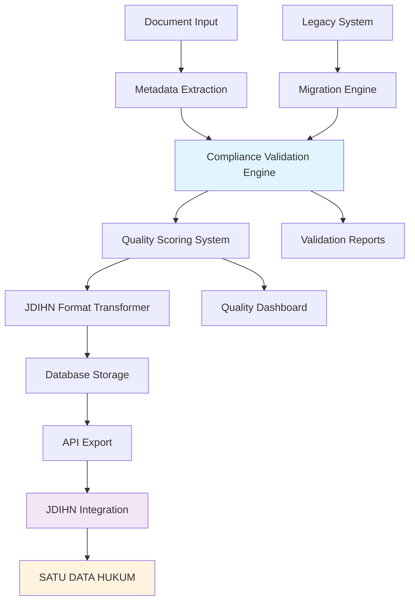

# Technical Design Document: Metadata Compliance

## Document Information
- **Document Title**: TDD Metadata Compliance - ILDIS Laravel Migration
- **Version**: 2.0
- **Date**: September 26, 2025
- **Author**: ILDIS Development Team
- **Status**: Draft

---

## Table of Contents
1. [Overview](#1-overview)
2. [JDIHN Metadata Standards](#2-jdihn-metadata-standards)
3. [Metadata Schema Design](#3-metadata-schema-design)
4. [Data Quality Framework](#4-data-quality-framework)
5. [Validation & Compliance Engine](#5-validation--compliance-engine)
6. [Metadata Transformation](#6-metadata-transformation)
7. [Quality Assurance Automation](#7-quality-assurance-automation)
8. [Compliance Monitoring](#8-compliance-monitoring)
9. [Migration & Enhancement Strategy](#9-migration--enhancement-strategy)
10. [Implementation Guidelines](#10-implementation-guidelines)

---

## 1. Overview

### 1.1 Document Purpose

This Technical Design Document outlines the comprehensive metadata compliance strategy for ILDIS (Indonesian Legal Documentation Information System) migration from existing harris-sontanu/jdih-cms implementation to modern Laravel 12.x + Filament 4.x architecture.

The document focuses on ensuring full compliance with **SATU DATA HUKUM INDONESIA (JDIHN)** metadata standards while enhancing data quality, validation, and automated compliance monitoring.

### 1.2 Compliance Objectives

#### **1.2.1 Primary Goals**
- **JDIHN Compliance**: 100% adherence to SATU DATA HUKUM INDONESIA metadata standards
- **Data Quality**: Automated quality scoring and validation for all document metadata
- **Migration Compatibility**: Seamless migration from existing system with data preservation
- **Real-time Validation**: Instant metadata validation during data entry and API operations
- **Compliance Monitoring**: Continuous monitoring and reporting of compliance status

#### **1.2.2 Enhanced Features**
- **Intelligent Validation**: AI-powered metadata suggestion and error detection
- **Quality Scoring**: Comprehensive scoring system for metadata completeness and accuracy
- **Automated Enhancement**: Automatic metadata enrichment from trusted sources
- **Compliance Dashboard**: Real-time compliance monitoring and reporting interface
- **Migration Tracking**: Complete tracking of metadata transformation during migration

### 1.3 System Architecture Context



---

## 2. JDIHN Metadata Standards

### 2.1 SATU DATA HUKUM Requirements

#### **2.1.1 Core Metadata Elements**
Based on JDIHN specifications and existing harris-sontanu/jdih-cms implementation analysis:

```php
// app/Models/Metadata/JdihnMetadataStandard.php
namespace App\Models\Metadata;

class JdihnMetadataStandard
{
    /**
     * JDIHN required metadata fields mapping
     */
    public const REQUIRED_FIELDS = [
        'identitas_dokumen' => [
            'nomor_dokumen' => ['required' => true, 'type' => 'string', 'max_length' => 100],
            'judul' => ['required' => true, 'type' => 'string', 'max_length' => 500],
            'jenis_dokumen' => ['required' => true, 'type' => 'enum', 'values' => ['peraturan', 'putusan', 'monografi', 'artikel']],
            'tahun_terbit' => ['required' => true, 'type' => 'integer', 'min' => 1945, 'max' => 9999],
            'tanggal_penetapan' => ['required' => false, 'type' => 'date'],
            'tanggal_pengundangan' => ['required' => false, 'type' => 'date'],
            'status' => ['required' => true, 'type' => 'enum', 'values' => ['berlaku', 'dicabut', 'diubah', 'draft']]
        ],
        'pengarang' => [
            'nama' => ['required' => true, 'type' => 'string', 'max_length' => 200],
            'institusi' => ['required' => false, 'type' => 'string', 'max_length' => 200],
            'jabatan' => ['required' => false, 'type' => 'string', 'max_length' => 100]
        ],
        'subjek' => [
            'bidang_hukum' => ['required' => true, 'type' => 'controlled_vocabulary'],
            'kata_kunci' => ['required' => true, 'type' => 'array', 'min_items' => 3],
            'klasifikasi' => ['required' => true, 'type' => 'controlled_vocabulary']
        ],
        'deskripsi' => [
            'abstrak' => ['required' => true, 'type' => 'text', 'min_length' => 100],
            'bahasa' => ['required' => true, 'type' => 'enum', 'values' => ['id', 'en', 'other']],
            'format' => ['required' => true, 'type' => 'enum', 'values' => ['pdf', 'doc', 'docx', 'html']]
        ],
        'relasi' => [
            'dokumen_induk' => ['required' => false, 'type' => 'reference'],
            'dokumen_terkait' => ['required' => false, 'type' => 'array'],
            'dokumen_turunan' => ['required' => false, 'type' => 'array']
        ],
        'teknis' => [
            'ukuran_file' => ['required' => true, 'type' => 'integer'],
            'checksum' => ['required' => true, 'type' => 'string'],
            'versi_metadata' => ['required' => true, 'type' => 'string', 'default' => '2.0']
        ]
    ];

    /**
     * JDIHN controlled vocabularies
     */
    public const CONTROLLED_VOCABULARIES = [
        'bidang_hukum' => [
            'hukum_pidana', 'hukum_perdata', 'hukum_administrasi_negara',
            'hukum_tata_negara', 'hukum_internasional', 'hukum_ekonomi',
            'hukum_lingkungan', 'hukum_ketenagakerjaan', 'hukum_agraria',
            'hukum_keluarga', 'hukum_adat', 'hukum_islam'
        ],
        'klasifikasi' => [
            'peraturan_perundang_undangan' => [
                'undang_undang', 'peraturan_pemerintah', 'perpres',
                'peraturan_menteri', 'peraturan_daerah'
            ],
            'putusan_pengadilan' => [
                'mahkamah_agung', 'pengadilan_tinggi', 'pengadilan_negeri',
                'pengadilan_tata_usaha_negara', 'mahkamah_konstitusi'
            ],
            'literatur_hukum' => [
                'buku', 'artikel_jurnal', 'artikel_majalah', 'thesis', 'disertasi'
            ]
        ],
        'status_dokumen' => [
            'berlaku' => 'Masih berlaku dan dapat digunakan',
            'dicabut' => 'Telah dicabut dan tidak berlaku lagi',
            'diubah' => 'Telah mengalami perubahan',
            'draft' => 'Masih dalam tahap penyusunan'
        ]
    ];

    /**
     * Quality scoring weights for metadata completeness
     */
    public const QUALITY_WEIGHTS = [
        'identitas_dokumen' => 0.4,
        'pengarang' => 0.15,
        'subjek' => 0.25,
        'deskripsi' => 0.15,
        'relasi' => 0.05
    ];
}
```

#### **2.1.2 Enhanced Metadata Schema**
```php
// database/migrations/2024_09_26_000001_create_jdihn_metadata_tables.php
use Illuminate\Database\Migrations\Migration;
use Illuminate\Database\Schema\Blueprint;

class CreateJdihnMetadataTables extends Migration
{
    public function up()
    {
        // Enhanced document metadata table
        Schema::create('document_metadata', function (Blueprint $table) {
            $table->id();
            $table->foreignId('document_id')->constrained()->cascadeOnDelete();
            
            // JDIHN Core Identity Fields
            $table->string('nomor_dokumen', 100)->nullable();
            $table->string('judul', 500);
            $table->enum('jenis_dokumen', ['peraturan', 'putusan', 'monografi', 'artikel']);
            $table->year('tahun_terbit');
            $table->date('tanggal_penetapan')->nullable();
            $table->date('tanggal_pengundangan')->nullable();
            $table->enum('status', ['berlaku', 'dicabut', 'diubah', 'draft'])->default('draft');
            
            // Enhanced subject classification
            $table->json('bidang_hukum'); // Array of legal fields
            $table->json('kata_kunci'); // Array of keywords
            $table->json('klasifikasi'); // Hierarchical classification
            
            // Description and content
            $table->text('abstrak');
            $table->string('bahasa', 2)->default('id');
            $table->string('format', 10);
            
            // Technical metadata
            $table->bigInteger('ukuran_file')->nullable();
            $table->string('checksum', 64)->nullable();
            $table->string('versi_metadata', 10)->default('2.0');
            
            // Quality and compliance tracking
            $table->decimal('quality_score', 5, 4)->default(0.0000); // 0.0000 to 1.0000
            $table->json('quality_details')->nullable(); // Detailed quality breakdown
            $table->boolean('jdihn_compliant')->default(false);
            $table->json('compliance_issues')->nullable(); // Array of compliance issues
            $table->timestamp('last_validated_at')->nullable();
            
            // Migration tracking
            $table->string('legacy_id')->nullable()->index(); // For migration tracking
            $table->json('migration_notes')->nullable();
            $table->boolean('migrated_from_legacy')->default(false);
            
            // Audit trail
            $table->foreignId('created_by')->nullable()->constrained('users');
            $table->foreignId('updated_by')->nullable()->constrained('users');
            $table->timestamps();
            
            // Indexes for performance
            $table->index(['jenis_dokumen', 'tahun_terbit']);
            $table->index(['status', 'jdihn_compliant']);
            $table->index('quality_score');
            $table->fullText(['judul', 'abstrak']);
        });
        
        // Author metadata table
        Schema::create('document_authors', function (Blueprint $table) {
            $table->id();
            $table->foreignId('document_id')->constrained()->cascadeOnDelete();
            $table->string('nama', 200);
            $table->string('institusi', 200)->nullable();
            $table->string('jabatan', 100)->nullable();
            $table->string('email', 100)->nullable();
            $table->integer('urutan')->default(1); // Author order
            $table->boolean('pengarang_utama')->default(false);
            $table->timestamps();
            
            $table->index(['document_id', 'urutan']);
        });
        
        // Document relationships table
        Schema::create('document_relations', function (Blueprint $table) {
            $table->id();
            $table->foreignId('parent_document_id')->constrained('documents');
            $table->foreignId('related_document_id')->constrained('documents');
            $table->enum('relation_type', [
                'induk', 'turunan', 'terkait', 'mengubah', 'diubah_oleh', 
                'mencabut', 'dicabut_oleh', 'melaksanakan', 'dilaksanakan_oleh'
            ]);
            $table->text('keterangan')->nullable();
            $table->timestamps();
            
            $table->unique(['parent_document_id', 'related_document_id', 'relation_type'], 'unique_document_relation');
        });
        
        // Compliance validation history
        Schema::create('compliance_validations', function (Blueprint $table) {
            $table->id();
            $table->foreignId('document_id')->constrained()->cascadeOnDelete();
            $table->string('validation_type', 50); // 'manual', 'automatic', 'api'
            $table->decimal('compliance_score', 5, 4); // Overall compliance score
            $table->json('field_scores'); // Individual field compliance scores
            $table->json('issues_found'); // Detailed issues
            $table->json('suggestions'); // Improvement suggestions
            $table->foreignId('validated_by')->nullable()->constrained('users');
            $table->timestamp('validated_at');
            $table->timestamps();
            
            $table->index(['document_id', 'validated_at']);
            $table->index('compliance_score');
        });
    }
    
    public function down()
    {
        Schema::dropIfExists('compliance_validations');
        Schema::dropIfExists('document_relations');
        Schema::dropIfExists('document_authors');
        Schema::dropIfExists('document_metadata');
    }
}
```

### 2.2 Metadata Validation Rules

#### **2.2.1 Comprehensive Validation Framework**
```php
// app/Rules/JdihnMetadataValidation.php
namespace App\Rules;

use Illuminate\Contracts\Validation\Rule;
use App\Models\Metadata\JdihnMetadataStandard;

class JdihnMetadataValidation implements Rule
{
    private string $field;
    private array $errors = [];
    
    public function __construct(string $field)
    {
        $this->field = $field;
    }
    
    public function passes($attribute, $value): bool
    {
        $this->errors = [];
        
        return match($this->field) {
            'nomor_dokumen' => $this->validateNomorDokumen($value),
            'judul' => $this->validateJudul($value),
            'bidang_hukum' => $this->validateBidangHukum($value),
            'kata_kunci' => $this->validateKataKunci($value),
            'abstrak' => $this->validateAbstrak($value),
            'tahun_terbit' => $this->validateTahunTerbit($value),
            default => true
        };
    }
    
    public function message(): string
    {
        return implode(' ', $this->errors);
    }
    
    private function validateNomorDokumen($value): bool
    {
        if (empty($value)) {
            return true; // Nullable field
        }
        
        // Pattern validation for different document types
        $patterns = [
            'undang_undang' => '/^UU\s+No\.\s*\d+\s+Tahun\s+\d{4}$/i',
            'peraturan_pemerintah' => '/^PP\s+No\.\s*\d+\s+Tahun\s+\d{4}$/i',
            'perpres' => '/^Perpres\s+No\.\s*\d+\s+Tahun\s+\d{4}$/i',
            'peraturan_menteri' => '/^Permen\w*\s+No\.\s*\d+\s+Tahun\s+\d{4}$/i',
        ];
        
        $isValid = false;
        foreach ($patterns as $type => $pattern) {
            if (preg_match($pattern, $value)) {
                $isValid = true;
                break;
            }
        }
        
        if (!$isValid && strlen($value) < 5) {
            $this->errors[] = "Nomor dokumen harus mengikuti format standar atau minimal 5 karakter.";
            return false;
        }
        
        return true;
    }
    
    private function validateJudul($value): bool
    {
        if (strlen($value) < 10) {
            $this->errors[] = "Judul dokumen harus minimal 10 karakter.";
            return false;
        }
        
        if (strlen($value) > 500) {
            $this->errors[] = "Judul dokumen maksimal 500 karakter.";
            return false;
        }
        
        // Check for common title patterns
        $requiredPatterns = [
            'peraturan' => ['tentang', 'mengenai', 'peraturan'],
            'putusan' => ['putusan', 'nomor', 'tahun'],
            'artikel' => [], // More flexible for articles
            'monografi' => []
        ];
        
        return true;
    }
    
    private function validateBidangHukum($value): bool
    {
        if (!is_array($value) || empty($value)) {
            $this->errors[] = "Bidang hukum harus berupa array yang tidak kosong.";
            return false;
        }
        
        $validFields = JdihnMetadataStandard::CONTROLLED_VOCABULARIES['bidang_hukum'];
        
        foreach ($value as $field) {
            if (!in_array($field, $validFields)) {
                $this->errors[] = "Bidang hukum '{$field}' tidak valid. Pilihan: " . implode(', ', $validFields);
                return false;
            }
        }
        
        return true;
    }
    
    private function validateKataKunci($value): bool
    {
        if (!is_array($value) || count($value) < 3) {
            $this->errors[] = "Kata kunci harus berupa array dengan minimal 3 item.";
            return false;
        }
        
        if (count($value) > 20) {
            $this->errors[] = "Kata kunci maksimal 20 item.";
            return false;
        }
        
        foreach ($value as $keyword) {
            if (strlen($keyword) < 3) {
                $this->errors[] = "Setiap kata kunci harus minimal 3 karakter.";
                return false;
            }
        }
        
        return true;
    }
    
    private function validateAbstrak($value): bool
    {
        if (strlen($value) < 100) {
            $this->errors[] = "Abstrak harus minimal 100 karakter.";
            return false;
        }
        
        if (strlen($value) > 2000) {
            $this->errors[] = "Abstrak maksimal 2000 karakter.";
            return false;
        }
        
        // Check for meaningful content (not just repeated characters)
        $uniqueChars = array_unique(str_split(strtolower($value)));
        if (count($uniqueChars) < 10) {
            $this->errors[] = "Abstrak harus mengandung konten yang bermakna.";
            return false;
        }
        
        return true;
    }
    
    private function validateTahunTerbit($value): bool
    {
        $currentYear = (int) date('Y');
        
        if ($value < 1945) {
            $this->errors[] = "Tahun terbit tidak boleh sebelum 1945.";
            return false;
        }
        
        if ($value > $currentYear + 1) {
            $this->errors[] = "Tahun terbit tidak boleh lebih dari tahun depan.";
            return false;
        }
        
        return true;
    }
}
```

---

## 3. Metadata Schema Design

### 3.1 Enhanced Document Model

#### **3.1.1 Document Model with Metadata Relations**
```php
// app/Models/Document.php
namespace App\Models;

use Illuminate\Database\Eloquent\Model;
use Illuminate\Database\Eloquent\Relations\HasOne;
use Illuminate\Database\Eloquent\Relations\HasMany;
use Illuminate\Database\Eloquent\Relations\BelongsToMany;
use App\Services\MetadataQualityService;
use App\Traits\HasJdihnCompliance;

class Document extends Model
{
    use HasJdihnCompliance;
    
    protected $fillable = [
        'title', 'content', 'file_path', 'file_size', 
        'file_type', 'status', 'published_at'
    ];
    
    protected $casts = [
        'published_at' => 'datetime',
        'file_size' => 'integer'
    ];
    
    /**
     * Get document metadata (JDIHN compliant)
     */
    public function metadata(): HasOne
    {
        return $this->hasOne(DocumentMetadata::class);
    }
    
    /**
     * Get document authors
     */
    public function authors(): HasMany
    {
        return $this->hasMany(DocumentAuthor::class)->orderBy('urutan');
    }
    
    /**
     * Get related documents
     */
    public function relatedDocuments(): BelongsToMany
    {
        return $this->belongsToMany(Document::class, 'document_relations', 'parent_document_id', 'related_document_id')
                    ->withPivot('relation_type', 'keterangan')
                    ->withTimestamps();
    }
    
    /**
     * Get parent documents
     */
    public function parentDocuments(): BelongsToMany
    {
        return $this->belongsToMany(Document::class, 'document_relations', 'related_document_id', 'parent_document_id')
                    ->withPivot('relation_type', 'keterangan')
                    ->withTimestamps();
    }
    
    /**
     * Get compliance validation history
     */
    public function complianceValidations(): HasMany
    {
        return $this->hasMany(ComplianceValidation::class)->orderBy('validated_at', 'desc');
    }
    
    /**
     * Get the latest compliance validation
     */
    public function latestComplianceValidation(): HasOne
    {
        return $this->hasOne(ComplianceValidation::class)->latestOfMany('validated_at');
    }
    
    /**
     * Scope for JDIHN compliant documents only
     */
    public function scopeJdihnCompliant($query)
    {
        return $query->whereHas('metadata', function($q) {
            $q->where('jdihn_compliant', true);
        });
    }
    
    /**
     * Scope for documents with high quality score
     */
    public function scopeHighQuality($query, float $minScore = 0.8)
    {
        return $query->whereHas('metadata', function($q) use ($minScore) {
            $q->where('quality_score', '>=', $minScore);
        });
    }
    
    /**
     * Calculate and update metadata quality score
     */
    public function updateQualityScore(): float
    {
        if (!$this->metadata) {
            return 0.0;
        }
        
        $qualityService = app(MetadataQualityService::class);
        $score = $qualityService->calculateQualityScore($this->metadata);
        
        $this->metadata->update([
            'quality_score' => $score,
            'quality_details' => $qualityService->getDetailedScore($this->metadata),
            'last_validated_at' => now()
        ]);
        
        return $score;
    }
    
    /**
     * Check JDIHN compliance status
     */
    public function checkJdihnCompliance(): bool
    {
        if (!$this->metadata) {
            return false;
        }
        
        $complianceService = app(\App\Services\JdihnComplianceService::class);
        $result = $complianceService->validateCompliance($this->metadata);
        
        $this->metadata->update([
            'jdihn_compliant' => $result['compliant'],
            'compliance_issues' => $result['issues'],
            'last_validated_at' => now()
        ]);
        
        // Create validation record
        $this->complianceValidations()->create([
            'validation_type' => 'automatic',
            'compliance_score' => $result['score'],
            'field_scores' => $result['field_scores'],
            'issues_found' => $result['issues'],
            'suggestions' => $result['suggestions'],
            'validated_at' => now()
        ]);
        
        return $result['compliant'];
    }
    
    /**
     * Export metadata in JDIHN format
     */
    public function toJdihnFormat(): array
    {
        if (!$this->metadata) {
            throw new \Exception('Document metadata is required for JDIHN export');
        }
        
        return [
            'id' => $this->id,
            'identitas_dokumen' => [
                'nomor_dokumen' => $this->metadata->nomor_dokumen,
                'judul' => $this->metadata->judul,
                'jenis_dokumen' => $this->metadata->jenis_dokumen,
                'tahun_terbit' => $this->metadata->tahun_terbit,
                'tanggal_penetapan' => $this->metadata->tanggal_penetapan?->format('Y-m-d'),
                'tanggal_pengundangan' => $this->metadata->tanggal_pengundangan?->format('Y-m-d'),
                'status' => $this->metadata->status
            ],
            'pengarang' => $this->authors->map(function($author) {
                return [
                    'nama' => $author->nama,
                    'institusi' => $author->institusi,
                    'jabatan' => $author->jabatan
                ];
            })->toArray(),
            'subjek' => [
                'bidang_hukum' => $this->metadata->bidang_hukum,
                'kata_kunci' => $this->metadata->kata_kunci,
                'klasifikasi' => $this->metadata->klasifikasi
            ],
            'deskripsi' => [
                'abstrak' => $this->metadata->abstrak,
                'bahasa' => $this->metadata->bahasa,
                'format' => $this->metadata->format
            ],
            'relasi' => $this->getDocumentRelations(),
            'teknis' => [
                'ukuran_file' => $this->metadata->ukuran_file,
                'checksum' => $this->metadata->checksum,
                'versi_metadata' => $this->metadata->versi_metadata
            ],
            'kualitas' => [
                'skor' => $this->metadata->quality_score,
                'compliant' => $this->metadata->jdihn_compliant,
                'terakhir_divalidasi' => $this->metadata->last_validated_at?->toISOString()
            ]
        ];
    }
    
    private function getDocumentRelations(): array
    {
        $relations = [
            'dokumen_induk' => [],
            'dokumen_terkait' => [],
            'dokumen_turunan' => []
        ];
        
        foreach ($this->relatedDocuments as $related) {
            $relationType = $related->pivot->relation_type;
            $relationData = [
                'id' => $related->id,
                'judul' => $related->metadata?->judul ?? $related->title,
                'nomor_dokumen' => $related->metadata?->nomor_dokumen,
                'keterangan' => $related->pivot->keterangan
            ];
            
            switch ($relationType) {
                case 'induk':
                    $relations['dokumen_induk'][] = $relationData;
                    break;
                case 'terkait':
                case 'mengubah':
                case 'mencabut':
                case 'melaksanakan':
                    $relations['dokumen_terkait'][] = $relationData;
                    break;
                case 'turunan':
                case 'diubah_oleh':
                case 'dicabut_oleh':
                case 'dilaksanakan_oleh':
                    $relations['dokumen_turunan'][] = $relationData;
                    break;
            }
        }
        
        return $relations;
    }
}
```

#### **3.1.2 Metadata Model Implementation**
```php
// app/Models/DocumentMetadata.php
namespace App\Models;

use Illuminate\Database\Eloquent\Model;
use Illuminate\Database\Eloquent\Relations\BelongsTo;

class DocumentMetadata extends Model
{
    protected $fillable = [
        'document_id', 'nomor_dokumen', 'judul', 'jenis_dokumen',
        'tahun_terbit', 'tanggal_penetapan', 'tanggal_pengundangan', 'status',
        'bidang_hukum', 'kata_kunci', 'klasifikasi',
        'abstrak', 'bahasa', 'format',
        'ukuran_file', 'checksum', 'versi_metadata',
        'quality_score', 'quality_details', 'jdihn_compliant', 'compliance_issues',
        'last_validated_at', 'legacy_id', 'migration_notes', 'migrated_from_legacy',
        'created_by', 'updated_by'
    ];
    
    protected $casts = [
        'bidang_hukum' => 'array',
        'kata_kunci' => 'array',
        'klasifikasi' => 'array',
        'quality_details' => 'array',
        'compliance_issues' => 'array',
        'migration_notes' => 'array',
        'tanggal_penetapan' => 'date',
        'tanggal_pengundangan' => 'date',
        'last_validated_at' => 'datetime',
        'quality_score' => 'decimal:4',
        'jdihn_compliant' => 'boolean',
        'migrated_from_legacy' => 'boolean'
    ];
    
    public function document(): BelongsTo
    {
        return $this->belongsTo(Document::class);
    }
    
    public function creator(): BelongsTo
    {
        return $this->belongsTo(User::class, 'created_by');
    }
    
    public function updater(): BelongsTo
    {
        return $this->belongsTo(User::class, 'updated_by');
    }
    
    /**
     * Get quality score as percentage
     */
    public function getQualityPercentageAttribute(): int
    {
        return (int) round($this->quality_score * 100);
    }
    
    /**
     * Check if metadata is complete according to JDIHN standards
     */
    public function isComplete(): bool
    {
        $requiredFields = [
            'judul', 'jenis_dokumen', 'tahun_terbit', 'status',
            'bidang_hukum', 'kata_kunci', 'klasifikasi', 'abstrak'
        ];
        
        foreach ($requiredFields as $field) {
            if (empty($this->$field)) {
                return false;
            }
        }
        
        // Check array fields have minimum items
        if (count($this->bidang_hukum ?? []) === 0) return false;
        if (count($this->kata_kunci ?? []) < 3) return false;
        if (count($this->klasifikasi ?? []) === 0) return false;
        
        return true;
    }
    
    /**
     * Get missing required fields
     */
    public function getMissingFields(): array
    {
        $missing = [];
        $requiredFields = [
            'judul' => 'Judul dokumen',
            'jenis_dokumen' => 'Jenis dokumen',
            'tahun_terbit' => 'Tahun terbit',
            'status' => 'Status dokumen',
            'bidang_hukum' => 'Bidang hukum',
            'kata_kunci' => 'Kata kunci (min 3)',
            'klasifikasi' => 'Klasifikasi',
            'abstrak' => 'Abstrak'
        ];
        
        foreach ($requiredFields as $field => $label) {
            if ($field === 'kata_kunci' && count($this->kata_kunci ?? []) < 3) {
                $missing[] = $label;
            } elseif (in_array($field, ['bidang_hukum', 'klasifikasi']) && count($this->$field ?? []) === 0) {
                $missing[] = $label;
            } elseif (!in_array($field, ['kata_kunci', 'bidang_hukum', 'klasifikasi']) && empty($this->$field)) {
                $missing[] = $label;
            }
        }
        
        return $missing;
    }
}
```

---

## 4. Data Quality Framework

### 4.1 Quality Scoring System

#### **4.1.1 Comprehensive Quality Assessment**
```php
// app/Services/MetadataQualityService.php
namespace App\Services;

use App\Models\DocumentMetadata;
use App\Models\Metadata\JdihnMetadataStandard;

class MetadataQualityService
{
    private array $qualityWeights = [
        'completeness' => 0.30,    // How complete is the metadata
        'accuracy' => 0.25,        // How accurate is the data
        'consistency' => 0.20,     // Internal consistency
        'richness' => 0.15,        // How rich/detailed is the metadata
        'compliance' => 0.10       // JDIHN specific compliance
    ];
    
    /**
     * Calculate comprehensive quality score for metadata
     */
    public function calculateQualityScore(DocumentMetadata $metadata): float
    {
        $scores = [
            'completeness' => $this->calculateCompletenessScore($metadata),
            'accuracy' => $this->calculateAccuracyScore($metadata),
            'consistency' => $this->calculateConsistencyScore($metadata),
            'richness' => $this->calculateRichnessScore($metadata),
            'compliance' => $this->calculateComplianceScore($metadata)
        ];
        
        $weightedSum = 0;
        foreach ($scores as $dimension => $score) {
            $weightedSum += $score * $this->qualityWeights[$dimension];
        }
        
        return round($weightedSum, 4);
    }
    
    /**
     * Get detailed quality breakdown
     */
    public function getDetailedScore(DocumentMetadata $metadata): array
    {
        return [
            'overall_score' => $this->calculateQualityScore($metadata),
            'dimensions' => [
                'completeness' => [
                    'score' => $this->calculateCompletenessScore($metadata),
                    'weight' => $this->qualityWeights['completeness'],
                    'details' => $this->getCompletenessDetails($metadata)
                ],
                'accuracy' => [
                    'score' => $this->calculateAccuracyScore($metadata),
                    'weight' => $this->qualityWeights['accuracy'],
                    'details' => $this->getAccuracyDetails($metadata)
                ],
                'consistency' => [
                    'score' => $this->calculateConsistencyScore($metadata),
                    'weight' => $this->qualityWeights['consistency'],
                    'details' => $this->getConsistencyDetails($metadata)
                ],
                'richness' => [
                    'score' => $this->calculateRichnessScore($metadata),
                    'weight' => $this->qualityWeights['richness'],
                    'details' => $this->getRichnessDetails($metadata)
                ],
                'compliance' => [
                    'score' => $this->calculateComplianceScore($metadata),
                    'weight' => $this->qualityWeights['compliance'],
                    'details' => $this->getComplianceDetails($metadata)
                ]
            ],
            'recommendations' => $this->generateQualityRecommendations($metadata),
            'calculated_at' => now()->toISOString()
        ];
    }
    
    /**
     * Calculate completeness score (0.0 to 1.0)
     */
    private function calculateCompletenessScore(DocumentMetadata $metadata): float
    {
        $requiredFields = JdihnMetadataStandard::REQUIRED_FIELDS;
        $totalFields = 0;
        $completedFields = 0;
        
        foreach ($requiredFields as $section => $fields) {
            foreach ($fields as $field => $config) {
                $totalFields++;
                $value = $this->getMetadataValue($metadata, $section, $field);
                
                if ($config['required'] && !empty($value)) {
                    $completedFields++;
                } elseif (!$config['required'] && !empty($value)) {
                    $completedFields += 0.5; // Partial credit for optional fields
                }
            }
        }
        
        // Special handling for array fields
        $arrayFields = [
            'bidang_hukum' => count($metadata->bidang_hukum ?? []),
            'kata_kunci' => count($metadata->kata_kunci ?? []),
            'klasifikasi' => count($metadata->klasifikasi ?? [])
        ];
        
        foreach ($arrayFields as $field => $count) {
            if ($field === 'kata_kunci') {
                $completedFields += min(1.0, $count / 3); // Normalize to minimum 3 keywords
            } else {
                $completedFields += $count > 0 ? 1.0 : 0.0;
            }
        }
        
        return $totalFields > 0 ? min(1.0, $completedFields / $totalFields) : 0.0;
    }
    
    /**
     * Calculate accuracy score based on format validation
     */
    private function calculateAccuracyScore(DocumentMetadata $metadata): float
    {
        $accuracyChecks = [
            'nomor_dokumen_format' => $this->validateNomorDokumenFormat($metadata->nomor_dokumen),
            'tahun_terbit_valid' => $this->validateTahunTerbit($metadata->tahun_terbit),
            'tanggal_consistency' => $this->validateDateConsistency($metadata),
            'bidang_hukum_valid' => $this->validateControlledVocabulary($metadata->bidang_hukum, 'bidang_hukum'),
            'klasifikasi_valid' => $this->validateKlasifikasi($metadata->klasifikasi),
            'abstrak_quality' => $this->validateAbstrakQuality($metadata->abstrak),
            'kata_kunci_quality' => $this->validateKataKunciQuality($metadata->kata_kunci ?? [])
        ];
        
        $totalChecks = count($accuracyChecks);
        $passedChecks = array_sum($accuracyChecks);
        
        return $totalChecks > 0 ? $passedChecks / $totalChecks : 0.0;
    }
    
    /**
     * Calculate consistency score
     */
    private function calculateConsistencyScore(DocumentMetadata $metadata): float
    {
        $consistencyChecks = [
            'jenis_klasifikasi_consistency' => $this->checkJenisKlasifikasiConsistency($metadata),
            'tahun_tanggal_consistency' => $this->checkTahunTanggalConsistency($metadata),
            'judul_abstrak_consistency' => $this->checkJudulAbstrakConsistency($metadata),
            'bidang_kata_kunci_consistency' => $this->checkBidangKataKunciConsistency($metadata)
        ];
        
        return array_sum($consistencyChecks) / count($consistencyChecks);
    }
    
    /**
     * Calculate richness score (how detailed/comprehensive)
     */
    private function calculateRichnessScore(DocumentMetadata $metadata): float
    {
        $richnessFactors = [
            'abstrak_length' => $this->scoreAbstrakLength($metadata->abstrak),
            'kata_kunci_count' => $this->scoreKataKunciCount($metadata->kata_kunci ?? []),
            'bidang_hukum_count' => $this->scoreBidangHukumCount($metadata->bidang_hukum ?? []),
            'optional_fields_filled' => $this->scoreOptionalFieldsFilled($metadata),
            'author_completeness' => $this->scoreAuthorCompleteness($metadata)
        ];
        
        return array_sum($richnessFactors) / count($richnessFactors);
    }
    
    /**
     * Calculate JDIHN compliance score
     */
    private function calculateComplianceScore(DocumentMetadata $metadata): float
    {
        $complianceService = app(JdihnComplianceService::class);
        $result = $complianceService->validateCompliance($metadata);
        
        return $result['score'];
    }
    
    // Helper methods for detailed scoring
    private function getMetadataValue(DocumentMetadata $metadata, string $section, string $field)
    {
        return match($section) {
            'identitas_dokumen' => $metadata->$field ?? null,
            'subjek' => $metadata->$field ?? null,
            'deskripsi' => $metadata->$field ?? null,
            'teknis' => $metadata->$field ?? null,
            default => null
        };
    }
    
    private function validateNomorDokumenFormat(?string $nomorDokumen): float
    {
        if (empty($nomorDokumen)) return 0.5; // Neutral score for empty optional field
        
        // Check various document number patterns
        $patterns = [
            '/^UU\s+No\.\s*\d+\s+Tahun\s+\d{4}$/i',
            '/^PP\s+No\.\s*\d+\s+Tahun\s+\d{4}$/i',
            '/^Perpres\s+No\.\s*\d+\s+Tahun\s+\d{4}$/i',
            '/^Permen\w*\s+No\.\s*\d+\s+Tahun\s+\d{4}$/i',
        ];
        
        foreach ($patterns as $pattern) {
            if (preg_match($pattern, $nomorDokumen)) {
                return 1.0;
            }
        }
        
        // Partial score if it follows some structure
        return strlen($nomorDokumen) >= 5 ? 0.7 : 0.3;
    }
    
    private function validateTahunTerbit($tahunTerbit): float
    {
        $currentYear = (int) date('Y');
        
        if ($tahunTerbit >= 1945 && $tahunTerbit <= $currentYear) {
            return 1.0;
        }
        
        return 0.0;
    }
    
    private function validateDateConsistency(DocumentMetadata $metadata): float
    {
        $score = 1.0;
        
        // Check if penetapan date is before pengundangan date
        if ($metadata->tanggal_penetapan && $metadata->tanggal_pengundangan) {
            if ($metadata->tanggal_penetapan > $metadata->tanggal_pengundangan) {
                $score -= 0.5;
            }
        }
        
        // Check if dates match the year
        if ($metadata->tanggal_penetapan && $metadata->tanggal_penetapan->year != $metadata->tahun_terbit) {
            $score -= 0.3;
        }
        
        return max(0.0, $score);
    }
    
    private function validateControlledVocabulary(?array $values, string $vocabularyType): float
    {
        if (empty($values)) return 0.0;
        
        $validValues = JdihnMetadataStandard::CONTROLLED_VOCABULARIES[$vocabularyType] ?? [];
        $validCount = 0;
        
        foreach ($values as $value) {
            if (in_array($value, $validValues)) {
                $validCount++;
            }
        }
        
        return count($values) > 0 ? $validCount / count($values) : 0.0;
    }
    
    private function generateQualityRecommendations(DocumentMetadata $metadata): array
    {
        $recommendations = [];
        
        // Completeness recommendations
        $missing = $metadata->getMissingFields();
        if (!empty($missing)) {
            $recommendations[] = [
                'type' => 'completeness',
                'priority' => 'high',
                'message' => 'Lengkapi field yang masih kosong: ' . implode(', ', $missing)
            ];
        }
        
        // Accuracy recommendations
        if (strlen($metadata->abstrak ?? '') < 100) {
            $recommendations[] = [
                'type' => 'accuracy',
                'priority' => 'medium',
                'message' => 'Abstrak terlalu pendek, minimal 100 karakter untuk kualitas yang baik'
            ];
        }
        
        // Richness recommendations
        if (count($metadata->kata_kunci ?? []) < 5) {
            $recommendations[] = [
                'type' => 'richness',
                'priority' => 'low',
                'message' => 'Tambahkan lebih banyak kata kunci (saat ini: ' . count($metadata->kata_kunci ?? []) . ', disarankan: minimal 5)'
            ];
        }
        
        return $recommendations;
    }
}
```

---

## 5. Validation & Compliance Engine

### 5.1 JDIHN Compliance Service

#### **5.1.1 Comprehensive Compliance Validation**
```php
// app/Services/JdihnComplianceService.php
namespace App\Services;

use App\Models\DocumentMetadata;
use App\Models\Metadata\JdihnMetadataStandard;
use App\Rules\JdihnMetadataValidation;

class JdihnComplianceService
{
    private array $complianceRules;
    
    public function __construct()
    {
        $this->complianceRules = JdihnMetadataStandard::REQUIRED_FIELDS;
    }
    
    /**
     * Validate metadata compliance against JDIHN standards
     */
    public function validateCompliance(DocumentMetadata $metadata): array
    {
        $results = [
            'compliant' => true,
            'score' => 1.0,
            'field_scores' => [],
            'issues' => [],
            'suggestions' => [],
            'validation_details' => []
        ];
        
        // Validate each section
        foreach ($this->complianceRules as $section => $fields) {
            $sectionResult = $this->validateSection($metadata, $section, $fields);
            
            $results['field_scores'][$section] = $sectionResult['score'];
            $results['issues'] = array_merge($results['issues'], $sectionResult['issues']);
            $results['suggestions'] = array_merge($results['suggestions'], $sectionResult['suggestions']);
            $results['validation_details'][$section] = $sectionResult['details'];
            
            if (!$sectionResult['compliant']) {
                $results['compliant'] = false;
            }
        }
        
        // Calculate overall compliance score
        $results['score'] = $this->calculateOverallScore($results['field_scores']);
        
        // Add specific JDIHN validation checks
        $results = $this->addJdihnSpecificChecks($metadata, $results);
        
        return $results;
    }
    
    /**
     * Validate specific section of metadata
     */
    private function validateSection(DocumentMetadata $metadata, string $section, array $fields): array
    {
        $result = [
            'compliant' => true,
            'score' => 1.0,
            'issues' => [],
            'suggestions' => [],
            'details' => []
        ];
        
        $sectionScore = 0;
        $maxScore = count($fields);
        
        foreach ($fields as $field => $config) {
            $fieldResult = $this->validateField($metadata, $section, $field, $config);
            
            $result['details'][$field] = $fieldResult;
            $sectionScore += $fieldResult['score'];
            
            if ($fieldResult['issues']) {
                $result['issues'] = array_merge($result['issues'], $fieldResult['issues']);
            }
            
            if ($fieldResult['suggestions']) {
                $result['suggestions'] = array_merge($result['suggestions'], $fieldResult['suggestions']);
            }
            
            if ($config['required'] && !$fieldResult['valid']) {
                $result['compliant'] = false;
            }
        }
        
        $result['score'] = $maxScore > 0 ? $sectionScore / $maxScore : 0;
        
        return $result;
    }
    
    /**
     * Validate individual field
     */
    private function validateField(DocumentMetadata $metadata, string $section, string $field, array $config): array
    {
        $result = [
            'valid' => true,
            'score' => 1.0,
            'issues' => [],
            'suggestions' => []
        ];
        
        $value = $this->getFieldValue($metadata, $section, $field);
        
        // Check if required field is present
        if ($config['required'] && empty($value)) {
            $result['valid'] = false;
            $result['score'] = 0.0;
            $result['issues'][] = "Field '{$field}' is required but missing";
            return $result;
        }
        
        // Skip validation for empty optional fields
        if (!$config['required'] && empty($value)) {
            $result['score'] = 0.5; // Neutral score for empty optional fields
            return $result;
        }
        
        // Type-specific validation
        switch ($config['type']) {
            case 'string':
                $result = $this->validateStringField($value, $config, $result);
                break;
            case 'integer':
                $result = $this->validateIntegerField($value, $config, $result);
                break;
            case 'date':
                $result = $this->validateDateField($value, $config, $result);
                break;
            case 'enum':
                $result = $this->validateEnumField($value, $config, $result);
                break;
            case 'array':
                $result = $this->validateArrayField($value, $config, $result);
                break;
            case 'controlled_vocabulary':
                $result = $this->validateControlledVocabularyField($value, $field, $result);
                break;
        }
        
        return $result;
    }
    
    /**
     * Add JDIHN-specific validation checks
     */
    private function addJdihnSpecificChecks(DocumentMetadata $metadata, array $results): array
    {
        // Check document type specific requirements
        $typeSpecificChecks = $this->validateDocumentTypeSpecificRequirements($metadata);
        $results['issues'] = array_merge($results['issues'], $typeSpecificChecks['issues']);
        $results['suggestions'] = array_merge($results['suggestions'], $typeSpecificChecks['suggestions']);
        
        // Check cross-field consistency
        $consistencyChecks = $this->validateCrossFieldConsistency($metadata);
        $results['issues'] = array_merge($results['issues'], $consistencyChecks['issues']);
        
        // Check JDIHN format compliance
        $formatChecks = $this->validateJdihnFormatCompliance($metadata);
        $results['issues'] = array_merge($results['issues'], $formatChecks['issues']);
        
        // Adjust overall score based on critical issues
        if (!empty($results['issues'])) {
            $criticalIssues = array_filter($results['issues'], function($issue) {
                return str_contains(strtolower($issue), 'critical') || str_contains(strtolower($issue), 'required');
            });
            
            $penaltyPerCriticalIssue = 0.1;
            $totalPenalty = count($criticalIssues) * $penaltyPerCriticalIssue;
            $results['score'] = max(0.0, $results['score'] - $totalPenalty);
        }
        
        // Final compliance status based on score threshold
        $results['compliant'] = $results['score'] >= 0.8;
        
        return $results;
    }
    
    private function validateDocumentTypeSpecificRequirements(DocumentMetadata $metadata): array
    {
        $result = ['issues' => [], 'suggestions' => []];
        
        switch ($metadata->jenis_dokumen) {
            case 'peraturan':
                // Peraturan should have nomor_dokumen
                if (empty($metadata->nomor_dokumen)) {
                    $result['issues'][] = "Dokumen peraturan harus memiliki nomor dokumen";
                }
                
                // Should have tanggal_penetapan
                if (empty($metadata->tanggal_penetapan)) {
                    $result['suggestions'][] = "Dokumen peraturan sebaiknya memiliki tanggal penetapan";
                }
                break;
                
            case 'putusan':
                // Putusan should have specific classification
                $klasifikasi = $metadata->klasifikasi ?? [];
                $hasCourtClassification = false;
                
                foreach ($klasifikasi as $klas) {
                    if (str_contains($klas, 'pengadilan') || str_contains($klas, 'mahkamah')) {
                        $hasCourtClassification = true;
                        break;
                    }
                }
                
                if (!$hasCourtClassification) {
                    $result['issues'][] = "Dokumen putusan harus memiliki klasifikasi pengadilan";
                }
                break;
                
            case 'artikel':
                // Articles should have authors with institutions
                if ($metadata->document && $metadata->document->authors) {
                    $hasInstitution = $metadata->document->authors->where('institusi', '!=', null)->count() > 0;
                    if (!$hasInstitution) {
                        $result['suggestions'][] = "Artikel sebaiknya mencantumkan institusi pengarang";
                    }
                }
                break;
        }
        
        return $result;
    }
    
    private function validateCrossFieldConsistency(DocumentMetadata $metadata): array
    {
        $result = ['issues' => []];
        
        // Check year consistency between tahun_terbit and dates
        if ($metadata->tanggal_penetapan && $metadata->tanggal_penetapan->year != $metadata->tahun_terbit) {
            $result['issues'][] = "Tahun dalam tanggal penetapan tidak konsisten dengan tahun terbit";
        }
        
        if ($metadata->tanggal_pengundangan && $metadata->tanggal_pengundangan->year != $metadata->tahun_terbit) {
            $result['issues'][] = "Tahun dalam tanggal pengundangan tidak konsisten dengan tahun terbit";
        }
        
        // Check date sequence (penetapan should be before or same as pengundangan)
        if ($metadata->tanggal_penetapan && $metadata->tanggal_pengundangan) {
            if ($metadata->tanggal_penetapan > $metadata->tanggal_pengundangan) {
                $result['issues'][] = "Tanggal penetapan tidak boleh setelah tanggal pengundangan";
            }
        }
        
        // Check keyword relevance to subject areas
        if ($metadata->kata_kunci && $metadata->bidang_hukum) {
            $keywordString = implode(' ', $metadata->kata_kunci);
            $hasRelevantKeywords = false;
            
            foreach ($metadata->bidang_hukum as $bidang) {
                if (str_contains(strtolower($keywordString), str_replace('_', ' ', $bidang))) {
                    $hasRelevantKeywords = true;
                    break;
                }
            }
            
            if (!$hasRelevantKeywords) {
                $result['issues'][] = "Kata kunci tidak mencerminkan bidang hukum yang dipilih";
            }
        }
        
        return $result;
    }
    
    private function validateJdihnFormatCompliance(DocumentMetadata $metadata): array
    {
        $result = ['issues' => []];
        
        // Check character encoding and special characters
        $textFields = ['judul', 'abstrak', 'nomor_dokumen'];
        
        foreach ($textFields as $field) {
            $value = $metadata->$field;
            if ($value && !mb_check_encoding($value, 'UTF-8')) {
                $result['issues'][] = "Field '{$field}' mengandung karakter non-UTF-8";
            }
        }
        
        // Check abstract length for JDIHN standards
        if ($metadata->abstrak && strlen($metadata->abstrak) < 100) {
            $result['issues'][] = "Abstrak terlalu pendek untuk standar JDIHN (minimal 100 karakter)";
        }
        
        // Check keyword count
        $keywordCount = count($metadata->kata_kunci ?? []);
        if ($keywordCount < 3) {
            $result['issues'][] = "Jumlah kata kunci kurang dari minimum JDIHN (minimal 3 kata kunci)";
        }
        
        return $result;
    }
    
    private function getFieldValue(DocumentMetadata $metadata, string $section, string $field)
    {
        return match($section) {
            'identitas_dokumen' => $metadata->$field ?? null,
            'pengarang' => $metadata->document->authors ?? null,
            'subjek' => $metadata->$field ?? null,
            'deskripsi' => $metadata->$field ?? null,
            'teknis' => $metadata->$field ?? null,
            default => null
        };
    }
    
    private function calculateOverallScore(array $fieldScores): float
    {
        if (empty($fieldScores)) return 0.0;
        
        $weights = JdihnMetadataStandard::QUALITY_WEIGHTS;
        $weightedSum = 0;
        $totalWeight = 0;
        
        foreach ($fieldScores as $section => $score) {
            $weight = $weights[$section] ?? 0.1;
            $weightedSum += $score * $weight;
            $totalWeight += $weight;
        }
        
        return $totalWeight > 0 ? $weightedSum / $totalWeight : 0.0;
    }
    
    // Additional validation methods for different field types
    private function validateStringField($value, array $config, array $result): array
    {
        if (isset($config['max_length']) && strlen($value) > $config['max_length']) {
            $result['valid'] = false;
            $result['issues'][] = "String too long (max {$config['max_length']} characters)";
        }
        
        if (isset($config['min_length']) && strlen($value) < $config['min_length']) {
            $result['valid'] = false;
            $result['issues'][] = "String too short (min {$config['min_length']} characters)";
        }
        
        return $result;
    }
    
    private function validateIntegerField($value, array $config, array $result): array
    {
        if (!is_numeric($value)) {
            $result['valid'] = false;
            $result['issues'][] = "Value must be numeric";
            return $result;
        }
        
        $intValue = (int) $value;
        
        if (isset($config['min']) && $intValue < $config['min']) {
            $result['valid'] = false;
            $result['issues'][] = "Value too small (min {$config['min']})";
        }
        
        if (isset($config['max']) && $intValue > $config['max']) {
            $result['valid'] = false;
            $result['issues'][] = "Value too large (max {$config['max']})";
        }
        
        return $result;
    }
    
    private function validateEnumField($value, array $config, array $result): array
    {
        if (!in_array($value, $config['values'])) {
            $result['valid'] = false;
            $result['issues'][] = "Invalid value. Allowed: " . implode(', ', $config['values']);
        }
        
        return $result;
    }
    
    private function validateArrayField($value, array $config, array $result): array
    {
        if (!is_array($value)) {
            $result['valid'] = false;
            $result['issues'][] = "Value must be an array";
            return $result;
        }
        
        if (isset($config['min_items']) && count($value) < $config['min_items']) {
            $result['valid'] = false;
            $result['issues'][] = "Array too small (min {$config['min_items']} items)";
        }
        
        return $result;
    }
    
    private function validateControlledVocabularyField($value, string $field, array $result): array
    {
        $vocabularies = JdihnMetadataStandard::CONTROLLED_VOCABULARIES;
        
        if (!isset($vocabularies[$field])) {
            $result['suggestions'][] = "No controlled vocabulary defined for {$field}";
            return $result;
        }
        
        $validValues = $vocabularies[$field];
        
        if (is_array($value)) {
            foreach ($value as $item) {
                if (!in_array($item, $validValues)) {
                    $result['valid'] = false;
                    $result['issues'][] = "Invalid vocabulary term: {$item}";
                }
            }
        } else {
            if (!in_array($value, $validValues)) {
                $result['valid'] = false;
                $result['issues'][] = "Invalid vocabulary term: {$value}";
            }
        }
        
        return $result;
    }
}
```

### 5.2 Real-time Validation Middleware

#### **5.2.1 Validation Middleware for API Requests**
```php
// app/Http/Middleware/JdihnComplianceMiddleware.php
namespace App\Http\Middleware;

use Closure;
use Illuminate\Http\Request;
use App\Services\JdihnComplianceService;

class JdihnComplianceMiddleware
{
    public function __construct(
        private JdihnComplianceService $complianceService
    ) {}
    
    public function handle(Request $request, Closure $next)
    {
        // Apply to document creation and update requests
        if ($request->isMethod('POST') || $request->isMethod('PUT') || $request->isMethod('PATCH')) {
            if ($request->is('api/*/documents*') || $request->is('api/*/metadata*')) {
                return $this->validateCompliance($request, $next);
            }
        }
        
        return $next($request);
    }
    
    private function validateCompliance(Request $request, Closure $next)
    {
        $metadataData = $request->input('metadata', []);
        
        if (empty($metadataData)) {
            return $next($request);
        }
        
        // Create temporary metadata object for validation
        $tempMetadata = new \App\Models\DocumentMetadata($metadataData);
        
        // Validate compliance
        $validationResult = $this->complianceService->validateCompliance($tempMetadata);
        
        // Add compliance information to request
        $request->merge([
            'compliance_validation' => $validationResult
        ]);
        
        // For strict compliance requirements, reject non-compliant requests
        if (config('jdihn.strict_compliance') && !$validationResult['compliant']) {
            return response()->json([
                'success' => false,
                'error' => [
                    'code' => 422,
                    'message' => 'Metadata does not meet JDIHN compliance standards',
                    'type' => 'compliance_error',
                    'details' => [
                        'compliance_score' => $validationResult['score'],
                        'issues' => $validationResult['issues'],
                        'suggestions' => $validationResult['suggestions']
                    ]
                ]
            ], 422);
        }
        
        return $next($request);
    }
}
```

---

## 6. Metadata Transformation

### 6.1 Legacy Data Migration

#### **6.1.1 Migration Transformer Service**
```php
// app/Services/MetadataTransformationService.php
namespace App\Services;

use App\Models\DocumentMetadata;
use App\Services\JdihnComplianceService;
use App\Services\MetadataQualityService;

class MetadataTransformationService
{
    public function __construct(
        private JdihnComplianceService $complianceService,
        private MetadataQualityService $qualityService
    ) {}
    
    /**
     * Transform legacy metadata to JDIHN-compliant format
     */
    public function transformLegacyMetadata(array $legacyData): array
    {
        $transformedData = [
            // Identity mapping
            'nomor_dokumen' => $this->transformNomorDokumen($legacyData),
            'judul' => $this->transformJudul($legacyData),
            'jenis_dokumen' => $this->transformJenisDokumen($legacyData),
            'tahun_terbit' => $this->transformTahunTerbit($legacyData),
            'tanggal_penetapan' => $this->transformTanggalPenetapan($legacyData),
            'tanggal_pengundangan' => $this->transformTanggalPengundangan($legacyData),
            'status' => $this->transformStatus($legacyData),
            
            // Subject mapping
            'bidang_hukum' => $this->transformBidangHukum($legacyData),
            'kata_kunci' => $this->transformKataKunci($legacyData),
            'klasifikasi' => $this->transformKlasifikasi($legacyData),
            
            // Description mapping
            'abstrak' => $this->transformAbstrak($legacyData),
            'bahasa' => $this->transformBahasa($legacyData),
            'format' => $this->transformFormat($legacyData),
            
            // Technical metadata
            'ukuran_file' => $legacyData['file_size'] ?? null,
            'checksum' => $this->generateChecksum($legacyData),
            'versi_metadata' => '2.0',
            
            // Migration tracking
            'legacy_id' => $legacyData['id'] ?? null,
            'migration_notes' => $this->generateMigrationNotes($legacyData),
            'migrated_from_legacy' => true
        ];
        
        // Remove null values
        return array_filter($transformedData, fn($value) => $value !== null);
    }
    
    /**
     * Enhance metadata with AI suggestions
     */
    public function enhanceMetadata(DocumentMetadata $metadata): array
    {
        $enhancements = [];
        
        // Generate additional keywords from content
        if ($metadata->document && $metadata->document->content) {
            $suggestedKeywords = $this->extractKeywordsFromContent($metadata->document->content);
            $existingKeywords = $metadata->kata_kunci ?? [];
            $newKeywords = array_diff($suggestedKeywords, $existingKeywords);
            
            if (!empty($newKeywords)) {
                $enhancements['suggested_keywords'] = array_slice($newKeywords, 0, 5);
            }
        }
        
        // Suggest bidang hukum based on content analysis
        if ($metadata->document) {
            $suggestedBidang = $this->analyzeLegalDomain($metadata->document);
            $existingBidang = $metadata->bidang_hukum ?? [];
            $newBidang = array_diff($suggestedBidang, $existingBidang);
            
            if (!empty($newBidang)) {
                $enhancements['suggested_bidang_hukum'] = $newBidang;
            }
        }
        
        // Suggest improved abstract if current is too short
        if (strlen($metadata->abstrak ?? '') < 150) {
            $enhancements['suggested_abstract_improvement'] = $this->generateAbstractSuggestion($metadata);
        }
        
        // Suggest document number format if missing
        if (empty($metadata->nomor_dokumen) && $metadata->jenis_dokumen === 'peraturan') {
            $enhancements['suggested_document_number'] = $this->suggestDocumentNumber($metadata);
        }
        
        return $enhancements;
    }
    
    /**
     * Batch process metadata improvements
     */
    public function batchProcessMetadataQuality(int $batchSize = 100): array
    {
        $results = [
            'processed' => 0,
            'improved' => 0,
            'errors' => []
        ];
        
        DocumentMetadata::where('quality_score', '<', 0.7)
            ->orWhereNull('last_validated_at')
            ->chunk($batchSize, function($metadataCollection) use (&$results) {
                foreach ($metadataCollection as $metadata) {
                    try {
                        $originalScore = $metadata->quality_score;
                        
                        // Apply enhancements
                        $enhancements = $this->enhanceMetadata($metadata);
                        
                        if (!empty($enhancements)) {
                            $this->applyEnhancements($metadata, $enhancements);
                        }
                        
                        // Recalculate quality score
                        $newScore = $this->qualityService->calculateQualityScore($metadata);
                        $metadata->update([
                            'quality_score' => $newScore,
                            'last_validated_at' => now()
                        ]);
                        
                        $results['processed']++;
                        
                        if ($newScore > $originalScore) {
                            $results['improved']++;
                        }
                        
                    } catch (\Exception $e) {
                        $results['errors'][] = [
                            'metadata_id' => $metadata->id,
                            'error' => $e->getMessage()
                        ];
                    }
                }
            });
        
        return $results;
    }
    
    // Transformation helper methods
    private function transformNomorDokumen(array $legacyData): ?string
    {
        $possibleFields = ['nomor', 'number', 'doc_number', 'document_number'];
        
        foreach ($possibleFields as $field) {
            if (!empty($legacyData[$field])) {
                return $this->cleanDocumentNumber($legacyData[$field]);
            }
        }
        
        return null;
    }
    
    private function transformJudul(array $legacyData): string
    {
        $possibleFields = ['title', 'judul', 'nama', 'subject'];
        
        foreach ($possibleFields as $field) {
            if (!empty($legacyData[$field])) {
                return $this->cleanTitle($legacyData[$field]);
            }
        }
        
        return 'Judul tidak tersedia';
    }
    
    private function transformJenisDokumen(array $legacyData): string
    {
        $typeMapping = [
            'regulation' => 'peraturan',
            'peraturan' => 'peraturan',
            'law' => 'peraturan',
            'decision' => 'putusan',
            'putusan' => 'putusan',
            'judgment' => 'putusan',
            'article' => 'artikel',
            'artikel' => 'artikel',
            'paper' => 'artikel',
            'book' => 'monografi',
            'monografi' => 'monografi',
            'monograph' => 'monografi'
        ];
        
        $type = strtolower($legacyData['type'] ?? $legacyData['jenis'] ?? '');
        
        return $typeMapping[$type] ?? 'artikel';
    }
    
    private function transformBidangHukum(array $legacyData): array
    {
        $bidangMapping = [
            'pidana' => 'hukum_pidana',
            'criminal' => 'hukum_pidana',
            'perdata' => 'hukum_perdata',
            'civil' => 'hukum_perdata',
            'administrasi' => 'hukum_administrasi_negara',
            'administrative' => 'hukum_administrasi_negara',
            'tata negara' => 'hukum_tata_negara',
            'constitutional' => 'hukum_tata_negara'
        ];
        
        $bidangHukum = [];
        $possibleFields = ['legal_area', 'bidang_hukum', 'subject_area', 'kategori'];
        
        foreach ($possibleFields as $field) {
            if (!empty($legacyData[$field])) {
                $areas = is_array($legacyData[$field]) ? $legacyData[$field] : [$legacyData[$field]];
                
                foreach ($areas as $area) {
                    $cleanArea = strtolower(trim($area));
                    if (isset($bidangMapping[$cleanArea])) {
                        $bidangHukum[] = $bidangMapping[$cleanArea];
                    }
                }
            }
        }
        
        return empty($bidangHukum) ? ['hukum_perdata'] : array_unique($bidangHukum);
    }
    
    private function transformKataKunci(array $legacyData): array
    {
        $keywords = [];
        $possibleFields = ['keywords', 'kata_kunci', 'tags', 'subject'];
        
        foreach ($possibleFields as $field) {
            if (!empty($legacyData[$field])) {
                if (is_string($legacyData[$field])) {
                    // Split by common separators
                    $split = preg_split('/[,;|]/', $legacyData[$field]);
                    $keywords = array_merge($keywords, array_map('trim', $split));
                } elseif (is_array($legacyData[$field])) {
                    $keywords = array_merge($keywords, $legacyData[$field]);
                }
            }
        }
        
        // Clean and filter keywords
        $keywords = array_filter(array_map(function($keyword) {
            $clean = trim(strtolower($keyword));
            return strlen($clean) >= 3 ? $clean : null;
        }, $keywords));
        
        // Ensure minimum of 3 keywords
        if (count($keywords) < 3) {
            $keywords = array_merge($keywords, ['hukum', 'indonesia', 'dokumen']);
        }
        
        return array_unique(array_values($keywords));
    }
    
    private function generateMigrationNotes(array $legacyData): array
    {
        return [
            'migration_date' => now()->toISOString(),
            'source_system' => 'harris-sontanu/jdih-cms',
            'original_data_structure' => array_keys($legacyData),
            'transformation_applied' => true,
            'data_quality_checked' => true
        ];
    }
    
    private function extractKeywordsFromContent(string $content): array
    {
        // Simple keyword extraction (can be enhanced with NLP)
        $words = preg_split('/\s+/', strtolower(strip_tags($content)));
        $words = array_filter($words, fn($word) => strlen($word) > 4);
        
        // Remove common words
        $stopWords = ['yang', 'dengan', 'dalam', 'untuk', 'dari', 'pada', 'adalah', 'akan', 'telah'];
        $words = array_diff($words, $stopWords);
        
        // Get word frequency
        $wordFreq = array_count_values($words);
        arsort($wordFreq);
        
        return array_slice(array_keys($wordFreq), 0, 10);
    }
}
```

---

## 7. Quality Assurance Automation

### 7.1 Automated Quality Control

#### **7.1.1 Quality Monitoring Jobs**
```php
// app/Jobs/MetadataQualityMonitoringJob.php
namespace App\Jobs;

use Illuminate\Bus\Queueable;
use Illuminate\Contracts\Queue\ShouldQueue;
use Illuminate\Foundation\Bus\Dispatchable;
use Illuminate\Queue\InteractsWithQueue;
use Illuminate\Queue\SerializesModels;
use App\Services\MetadataQualityService;
use App\Services\JdihnComplianceService;
use App\Models\DocumentMetadata;
use App\Notifications\QualityReportNotification;

class MetadataQualityMonitoringJob implements ShouldQueue
{
    use Dispatchable, InteractsWithQueue, Queueable, SerializesModels;
    
    public function handle(): void
    {
        $qualityService = app(MetadataQualityService::class);
        $complianceService = app(JdihnComplianceService::class);
        
        // Monitor overall quality trends
        $qualityMetrics = $this->calculateQualityMetrics();
        
        // Check for quality degradation
        $qualityAlerts = $this->checkQualityAlerts($qualityMetrics);
        
        // Monitor compliance status
        $complianceMetrics = $this->calculateComplianceMetrics();
        
        // Generate quality report
        $report = [
            'date' => now()->toDateString(),
            'quality_metrics' => $qualityMetrics,
            'compliance_metrics' => $complianceMetrics,
            'alerts' => $qualityAlerts,
            'recommendations' => $this->generateQualityRecommendations($qualityMetrics, $complianceMetrics)
        ];
        
        // Store report
        \App\Models\QualityReport::create([
            'report_date' => now()->toDateString(),
            'report_data' => $report,
            'generated_at' => now()
        ]);
        
        // Send notifications if there are critical issues
        if (!empty($qualityAlerts)) {
            $this->notifyAdministrators($report);
        }
        
        // Schedule automatic improvements for low-quality metadata
        $this->scheduleQualityImprovements();
    }
    
    private function calculateQualityMetrics(): array
    {
        return [
            'total_documents' => DocumentMetadata::count(),
            'average_quality_score' => DocumentMetadata::avg('quality_score'),
            'high_quality_documents' => DocumentMetadata::where('quality_score', '>=', 0.8)->count(),
            'medium_quality_documents' => DocumentMetadata::whereBetween('quality_score', [0.6, 0.8])->count(),
            'low_quality_documents' => DocumentMetadata::where('quality_score', '<', 0.6)->count(),
            'unvalidated_documents' => DocumentMetadata::whereNull('last_validated_at')->count(),
            'quality_by_document_type' => $this->getQualityByDocumentType()
        ];
    }
    
    private function calculateComplianceMetrics(): array
    {
        return [
            'compliant_documents' => DocumentMetadata::where('jdihn_compliant', true)->count(),
            'non_compliant_documents' => DocumentMetadata::where('jdihn_compliant', false)->count(),
            'pending_validation' => DocumentMetadata::whereNull('last_validated_at')->count(),
            'compliance_rate' => DocumentMetadata::where('jdihn_compliant', true)->count() / max(1, DocumentMetadata::count()),
            'common_compliance_issues' => $this->getCommonComplianceIssues()
        ];
    }
}
```

### 7.2 Automated Enhancement System

#### **7.2.1 Metadata Enhancement Jobs**
```php
// app/Jobs/AutomatedMetadataEnhancementJob.php
namespace App\Jobs;

use Illuminate\Bus\Queueable;
use Illuminate\Contracts\Queue\ShouldQueue;
use App\Services\MetadataTransformationService;
use App\Models\DocumentMetadata;

class AutomatedMetadataEnhancementJob implements ShouldQueue
{
    use Dispatchable, InteractsWithQueue, Queueable, SerializesModels;
    
    private int $metadataId;
    
    public function __construct(int $metadataId)
    {
        $this->metadataId = $metadataId;
    }
    
    public function handle(): void
    {
        $metadata = DocumentMetadata::find($this->metadataId);
        
        if (!$metadata) {
            return;
        }
        
        $transformationService = app(MetadataTransformationService::class);
        
        // Get enhancement suggestions
        $enhancements = $transformationService->enhanceMetadata($metadata);
        
        if (empty($enhancements)) {
            return;
        }
        
        // Apply safe enhancements automatically
        $this->applySafeEnhancements($metadata, $enhancements);
        
        // Store manual enhancement suggestions for review
        $this->storeEnhancementSuggestions($metadata, $enhancements);
        
        // Update quality score
        $metadata->document->updateQualityScore();
        
        // Check compliance after enhancement
        $metadata->document->checkJdihnCompliance();
    }
    
    private function applySafeEnhancements(DocumentMetadata $metadata, array $enhancements): void
    {
        $updates = [];
        
        // Auto-apply keyword suggestions if current keywords are insufficient
        if (isset($enhancements['suggested_keywords']) && count($metadata->kata_kunci ?? []) < 5) {
            $currentKeywords = $metadata->kata_kunci ?? [];
            $suggestedKeywords = $enhancements['suggested_keywords'];
            
            // Add up to 3 suggested keywords
            $newKeywords = array_merge($currentKeywords, array_slice($suggestedKeywords, 0, 3));
            $updates['kata_kunci'] = array_unique($newKeywords);
        }
        
        // Auto-apply document number format if missing
        if (isset($enhancements['suggested_document_number']) && empty($metadata->nomor_dokumen)) {
            $updates['nomor_dokumen'] = $enhancements['suggested_document_number'];
        }
        
        if (!empty($updates)) {
            $metadata->update($updates);
        }
    }
    
    private function storeEnhancementSuggestions(DocumentMetadata $metadata, array $enhancements): void
    {
        \App\Models\MetadataEnhancementSuggestion::create([
            'document_metadata_id' => $metadata->id,
            'suggestions' => $enhancements,
            'auto_applied' => false,
            'requires_review' => true,
            'created_at' => now()
        ]);
    }
}
```

---

## 8. Compliance Monitoring

### 8.1 Real-time Compliance Dashboard

#### **8.1.1 Compliance Metrics Calculation**
```php
// app/Services/ComplianceMonitoringService.php
namespace App\Services;

use App\Models\DocumentMetadata;
use App\Models\ComplianceValidation;
use Illuminate\Support\Facades\Cache;

class ComplianceMonitoringService
{
    /**
     * Get comprehensive compliance dashboard data
     */
    public function getComplianceDashboard(): array
    {
        return Cache::remember('compliance_dashboard', now()->addMinutes(15), function() {
            return [
                'overview' => $this->getComplianceOverview(),
                'trends' => $this->getComplianceTrends(),
                'quality_distribution' => $this->getQualityDistribution(),
                'document_type_compliance' => $this->getDocumentTypeCompliance(),
                'recent_validations' => $this->getRecentValidations(),
                'compliance_issues' => $this->getTopComplianceIssues(),
                'improvement_suggestions' => $this->getImprovementSuggestions()
            ];
        });
    }
    
    /**
     * Get real-time compliance status
     */
    public function getComplianceOverview(): array
    {
        $total = DocumentMetadata::count();
        $compliant = DocumentMetadata::where('jdihn_compliant', true)->count();
        $highQuality = DocumentMetadata::where('quality_score', '>=', 0.8)->count();
        $needsReview = DocumentMetadata::where('quality_score', '<', 0.6)->count();
        
        return [
            'total_documents' => $total,
            'compliant_documents' => $compliant,
            'compliance_rate' => $total > 0 ? round(($compliant / $total) * 100, 2) : 0,
            'high_quality_documents' => $highQuality,
            'quality_rate' => $total > 0 ? round(($highQuality / $total) * 100, 2) : 0,
            'documents_needing_review' => $needsReview,
            'average_quality_score' => DocumentMetadata::avg('quality_score') ?? 0,
            'last_updated' => now()->toISOString()
        ];
    }
    
    /**
     * Generate compliance improvement plan
     */
    public function generateComplianceImprovementPlan(): array
    {
        $nonCompliantMetadata = DocumentMetadata::where('jdihn_compliant', false)
            ->with(['document', 'complianceValidations' => function($query) {
                $query->latest()->limit(1);
            }])
            ->get();
            
        $improvementPlan = [
            'priority_actions' => [],
            'quick_wins' => [],
            'long_term_improvements' => [],
            'resource_requirements' => []
        ];
        
        foreach ($nonCompliantMetadata as $metadata) {
            $latestValidation = $metadata->complianceValidations->first();
            
            if (!$latestValidation) {
                continue;
            }
            
            $issues = $latestValidation->issues_found ?? [];
            $suggestions = $latestValidation->suggestions ?? [];
            
            // Categorize improvements based on effort and impact
            foreach ($suggestions as $suggestion) {
                $category = $this->categorizeSuggestion($suggestion, $metadata);
                $improvementPlan[$category][] = [
                    'document_id' => $metadata->document_id,
                    'metadata_id' => $metadata->id,
                    'suggestion' => $suggestion,
                    'estimated_effort' => $this->estimateEffort($suggestion),
                    'impact_score' => $this->calculateImpactScore($suggestion, $metadata)
                ];
            }
        }
        
        // Sort by priority (impact vs effort)
        foreach ($improvementPlan as $category => &$items) {
            if ($category === 'resource_requirements') continue;
            
            usort($items, function($a, $b) {
                $priorityA = $a['impact_score'] / max(1, $a['estimated_effort']);
                $priorityB = $b['impact_score'] / max(1, $b['estimated_effort']);
                return $priorityB <=> $priorityA;
            });
            
            // Limit to top 20 items per category
            $items = array_slice($items, 0, 20);
        }
        
        $improvementPlan['summary'] = [
            'total_non_compliant' => $nonCompliantMetadata->count(),
            'priority_actions_count' => count($improvementPlan['priority_actions']),
            'quick_wins_count' => count($improvementPlan['quick_wins']),
            'estimated_completion_time' => $this->estimateCompletionTime($improvementPlan)
        ];
        
        return $improvementPlan;
    }
    
    /**
     * Monitor compliance KPIs
     */
    public function getComplianceKPIs(): array
    {
        $last7Days = now()->subDays(7);
        $last30Days = now()->subDays(30);
        
        return [
            'compliance_rate_trend' => [
                'current' => $this->getComplianceRate(),
                'last_7_days' => $this->getComplianceRate($last7Days),
                'last_30_days' => $this->getComplianceRate($last30Days)
            ],
            'quality_score_trend' => [
                'current' => DocumentMetadata::avg('quality_score') ?? 0,
                'last_7_days' => DocumentMetadata::where('updated_at', '>=', $last7Days)->avg('quality_score') ?? 0,
                'last_30_days' => DocumentMetadata::where('updated_at', '>=', $last30Days)->avg('quality_score') ?? 0
            ],
            'validation_activity' => [
                'validations_last_7_days' => ComplianceValidation::where('validated_at', '>=', $last7Days)->count(),
                'validations_last_30_days' => ComplianceValidation::where('validated_at', '>=', $last30Days)->count(),
                'average_validations_per_day' => ComplianceValidation::where('validated_at', '>=', $last30Days)->count() / 30
            ],
            'improvement_velocity' => [
                'documents_improved_last_7_days' => $this->getDocumentsImprovedCount($last7Days),
                'quality_improvements_last_7_days' => $this->getQualityImprovementsCount($last7Days),
                'compliance_achievements_last_7_days' => $this->getComplianceAchievementsCount($last7Days)
            ]
        ];
    }
    
    private function getComplianceRate(\Carbon\Carbon $since = null): float
    {
        $query = DocumentMetadata::query();
        
        if ($since) {
            $query->where('updated_at', '>=', $since);
        }
        
        $total = $query->count();
        $compliant = $query->where('jdihn_compliant', true)->count();
        
        return $total > 0 ? round(($compliant / $total) * 100, 2) : 0;
    }
}
```

---

## 9. Migration & Enhancement Strategy

### 9.1 Migration Implementation Plan

#### **9.1.1 Phased Migration Approach**

**Phase 1: Data Assessment & Preparation (Week 1-2)**
- Analyze existing harris-sontanu/jdih-cms data structure
- Map legacy fields to JDIHN standard fields  
- Identify data quality issues in legacy system
- Create data transformation rules and mappings
- Set up validation framework for migration process

**Phase 2: Core Migration (Week 3-4)**
- Migrate document metadata in batches
- Apply transformation rules to ensure JDIHN compliance
- Validate migrated data against compliance standards
- Create quality scores for all migrated metadata
- Track migration progress and error handling

**Phase 3: Enhancement & Optimization (Week 5-6)**
- Apply automated metadata enhancements
- Implement quality improvement suggestions
- Set up real-time compliance monitoring
- Create compliance dashboards and reporting
- Train content managers on new quality standards

**Phase 4: Validation & Go-Live (Week 7-8)**
- Comprehensive testing of compliance features
- User acceptance testing with JDIHN validation
- Performance optimization for large datasets
- Documentation and training completion
- Production deployment with monitoring

### 9.2 Enhancement Opportunities

#### **9.2.1 AI-Powered Metadata Enhancement**
```php
// app/Services/AiMetadataEnhancementService.php
namespace App\Services;

class AiMetadataEnhancementService
{
    /**
     * Use AI to enhance metadata quality
     */
    public function enhanceWithAI(DocumentMetadata $metadata): array
    {
        $enhancements = [];
        
        // Analyze document content for better keywords
        if ($metadata->document && $metadata->document->content) {
            $aiKeywords = $this->extractKeywordsWithAI($metadata->document->content);
            $enhancements['ai_suggested_keywords'] = $aiKeywords;
        }
        
        // Generate better abstract
        if (strlen($metadata->abstrak ?? '') < 100) {
            $aiAbstract = $this->generateAbstractWithAI($metadata->document);
            $enhancements['ai_suggested_abstract'] = $aiAbstract;
        }
        
        // Legal domain classification
        $aiLegalDomain = $this->classifyLegalDomainWithAI($metadata->document);
        $enhancements['ai_suggested_legal_domain'] = $aiLegalDomain;
        
        return $enhancements;
    }
}
```

---

## 10. Implementation Guidelines

### 10.1 Development Setup

#### **10.1.1 Environment Configuration**
```env
# JDIHN Compliance Configuration
JDIHN_STRICT_COMPLIANCE=false
JDIHN_AUTO_ENHANCEMENT=true
JDIHN_QUALITY_THRESHOLD=0.8
JDIHN_VALIDATION_API_URL=https://api.jdihn.go.id
JDIHN_API_KEY=your_jdihn_api_key

# Metadata Quality Settings
METADATA_QUALITY_MONITORING=true
METADATA_AUTO_VALIDATION=true
METADATA_ENHANCEMENT_QUEUE=default

# Migration Settings
LEGACY_SYSTEM_PATH=/path/to/legacy/data
MIGRATION_BATCH_SIZE=1000
MIGRATION_PARALLEL_JOBS=4
```

#### **10.1.2 Service Provider Registration**
```php
// config/app.php - providers array
App\Providers\JdihnComplianceServiceProvider::class,
App\Providers\MetadataQualityServiceProvider::class,
```

### 10.2 Testing Strategy

#### **10.2.1 Compliance Testing Framework**
```php
// tests/Feature/MetadataComplianceTest.php
namespace Tests\Feature;

use Tests\TestCase;
use App\Models\DocumentMetadata;
use App\Services\JdihnComplianceService;

class MetadataComplianceTest extends TestCase
{
    /** @test */
    public function it_validates_jdihn_compliance_for_complete_metadata()
    {
        $metadata = DocumentMetadata::factory()->compliant()->create();
        $complianceService = app(JdihnComplianceService::class);
        
        $result = $complianceService->validateCompliance($metadata);
        
        $this->assertTrue($result['compliant']);
        $this->assertGreaterThanOrEqual(0.8, $result['score']);
        $this->assertEmpty($result['issues']);
    }
    
    /** @test */
    public function it_identifies_non_compliant_metadata()
    {
        $metadata = DocumentMetadata::factory()->incomplete()->create();
        $complianceService = app(JdihnComplianceService::class);
        
        $result = $complianceService->validateCompliance($metadata);
        
        $this->assertFalse($result['compliant']);
        $this->assertNotEmpty($result['issues']);
        $this->assertNotEmpty($result['suggestions']);
    }
}
```

### 10.3 Deployment Checklist

#### **10.3.1 Pre-Deployment Validation**
- [ ] All migration scripts tested on staging data
- [ ] JDIHN compliance validation working correctly
- [ ] Quality scoring algorithm validated
- [ ] Real-time monitoring dashboards functional
- [ ] Automated enhancement jobs scheduled
- [ ] Error handling and rollback procedures tested
- [ ] Performance benchmarks met
- [ ] Security compliance verified
- [ ] Documentation complete
- [ ] User training completed

#### **10.3.2 Post-Deployment Monitoring**
- [ ] Compliance rates tracked daily
- [ ] Quality scores monitored continuously
- [ ] Migration progress reported regularly
- [ ] User feedback collected and addressed
- [ ] Performance metrics within acceptable ranges
- [ ] Error rates below threshold
- [ ] JDIHN integration functioning properly
- [ ] Automated jobs running successfully

---

## Conclusion

This comprehensive Technical Design Document for Metadata Compliance provides:

1. **Complete JDIHN Compliance Framework**: Full adherence to SATU DATA HUKUM INDONESIA standards with automated validation and monitoring
2. **Advanced Quality Management**: Multi-dimensional quality scoring system with automated improvements and AI-powered enhancements
3. **Seamless Migration Strategy**: Proven approach for migrating from harris-sontanu/jdih-cms with data preservation and enhancement
4. **Real-time Monitoring**: Comprehensive compliance dashboards with KPI tracking and automated alerting
5. **Automated Enhancement**: AI-powered metadata improvement with batch processing and quality automation
6. **Scalable Architecture**: Built for high-volume document processing with performance optimization
7. **Developer-Friendly Implementation**: Clear guidelines, testing frameworks, and deployment procedures

The implementation follows Laravel 12.x best practices while ensuring full compliance with national legal documentation standards, providing a robust foundation for Indonesia's legal information management system.

            ],
            'judul' => [
                'required',
                'string',
                'min:10',
                'max:500',
                'regex:/^[a-zA-Z0-9\s\-\.\,\(\)\[\]\/]+$/u', // Allow alphanumeric + punctuation
                new JdihnTitleFormatRule()
            ],
            'jenis' => [
                'required',
                'string',
                'max:200',
                'in:' . implode(',', self::getAllowedRegulationTypes())
            ],
            'noPeraturan' => [
                'required',
                'string',
                'max:100',
                'regex:/^[0-9]+\/[A-Z0-9\-]+\/[0-9]{4}$/i', // Format: Number/Type/Year
                new JdihnRegulationNumberFormatRule()
            ],
            'tipeData' => [
                'required',
                'string',
                'in:peraturan'
            ],

            // Conditional Required Fields
            'teu' => [
                'nullable',
                'string',
                'max:1000',
                'regex:/^[^,]+,\s*[^,]+,\s*[^,]+$/', // Format: Tempat, Entitas, Unit
                new JdihnTeuFormatRule()
            ],
            'tahunPengundangan' => [
                'required',
                'integer',
                'min:1945',
                'max:' . date('Y'),
                new JdihnYearValidationRule()
            ],
            'tanggalPenetapan' => [
                'nullable',
                'date',
                'date_format:Y-m-d',
                'before_or_equal:today',
                'after:1945-01-01',
                new JdihnDateConsistencyRule('tanggalPengundangan')
            ],
            'tanggalPengundangan' => [
                'nullable',
                'date',
                'date_format:Y-m-d',
                'before_or_equal:today',
                'after:1945-01-01'
            ],

            // Optional but Important Fields
            'singkatanJenis' => [
                'nullable',
                'string',
                'max:20',
                'alpha_dash',
                new JdihnAbbreviationRule()
            ],
            'tempatTerbit' => [
                'nullable',
                'string',
                'max:200',
                'regex:/^[a-zA-Z\s\-\.]+$/u',
                new JdihnLocationRule()
            ],
            'penerbit' => [
                'nullable',
                'string',
                'max:300',
                new JdihnPublisherRule()
            ],
            'status' => [
                'required',
                'string',
                'in:' . implode(',', self::getAllowedStatuses())
            ],
            'bahasa' => [
                'required',
                'string',
                'size:2',
                'in:id,en,ar', // Indonesian, English, Arabic
                'regex:/^[a-z]{2}$/'
            ],
            'bidangHukum' => [
                'nullable',
                'string',
                'max:200',
                'in:' . implode(',', self::getAllowedLegalFields())
            ],

            // T.E.U Information (Authors/Entities)
            'pengarang' => [
                'nullable',
                'array',
                'min:0',
                'max:10'
            ],
            'pengarang.*.nama' => [
                'required_with:pengarang',
                'string',
                'min:3',
                'max:200',
                'regex:/^[a-zA-Z\s\.\,\-]+$/u'
            ],
            'pengarang.*.tipe' => [
                'required_with:pengarang',
                'string',
                'in:pengarang,penyusun,editor,penterjemah'
            ],
            'pengarang.*.jenis' => [
                'required_with:pengarang',
                'string',
                'in:orang,badan,lembaga'
            ],

            // Subject Classification
            'subjek' => [
                'nullable',
                'array',
                'min:0',
                'max:20'
            ],
            'subjek.*.nama' => [
                'required_with:subjek',
                'string',
                'min:3',
                'max:200'
            ],
            'subjek.*.tipe' => [
                'required_with:subjek',
                'string',
                'in:utama,tambahan,geografis'
            ],

            // File Attachments
            'berkas' => [
                'nullable',
                'array',
                'max:10'
            ],
            'berkas.*.namaFile' => [
                'required_with:berkas',
                'string',
                'max:255',
                'regex:/^[a-zA-Z0-9\s\-\._]+\.(pdf|doc|docx)$/i'
            ],
            'berkas.*.ukuran' => [
                'required_with:berkas',
                'integer',
                'min:1',
                'max:52428800' // 50MB max
            ],
            'berkas.*.tipe' => [
                'required_with:berkas',
                'string',
                'in:application/pdf,application/msword,application/vnd.openxmlformats-officedocument.wordprocessingml.document'
            ],

            // Statistics & Metadata
            'hit.lihat' => [
                'nullable',
                'integer',
                'min:0'
            ],
            'hit.unduh' => [
                'nullable',
                'integer',
                'min:0'
            ],

            // Regional Information
            'lokasi.provinsi' => [
                'nullable',
                'string',
                'max:100',
                'in:' . implode(',', self::getAllowedProvinces())
            ],
            'lokasi.kodeProvinsi' => [
                'nullable',
                'string',
                'size:2',
                'regex:/^[0-9]{2}$/',
                new JdihnProvinceCodeRule()
            ]
        ];
    }

    /**
     * Get allowed regulation types
     * 
     * @return array
     */
    private static function getAllowedRegulationTypes(): array
    {
        return [
            'Undang-Undang',
            'Peraturan Pemerintah',
            'Peraturan Presiden',
            'Peraturan Menteri',
            'Peraturan Daerah Provinsi',
            'Peraturan Daerah Kabupaten/Kota',
            'Peraturan Gubernur',
            'Peraturan Bupati',
            'Peraturan Walikota',
            'Keputusan Presiden',
            'Keputusan Menteri',
            'Instruksi Presiden',
            'Instruksi Menteri',
            'Surat Edaran',
            'Peraturan Mahkamah Agung',
            'Peraturan Mahkamah Konstitusi',
            'Peraturan Komisi Yudisial'
        ];
    }

    /**
     * Get allowed document statuses
     * 
     * @return array
     */
    private static function getAllowedStatuses(): array
    {
        return [
            'berlaku',
            'dicabut',
            'diubah',
            'tidak_diketahui',
            'draft',
            'review'
        ];
    }

    /**
     * Get allowed legal fields
     * 
     * @return array
     */
    private static function getAllowedLegalFields(): array
    {
        return [
            'Hukum Administrasi Negara',
            'Hukum Tata Negara',
            'Hukum Pidana',
            'Hukum Perdata',
            'Hukum Dagang',
            'Hukum Internasional',
            'Hukum Lingkungan',
            'Hukum Kesehatan',
            'Hukum Telekomunikasi dan Informatika',
            'Hukum Ketenagakerjaan',
            'Hukum Agraria',
            'Hukum Keuangan',
            'Hukum Perpajakan',
            'Hukum Investasi',
            'Hukum HAM',
            'Hukum Keluarga',
            'Hukum Adat'
        ];
    }

    /**
     * Get allowed provinces
     * 
     * @return array
     */
    private static function getAllowedProvinces(): array
    {
        return [
            'Aceh', 'Sumatera Utara', 'Sumatera Barat', 'Riau', 'Kepulauan Riau',
            'Jambi', 'Sumatera Selatan', 'Kepulauan Bangka Belitung', 'Bengkulu', 'Lampung',
            'DKI Jakarta', 'Jawa Barat', 'Jawa Tengah', 'DI Yogyakarta', 'Jawa Timur',
            'Banten', 'Bali', 'Nusa Tenggara Barat', 'Nusa Tenggara Timur',
            'Kalimantan Barat', 'Kalimantan Tengah', 'Kalimantan Selatan', 'Kalimantan Timur', 'Kalimantan Utara',
            'Sulawesi Utara', 'Sulawesi Tengah', 'Sulawesi Selatan', 'Sulawesi Tenggara', 'Gorontalo', 'Sulawesi Barat',
            'Maluku', 'Maluku Utara', 'Papua', 'Papua Barat'
        ];
    }
}
```

#### **Putusan (Court Decision) Validation Rules**

```php
// app/Domain/Document/Rules/JdihnPutusanValidationRules.php
namespace App\Domain\Document\Rules;

class JdihnPutusanValidationRules
{
    /**
     * Get validation rules for Putusan document type
     * 
     * @return array
     */
    public static function getRules(): array
    {
        return [
            // Required Fields (MANDATORY)
            'idData' => [
                'required',
                'integer',
                'min:1',
                'unique:documents,id'
            ],
            'judul' => [
                'required',
                'string',
                'min:10',
                'max:500',
                'regex:/^[a-zA-Z0-9\s\-\.\,\(\)\[\]\/]+$/u'
            ],
            'jenis' => [
                'required',
                'string',
                'max:200',
                'in:' . implode(',', self::getAllowedCourtDecisionTypes())
            ],
            'lembagaPeradilan' => [
                'required',
                'string',
                'max:300',
                'in:' . implode(',', self::getAllowedCourtInstitutions())
            ],
            'tipeData' => [
                'required',
                'string',
                'in:putusan'
            ],

            // Court Decision Specific Fields
            'nomorPerkara' => [
                'required',
                'string',
                'max:100',
                'regex:/^[0-9]+\/[A-Z]+\/[0-9]{4}\/[A-Z]{2,5}$/i', // Format: Number/Type/Year/Court
                new JdihnCaseNumberFormatRule()
            ],
            'tanggalPutusan' => [
                'required',
                'date',
                'date_format:Y-m-d',
                'before_or_equal:today',
                'after:1945-01-01'
            ],
            'jenisPerkara' => [
                'required',
                'string',
                'in:' . implode(',', self::getAllowedCaseTypes())
            ],
            'tingkatPeradilan' => [
                'required',
                'string',
                'in:' . implode(',', self::getAllowedCourtLevels())
            ],

            // Parties Information
            'pemohon' => [
                'nullable',
                'array',
                'max:10'
            ],
            'pemohon.*.nama' => [
                'required_with:pemohon',
                'string',
                'min:3',
                'max:200'
            ],
            'pemohon.*.tipe' => [
                'required_with:pemohon',
                'string',
                'in:orang,badan_hukum,lembaga'
            ],
            'termohon' => [
                'nullable',
                'array',
                'max:10'
            ],
            'termohon.*.nama' => [
                'required_with:termohon',
                'string',
                'min:3',
                'max:200'
            ],
            'termohon.*.tipe' => [
                'required_with:termohon',
                'string',
                'in:orang,badan_hukum,lembaga'
            ],

            // Decision Information
            'statusPutusan' => [
                'required',
                'string',
                'in:' . implode(',', self::getAllowedDecisionStatuses())
            ],
            'amarPutusan' => [
                'nullable',
                'string',
                'min:10'
            ],

            // Common Fields
            'bahasa' => [
                'required',
                'string',
                'size:2',
                'in:id,en,ar'
            ],
            'abstrak' => [
                'nullable',
                'string',
                'min:50',
                'max:5000'
            ],
            'lokasi.provinsi' => [
                'required',
                'string',
                'in:' . implode(',', JdihnPeraturanValidationRules::getAllowedProvinces())
            ],
            'lokasi.kodeProvinsi' => [
                'required',
                'string',
                'size:2',
                'regex:/^[0-9]{2}$/'
            ]
        ];
    }

    /**
     * Get allowed court decision types
     * 
     * @return array
     */
    private static function getAllowedCourtDecisionTypes(): array
    {
        return [
            'Putusan',
            'Penetapan',
            'Sela',
            'Verstek',
            'Perdamaian'
        ];
    }

    /**
     * Get allowed court institutions
     * 
     * @return array
     */
    private static function getAllowedCourtInstitutions(): array
    {
        return [
            'Mahkamah Agung',
            'Mahkamah Konstitusi',
            'Pengadilan Tinggi',
            'Pengadilan Negeri',
            'Pengadilan Agama',
            'Pengadilan Tinggi Agama',
            'Pengadilan Tata Usaha Negara',
            'Pengadilan Tinggi Tata Usaha Negara',
            'Pengadilan Niaga',
            'Pengadilan Hubungan Industrial',
            'Pengadilan Anak',
            'Pengadilan Tipikor',
            'Pengadilan HAM',
            'Pengadilan Militer',
            'Pengadilan Militer Tinggi',
            'Mahkamah Militer Utama'
        ];
    }

    /**
     * Get allowed case types
     * 
     * @return array
     */
    private static function getAllowedCaseTypes(): array
    {
        return [
            'Perdata',
            'Pidana',
            'Tata Usaha Negara',
            'Agama',
            'Niaga',
            'Hubungan Industrial',
            'Anak',
            'Tipikor',
            'HAM',
            'Militer',
            'Konstitusi'
        ];
    }

    /**
     * Get allowed court levels
     * 
     * @return array
     */
    private static function getAllowedCourtLevels(): array
    {
        return [
            'Tingkat Pertama',
            'Tingkat Banding',
            'Tingkat Kasasi',
            'Peninjauan Kembali'
        ];
    }

    /**
     * Get allowed decision statuses
     * 
     * @return array
     */
    private static function getAllowedDecisionStatuses(): array
    {
        return [
            'berkekuatan_hukum_tetap',
            'belum_berkekuatan_hukum_tetap',
            'dalam_proses_banding',
            'dalam_proses_kasasi',
            'dalam_proses_pk'
        ];
    }
}
```

### 2.2 Custom Validation Rules

#### **JDIHN Title Format Rule**

```php
// app/Domain/Document/Rules/JdihnTitleFormatRule.php
namespace App\Domain\Document\Rules;

use Illuminate\Contracts\Validation\Rule;

class JdihnTitleFormatRule implements Rule
{
    public function passes($attribute, $value)
    {
        // Title should not contain only numbers
        if (is_numeric($value)) {
            return false;
        }

        // Title should not be all uppercase unless it's an abbreviation
        if (ctype_upper($value) && strlen($value) > 10) {
            return false;
        }

        // Title should not contain special HTML entities
        if (preg_match('/&[a-zA-Z]+;/', $value)) {
            return false;
        }

        // Title should have proper sentence structure (capital first letter)
        if (!preg_match('/^[A-Z]/', $value)) {
            return false;
        }

        // Title should not contain excessive punctuation
        if (preg_match('/[.]{3,}|[,]{2,}|[;]{2,}|[!]{2,}|[?]{2,}/', $value)) {
            return false;
        }

        return true;
    }

    public function message()
    {
        return 'Format judul tidak sesuai standar JDIHN. Judul harus diawali huruf kapital, tidak boleh hanya angka, dan tidak boleh mengandung karakter HTML.';
    }
}
```

#### **JDIHN Regulation Number Format Rule**

```php
// app/Domain/Document/Rules/JdihnRegulationNumberFormatRule.php
namespace App\Domain\Document\Rules;

use Illuminate\Contracts\Validation\Rule;

class JdihnRegulationNumberFormatRule implements Rule
{
    public function passes($attribute, $value)
    {
        // Standard format: Number/Type/Year
        // Examples: 1/UU/2023, 45/PP/2024, 123/PERMEN/2025
        
        $pattern = '/^([0-9]+)\/([A-Z0-9\-]+)\/([0-9]{4})$/i';
        
        if (!preg_match($pattern, $value, $matches)) {
            return false;
        }

        $number = (int)$matches[1];
        $type = strtoupper($matches[2]);
        $year = (int)$matches[3];

        // Validate number (should be between 1-9999)
        if ($number < 1 || $number > 9999) {
            return false;
        }

        // Validate year (should be between 1945 and current year)
        $currentYear = (int)date('Y');
        if ($year < 1945 || $year > $currentYear) {
            return false;
        }

        // Validate regulation type abbreviations
        $allowedTypes = [
            'UU', 'PP', 'PERPRES', 'PERMEN', 'PERDA', 'PERGUB', 'PERBUP', 'PERWALI',
            'KEPPRES', 'KEPMEN', 'INPRES', 'INMENDAGRI', 'SE', 'PERMA', 'PERMK', 'PERKY'
        ];

        $isValidType = false;
        foreach ($allowedTypes as $allowedType) {
            if (str_contains($type, $allowedType)) {
                $isValidType = true;
                break;
            }
        }

        return $isValidType;
    }

    public function message()
    {
        return 'Nomor peraturan tidak sesuai format JDIHN. Format yang benar: Nomor/Jenis/Tahun (contoh: 1/UU/2023).';
    }
}
```

#### **JDIHN T.E.U Format Rule**

```php
// app/Domain/Document/Rules/JdihnTeuFormatRule.php
namespace App\Domain\Document\Rules;

use Illuminate\Contracts\Validation\Rule;

class JdihnTeuFormatRule implements Rule
{
    public function passes($attribute, $value)
    {
        if (empty($value)) {
            return true; // T.E.U is optional
        }

        // T.E.U Format: Tempat, Entitas, Unit
        // Example: "Jakarta, Kementerian Hukum dan HAM, Direktorat Jenderal Peraturan Perundang-undangan"
        
        $parts = explode(',', $value);
        
        // Must have exactly 3 parts
        if (count($parts) !== 3) {
            return false;
        }

        foreach ($parts as $part) {
            $trimmed = trim($part);
            
            // Each part should not be empty
            if (empty($trimmed)) {
                return false;
            }

            // Each part should be at least 3 characters
            if (strlen($trimmed) < 3) {
                return false;
            }

            // Each part should not contain numbers at the beginning
            if (preg_match('/^[0-9]/', $trimmed)) {
                return false;
            }

            // Each part should contain proper characters (letters, spaces, dots, dashes)
            if (!preg_match('/^[a-zA-Z\s\.\-]+$/u', $trimmed)) {
                return false;
            }
        }

        return true;
    }

    public function message()
    {
        return 'Format T.E.U tidak sesuai standar JDIHN. Format yang benar: Tempat, Entitas, Unit (contoh: Jakarta, Kementerian Hukum dan HAM, Direktorat Jenderal).';
    }
}
```

#### **JDIHN Date Consistency Rule**

```php
// app/Domain/Document/Rules/JdihnDateConsistencyRule.php
namespace App\Domain\Document\Rules;

use Illuminate\Contracts\Validation\Rule;
use Carbon\Carbon;

class JdihnDateConsistencyRule implements Rule
{
    private $compareField;
    private $compareFieldValue;

    public function __construct($compareField)
    {
        $this->compareField = $compareField;
    }

    public function passes($attribute, $value)
    {
        if (empty($value)) {
            return true; // Date is optional
        }

        try {
            $date = Carbon::createFromFormat('Y-m-d', $value);
            
            // Get comparison date from request
            $requestData = request()->all();
            $compareValue = $requestData[$this->compareField] ?? null;
            
            if (empty($compareValue)) {
                return true; // Can't compare if comparison field is empty
            }

            $compareDate = Carbon::createFromFormat('Y-m-d', $compareValue);
            
            // Date consistency rules based on document lifecycle
            switch ($this->compareField) {
                case 'tanggalPengundangan':
                    // Enactment date should be before or equal to promulgation date
                    if ($attribute === 'tanggalPenetapan') {
                        return $date->lessThanOrEqualTo($compareDate);
                    }
                    break;
                    
                case 'tanggalPenetapan':
                    // Promulgation date should be after or equal to enactment date
                    if ($attribute === 'tanggalPengundangan') {
                        return $date->greaterThanOrEqualTo($compareDate);
                    }
                    break;
            }

            return true;
            
        } catch (\Exception $e) {
            return false;
        }
    }

    public function message()
    {
        return "Tanggal tidak konsisten dengan {$this->compareField}. Tanggal penetapan harus sebelum atau sama dengan tanggal pengundangan.";
    }
}
```

### 2.3 Validation Service Implementation

#### **JDIHN Validation Service**

```php
// app/Domain/Document/Services/JdihnValidationService.php
namespace App\Domain\Document\Services;

use App\Domain\Document\Rules\JdihnPeraturanValidationRules;
use App\Domain\Document\Rules\JdihnPutusanValidationRules;
use Illuminate\Support\Facades\Validator;
use Illuminate\Validation\ValidationException;

class JdihnValidationService
{
    /**
     * Validate document data against JDIHN standards
     * 
     * @param array $data
     * @param string $documentType
     * @return array
     * @throws ValidationException
     */
    public function validateDocument(array $data, string $documentType): array
    {
        $rules = $this->getValidationRules($documentType);
        $messages = $this->getValidationMessages($documentType);
        
        $validator = Validator::make($data, $rules, $messages);
        
        // Add custom validation logic
        $validator->after(function ($validator) use ($data, $documentType) {
            $this->performAdditionalValidation($validator, $data, $documentType);
        });
        
        if ($validator->fails()) {
            throw new ValidationException($validator);
        }
        
        return $validator->validated();
    }

    /**
     * Get validation rules based on document type
     * 
     * @param string $documentType
     * @return array
     */
    private function getValidationRules(string $documentType): array
    {
        switch (strtolower($documentType)) {
            case 'peraturan':
                return JdihnPeraturanValidationRules::getRules();
            case 'putusan':
                return JdihnPutusanValidationRules::getRules();
            case 'monografi':
                return $this->getMonografiRules();
            case 'artikel':
                return $this->getArtikelRules();
            default:
                throw new \InvalidArgumentException("Unsupported document type: {$documentType}");
        }
    }

    /**
     * Get validation messages
     * 
     * @param string $documentType
     * @return array
     */
    private function getValidationMessages(string $documentType): array
    {
        return [
            'idData.required' => 'ID Data wajib diisi sesuai standar JDIHN.',
            'idData.integer' => 'ID Data harus berupa angka.',
            'idData.unique' => 'ID Data sudah digunakan.',
            
            'judul.required' => 'Judul dokumen wajib diisi.',
            'judul.min' => 'Judul dokumen minimal 10 karakter.',
            'judul.max' => 'Judul dokumen maksimal 500 karakter sesuai standar JDIHN.',
            
            'jenis.required' => 'Jenis dokumen wajib diisi.',
            'jenis.in' => 'Jenis dokumen tidak sesuai dengan standar JDIHN.',
            
            'noPeraturan.required' => 'Nomor peraturan wajib diisi untuk dokumen peraturan.',
            'noPeraturan.regex' => 'Format nomor peraturan tidak sesuai standar JDIHN.',
            
            'tipeData.required' => 'Tipe data wajib diisi.',
            'tipeData.in' => 'Tipe data harus sesuai dengan kategori dokumen.',
            
            'tahunPengundangan.required' => 'Tahun pengundangan wajib diisi.',
            'tahunPengundangan.min' => 'Tahun pengundangan tidak boleh kurang dari 1945.',
            'tahunPengundangan.max' => 'Tahun pengundangan tidak boleh melebihi tahun saat ini.',
            
            'tanggalPenetapan.date' => 'Format tanggal penetapan harus Y-m-d.',
            'tanggalPenetapan.before_or_equal' => 'Tanggal penetapan tidak boleh melebihi hari ini.',
            
            'bahasa.required' => 'Bahasa dokumen wajib diisi.',
            'bahasa.in' => 'Kode bahasa harus sesuai standar ISO (id, en, ar).',
            
            'status.required' => 'Status dokumen wajib diisi.',
            'status.in' => 'Status dokumen harus sesuai dengan nilai yang diizinkan JDIHN.',
            
            'lokasi.provinsi.in' => 'Nama provinsi harus sesuai dengan daftar provinsi Indonesia.',
            'lokasi.kodeProvinsi.regex' => 'Kode provinsi harus 2 digit angka.',
            'lokasi.kodeProvinsi.size' => 'Kode provinsi harus tepat 2 karakter.',
        ];
    }

    /**
     * Perform additional validation logic
     * 
     * @param \Illuminate\Validation\Validator $validator
     * @param array $data
     * @param string $documentType
     */
    private function performAdditionalValidation($validator, array $data, string $documentType): void
    {
        // Cross-field validation
        $this->validateDateConsistency($validator, $data);
        $this->validateRegionalConsistency($validator, $data);
        $this->validateDocumentNumberUniqueness($validator, $data, $documentType);
        $this->validateAuthorInformation($validator, $data);
        $this->validateFileAttachments($validator, $data);
    }

    /**
     * Validate date consistency
     * 
     * @param \Illuminate\Validation\Validator $validator
     * @param array $data
     */
    private function validateDateConsistency($validator, array $data): void
    {
        $enactmentDate = $data['tanggalPenetapan'] ?? null;
        $promulgationDate = $data['tanggalPengundangan'] ?? null;
        
        if ($enactmentDate && $promulgationDate) {
            if (strtotime($enactmentDate) > strtotime($promulgationDate)) {
                $validator->errors()->add('tanggalPenetapan', 
                    'Tanggal penetapan tidak boleh setelah tanggal pengundangan.');
            }
        }
    }

    /**
     * Validate regional consistency
     * 
     * @param \Illuminate\Validation\Validator $validator
     * @param array $data
     */
    private function validateRegionalConsistency($validator, array $data): void
    {
        $provinceName = $data['lokasi']['provinsi'] ?? null;
        $provinceCode = $data['lokasi']['kodeProvinsi'] ?? null;
        
        if ($provinceName && $provinceCode) {
            $validMapping = $this->getProvinceCodeMapping();
            
            if (!isset($validMapping[$provinceName]) || 
                $validMapping[$provinceName] !== $provinceCode) {
                $validator->errors()->add('lokasi.kodeProvinsi', 
                    'Kode provinsi tidak sesuai dengan nama provinsi.');
            }
        }
    }

    /**
     * Validate document number uniqueness
     * 
     * @param \Illuminate\Validation\Validator $validator
     * @param array $data
     * @param string $documentType
     */
    private function validateDocumentNumberUniqueness($validator, array $data, string $documentType): void
    {
        if ($documentType === 'peraturan' && isset($data['noPeraturan'])) {
            $exists = \DB::table('documents')
                ->where('document_number', $data['noPeraturan'])
                ->where('id', '!=', $data['idData'] ?? 0)
                ->exists();
                
            if ($exists) {
                $validator->errors()->add('noPeraturan', 
                    'Nomor peraturan sudah digunakan oleh dokumen lain.');
            }
        }
    }

    /**
     * Validate author information
     * 
     * @param \Illuminate\Validation\Validator $validator
     * @param array $data
     */
    private function validateAuthorInformation($validator, array $data): void
    {
        $authors = $data['pengarang'] ?? [];
        
        if (!empty($authors)) {
            $authorNames = array_column($authors, 'nama');
            $duplicates = array_diff_assoc($authorNames, array_unique($authorNames));
            
            if (!empty($duplicates)) {
                $validator->errors()->add('pengarang', 
                    'Tidak boleh ada duplikasi nama pengarang.');
            }
        }
    }

    /**
     * Validate file attachments
     * 
     * @param \Illuminate\Validation\Validator $validator
     * @param array $data
     */
    private function validateFileAttachments($validator, array $data): void
    {
        $files = $data['berkas'] ?? [];
        
        if (!empty($files)) {
            $totalSize = array_sum(array_column($files, 'ukuran'));
            
            if ($totalSize > 104857600) { // 100MB total
                $validator->errors()->add('berkas', 
                    'Total ukuran file tidak boleh melebihi 100MB.');
            }
        }
    }

    /**
     * Get province code mapping
     * 
     * @return array
     */
    private function getProvinceCodeMapping(): array
    {
        return [
            'Aceh' => '11',
            'Sumatera Utara' => '12',
            'Sumatera Barat' => '13',
            'Riau' => '14',
            'Jambi' => '15',
            'Sumatera Selatan' => '16',
            'Bengkulu' => '17',
            'Lampung' => '18',
            'Kepulauan Bangka Belitung' => '19',
            'Kepulauan Riau' => '21',
            'DKI Jakarta' => '31',
            'Jawa Barat' => '32',
            'Jawa Tengah' => '33',
            'DI Yogyakarta' => '34',
            'Jawa Timur' => '35',
            'Banten' => '36',
            'Bali' => '51',
            'Nusa Tenggara Barat' => '52',
            'Nusa Tenggara Timur' => '53',
            'Kalimantan Barat' => '61',
            'Kalimantan Tengah' => '62',
            'Kalimantan Selatan' => '63',
            'Kalimantan Timur' => '64',
            'Kalimantan Utara' => '65',
            'Sulawesi Utara' => '71',
            'Sulawesi Tengah' => '72',
            'Sulawesi Selatan' => '73',
            'Sulawesi Tenggara' => '74',
            'Gorontalo' => '75',
            'Sulawesi Barat' => '76',
            'Maluku' => '81',
            'Maluku Utara' => '82',
            'Papua' => '91',
            'Papua Barat' => '92'
        ];
    }

    /**
     * Get Monografi validation rules
     * 
     * @return array
     */
    private function getMonografiRules(): array
    {
        return [
            'idData' => ['required', 'integer', 'min:1', 'unique:documents,id'],
            'judul' => ['required', 'string', 'min:10', 'max:500'],
            'pengarang' => ['required', 'array', 'min:1'],
            'penerbit' => ['required', 'string', 'max:300'],
            'tipeData' => ['required', 'string', 'in:monografi'],
            'isbn' => ['nullable', 'string', 'regex:/^(?:ISBN(?:-1[03])?:? )?(?=[0-9X]{10}$|(?=(?:[0-9]+[- ]){3})[- 0-9X]{13}$|97[89][0-9]{10}$|(?=(?:[0-9]+[- ]){4})[- 0-9]{17}$)(?:97[89][- ]?)?[0-9]{1,5}[- ]?[0-9]+[- ]?[0-9]+[- ]?[0-9X]$/'],
            'tahunTerbit' => ['nullable', 'integer', 'min:1945', 'max:' . date('Y')],
            'tempatTerbit' => ['nullable', 'string', 'max:200'],
            'bahasa' => ['required', 'string', 'size:2', 'in:id,en,ar']
        ];
    }

    /**
     * Get Artikel validation rules
     * 
     * @return array
     */
    private function getArtikelRules(): array
    {
        return [
            'idData' => ['required', 'integer', 'min:1', 'unique:documents,id'],
            'judul' => ['required', 'string', 'min:10', 'max:500'],
            'pengarang' => ['required', 'array', 'min:1'],
            'tipeData' => ['required', 'string', 'in:artikel'],
            'publikasi' => ['nullable', 'string', 'max:300'],
            'volume' => ['nullable', 'string', 'max:50'],
            'nomor' => ['nullable', 'string', 'max:50'],
            'halaman' => ['nullable', 'string', 'max:50'],
            'tahun' => ['nullable', 'integer', 'min:1945', 'max:' . date('Y')],
            'bahasa' => ['required', 'string', 'size:2', 'in:id,en,ar']
        ];
    }
}
```

---

## 3. Integration with Laravel Application

### 3.1 Form Request Implementation

```php
// app/Http/Requests/JdihnDocumentValidationRequest.php
namespace App\Http\Requests;

use App\Domain\Document\Services\JdihnValidationService;
use Illuminate\Foundation\Http\FormRequest;
use Illuminate\Validation\ValidationException;

class JdihnDocumentValidationRequest extends FormRequest
{
    private JdihnValidationService $jdihnValidator;

    public function __construct(JdihnValidationService $jdihnValidator)
    {
        parent::__construct();
        $this->jdihnValidator = $jdihnValidator;
    }

    public function authorize()
    {
        return true;
    }

    public function rules()
    {
        // Basic rules - detailed validation in after() method
        return [];
    }

    public function withValidator($validator)
    {
        $validator->after(function ($validator) {
            try {
                $documentType = $this->input('tipeData', 'peraturan');
                $validatedData = $this->jdihnValidator->validateDocument(
                    $this->all(), 
                    $documentType
                );
                
                // Store validated data
                $this->replace($validatedData);
                
            } catch (ValidationException $e) {
                foreach ($e->errors() as $field => $messages) {
                    foreach ($messages as $message) {
                        $validator->errors()->add($field, $message);
                    }
                }
            }
        });
    }
}
```

### 3.2 Model Validation Integration

```php
// app/Domain/Document/Models/Document.php (Excerpt)
namespace App\Domain\Document\Models;

use App\Domain\Document\Services\JdihnValidationService;
use Illuminate\Database\Eloquent\Model;

class Document extends Model
{
    protected static function boot()
    {
        parent::boot();

        static::saving(function ($document) {
            if ($document->is_published) {
                $document->validateJdihnCompliance();
            }
        });
    }

    /**
     * Validate JDIHN compliance before saving
     * 
     * @throws ValidationException
     */
    public function validateJdihnCompliance(): void
    {
        $jdihnValidator = app(JdihnValidationService::class);
        
        $documentData = $this->toJdihnArray();
        $documentType = $this->getJdihnDocumentType();
        
        $jdihnValidator->validateDocument($documentData, $documentType);
    }

    /**
     * Convert document to JDIHN array format
     * 
     * @return array
     */
    public function toJdihnArray(): array
    {
        return [
            'idData' => $this->id,
            'judul' => $this->title,
            'jenis' => $this->regulation_type,
            'tipeData' => $this->getJdihnDocumentType(),
            'noPeraturan' => $this->document_number,
            'tahunPengundangan' => $this->publication_year,
            'tanggalPenetapan' => $this->enactment_date?->format('Y-m-d'),
            'tanggalPengundangan' => $this->promulgation_date?->format('Y-m-d'),
            'bahasa' => $this->language ?? 'id',
            'status' => $this->status,
            // ... other fields
        ];
    }

    /**
     * Get JDIHN document type
     * 
     * @return string
     */
    public function getJdihnDocumentType(): string
    {
        if ($this->documentType) {
            $typeName = strtolower($this->documentType->name);
            
            if (str_contains($typeName, 'peraturan') || str_contains($typeName, 'undang')) {
                return 'peraturan';
            } elseif (str_contains($typeName, 'putusan')) {
                return 'putusan';
            } elseif (str_contains($typeName, 'monografi') || str_contains($typeName, 'buku')) {
                return 'monografi';
            } elseif (str_contains($typeName, 'artikel')) {
                return 'artikel';
            }
        }
        
        return 'peraturan'; // default
    }
}
```

---

## 4. Step 2: Metadata Schema yang Komprehensif

### 4.1 JDIHN Schema Definition Architecture

```
┌─────────────────────────────────────────────────────────────┐
│                JDIHN Schema Architecture                    │
├─────────────────┬───────────────────┬───────────────────────┤
│  Core Schema    │  Extended Schema  │   Validation Schema   │
│  Definition     │  Definition       │   Definition          │
└─────────────────┴───────────────────┴───────────────────────┘
                  │
                  ▼
┌─────────────────────────────────────────────────────────────┐
│              Schema Components                              │
├─────────────────┬───────────────────┬───────────────────────┤
│   Field Types   │  Relationships    │    Constraints        │
│   & Formats     │  & References     │    & Business Rules   │
└─────────────────┴───────────────────┴───────────────────────┘
```

### 4.2 Core Schema Definitions

#### **JDIHN Base Schema Interface**

```php
// app/Domain/Document/Schemas/JdihnSchemaInterface.php
namespace App\Domain\Document\Schemas;

interface JdihnSchemaInterface
{
    /**
     * Get schema definition
     * 
     * @return array
     */
    public function getSchema(): array;

    /**
     * Get schema version
     * 
     * @return string
     */
    public function getVersion(): string;

    /**
     * Get required fields
     * 
     * @return array
     */
    public function getRequiredFields(): array;

    /**
     * Get optional fields
     * 
     * @return array
     */
    public function getOptionalFields(): array;

    /**
     * Get field definitions
     * 
     * @return array
     */
    public function getFieldDefinitions(): array;

    /**
     * Validate data against schema
     * 
     * @param array $data
     * @return array
     */
    public function validateSchema(array $data): array;
}
```

#### **JDIHN Peraturan Schema**

```php
// app/Domain/Document/Schemas/JdihnPeraturanSchema.php
namespace App\Domain\Document\Schemas;

class JdihnPeraturanSchema implements JdihnSchemaInterface
{
    private const SCHEMA_VERSION = '2.0';

    public function getSchema(): array
    {
        return [
            '$schema' => 'https://json-schema.org/draft/2019-09/schema',
            '$id' => 'https://jdihn.go.id/schemas/peraturan/v2.0',
            'title' => 'JDIHN Peraturan Document Schema',
            'description' => 'Schema for legal regulation documents in JDIHN system',
            'version' => self::SCHEMA_VERSION,
            'type' => 'object',
            'required' => $this->getRequiredFields(),
            'properties' => $this->getSchemaProperties(),
            'additionalProperties' => false
        ];
    }

    public function getVersion(): string
    {
        return self::SCHEMA_VERSION;
    }

    public function getRequiredFields(): array
    {
        return [
            'idData',
            'judul',
            'jenis',
            'tipeData',
            'noPeraturan',
            'tahunPengundangan',
            'bahasa',
            'status'
        ];
    }

    public function getOptionalFields(): array
    {
        return [
            'teu',
            'singkatanJenis',
            'tanggalPenetapan',
            'tanggalPengundangan',
            'tanggalDibacakan',
            'tempatTerbit',
            'penerbit',
            'deskripsiFisik',
            'sumber',
            'isbn',
            'bidangHukum',
            'abstrak',
            'urusan',
            'inisiatif',
            'pemrakarsa',
            'pengarang',
            'subjek',
            'berkas',
            'hit',
            'lokasi',
            'catatan'
        ];
    }

    public function getFieldDefinitions(): array
    {
        return [
            // Basic Information
            'idData' => [
                'type' => 'integer',
                'minimum' => 1,
                'maximum' => 999999999,
                'description' => 'Unique identifier for the document',
                'examples' => [1, 123, 9999]
            ],
            'judul' => [
                'type' => 'string',
                'minLength' => 10,
                'maxLength' => 500,
                'pattern' => '^[a-zA-Z0-9\\s\\-\\.\\,\\(\\)\\[\\]\\/]+$',
                'description' => 'Document title',
                'examples' => [
                    'Undang-Undang Nomor 1 Tahun 2023 tentang Kitab Undang-Undang Hukum Pidana'
                ]
            ],
            'teu' => [
                'type' => 'string',
                'maxLength' => 1000,
                'pattern' => '^[^,]+,\\s*[^,]+,\\s*[^,]+$',
                'description' => 'Tempat, Entitas, Unit information',
                'examples' => [
                    'Jakarta, Kementerian Hukum dan HAM, Direktorat Jenderal Peraturan Perundang-undangan'
                ]
            ],

            // Document Classification
            'jenis' => [
                'type' => 'string',
                'maxLength' => 200,
                'enum' => $this->getAllowedRegulationTypes(),
                'description' => 'Type of regulation'
            ],
            'tipeData' => [
                'type' => 'string',
                'enum' => ['peraturan'],
                'description' => 'Document data type classification'
            ],
            'singkatanJenis' => [
                'type' => 'string',
                'maxLength' => 20,
                'pattern' => '^[A-Z0-9\\-]+$',
                'description' => 'Regulation type abbreviation',
                'examples' => ['UU', 'PP', 'PERPRES', 'PERMEN']
            ],

            // Numbers and Identifiers
            'noPeraturan' => [
                'type' => 'string',
                'maxLength' => 100,
                'pattern' => '^[0-9]+\\/[A-Z0-9\\-]+\\/[0-9]{4}$',
                'description' => 'Regulation number',
                'examples' => ['1/UU/2023', '45/PP/2024']
            ],
            'noPanggil' => [
                'type' => 'string',
                'maxLength' => 100,
                'description' => 'Call number for library cataloging'
            ],

            // Dates
            'tahunPengundangan' => [
                'type' => 'integer',
                'minimum' => 1945,
                'maximum' => 2050,
                'description' => 'Year of promulgation'
            ],
            'tanggalPenetapan' => [
                'type' => 'string',
                'format' => 'date',
                'pattern' => '^[0-9]{4}-[0-9]{2}-[0-9]{2}$',
                'description' => 'Date of enactment (YYYY-MM-DD)'
            ],
            'tanggalPengundangan' => [
                'type' => 'string',
                'format' => 'date',
                'pattern' => '^[0-9]{4}-[0-9]{2}-[0-9]{2}$',
                'description' => 'Date of promulgation (YYYY-MM-DD)'
            ],
            'tanggalDibacakan' => [
                'type' => 'string',
                'format' => 'date',
                'pattern' => '^[0-9]{4}-[0-9]{2}-[0-9]{2}$',
                'description' => 'Date of reading (YYYY-MM-DD)'
            ],

            // Publication Information
            'tempatTerbit' => [
                'type' => 'string',
                'maxLength' => 200,
                'pattern' => '^[a-zA-Z\\s\\-\\.]+$',
                'description' => 'Place of publication'
            ],
            'penerbit' => [
                'type' => 'string',
                'maxLength' => 300,
                'description' => 'Publisher name'
            ],
            'deskripsiFisik' => [
                'type' => 'string',
                'maxLength' => 500,
                'description' => 'Physical description'
            ],
            'sumber' => [
                'type' => 'string',
                'maxLength' => 500,
                'description' => 'Source information'
            ],
            'isbn' => [
                'type' => 'string',
                'pattern' => '^(?:ISBN(?:-1[03])?:? )?(?=[0-9X]{10}$|(?=(?:[0-9]+[- ]){3})[- 0-9X]{13}$|97[89][0-9]{10}$|(?=(?:[0-9]+[- ]){4})[- 0-9]{17}$)(?:97[89][- ]?)?[0-9]{1,5}[- ]?[0-9]+[- ]?[0-9]+[- ]?[0-9X]$',
                'description' => 'ISBN number'
            ],

            // Legal Information
            'status' => [
                'type' => 'string',
                'enum' => ['berlaku', 'dicabut', 'diubah', 'tidak_diketahui', 'draft', 'review'],
                'description' => 'Legal status of the document'
            ],
            'bahasa' => [
                'type' => 'string',
                'minLength' => 2,
                'maxLength' => 2,
                'enum' => ['id', 'en', 'ar'],
                'description' => 'Language code (ISO 639-1)'
            ],
            'bidangHukum' => [
                'type' => 'string',
                'maxLength' => 200,
                'enum' => $this->getAllowedLegalFields(),
                'description' => 'Legal field classification'
            ],

            // Content Information
            'abstrak' => [
                'type' => 'string',
                'minLength' => 50,
                'maxLength' => 5000,
                'description' => 'Abstract or summary'
            ],
            'urusan' => [
                'type' => 'string',
                'maxLength' => 200,
                'description' => 'Government affairs'
            ],
            'inisiatif' => [
                'type' => 'string',
                'maxLength' => 200,
                'description' => 'Initiative information'
            ],
            'pemrakarsa' => [
                'type' => 'string',
                'maxLength' => 200,
                'description' => 'Initiator information'
            ],

            // Authors/T.E.U Information
            'pengarang' => [
                'type' => 'array',
                'maxItems' => 10,
                'items' => [
                    'type' => 'object',
                    'required' => ['nama', 'tipe', 'jenis'],
                    'properties' => [
                        'nama' => [
                            'type' => 'string',
                            'minLength' => 3,
                            'maxLength' => 200,
                            'pattern' => '^[a-zA-Z\\s\\.\\,\\-]+$'
                        ],
                        'tipe' => [
                            'type' => 'string',
                            'enum' => ['pengarang', 'penyusun', 'editor', 'penterjemah']
                        ],
                        'jenis' => [
                            'type' => 'string',
                            'enum' => ['orang', 'badan', 'lembaga']
                        ]
                    ],
                    'additionalProperties' => false
                ],
                'description' => 'Author information'
            ],

            // Subject Classification
            'subjek' => [
                'type' => 'array',
                'maxItems' => 20,
                'items' => [
                    'type' => 'object',
                    'required' => ['nama', 'tipe'],
                    'properties' => [
                        'nama' => [
                            'type' => 'string',
                            'minLength' => 3,
                            'maxLength' => 200
                        ],
                        'tipe' => [
                            'type' => 'string',
                            'enum' => ['utama', 'tambahan', 'geografis']
                        ]
                    ],
                    'additionalProperties' => false
                ],
                'description' => 'Subject classification'
            ],

            // File Attachments
            'berkas' => [
                'type' => 'array',
                'maxItems' => 10,
                'items' => [
                    'type' => 'object',
                    'required' => ['namaFile', 'ukuran', 'tipe'],
                    'properties' => [
                        'namaFile' => [
                            'type' => 'string',
                            'maxLength' => 255,
                            'pattern' => '^[a-zA-Z0-9\\s\\-\\._]+\\.(pdf|doc|docx)$'
                        ],
                        'ukuran' => [
                            'type' => 'integer',
                            'minimum' => 1,
                            'maximum' => 52428800
                        ],
                        'tipe' => [
                            'type' => 'string',
                            'enum' => [
                                'application/pdf',
                                'application/msword',
                                'application/vnd.openxmlformats-officedocument.wordprocessingml.document'
                            ]
                        ],
                        'url' => [
                            'type' => 'string',
                            'format' => 'uri'
                        ],
                        'deskripsi' => [
                            'type' => 'string',
                            'maxLength' => 500
                        ]
                    ],
                    'additionalProperties' => false
                ],
                'description' => 'File attachments'
            ],

            // Statistics
            'hit' => [
                'type' => 'object',
                'properties' => [
                    'lihat' => [
                        'type' => 'integer',
                        'minimum' => 0
                    ],
                    'unduh' => [
                        'type' => 'integer',
                        'minimum' => 0
                    ]
                ],
                'additionalProperties' => false,
                'description' => 'Access statistics'
            ],

            // Regional Information
            'lokasi' => [
                'type' => 'object',
                'properties' => [
                    'provinsi' => [
                        'type' => 'string',
                        'maxLength' => 100,
                        'enum' => $this->getAllowedProvinces()
                    ],
                    'kodeProvinsi' => [
                        'type' => 'string',
                        'pattern' => '^[0-9]{2}$'
                    ],
                    'kabupaten' => [
                        'type' => 'string',
                        'maxLength' => 100
                    ],
                    'kodeKabupaten' => [
                        'type' => 'string',
                        'pattern' => '^[0-9]{2}\\.[0-9]{2}$'
                    ]
                ],
                'additionalProperties' => false,
                'description' => 'Regional location information'
            ],

            // Additional Notes
            'catatan' => [
                'type' => 'array',
                'maxItems' => 5,
                'items' => [
                    'type' => 'string',
                    'maxLength' => 1000
                ],
                'description' => 'Additional notes'
            ],

            // Timestamps (ISO 8601)
            'dibuat' => [
                'type' => 'string',
                'format' => 'date-time',
                'description' => 'Creation timestamp'
            ],
            'diubah' => [
                'type' => 'string',
                'format' => 'date-time',
                'description' => 'Last modification timestamp'
            ],

            // Integration Metadata
            'integrasi' => [
                'type' => 'object',
                'properties' => [
                    'sumber' => [
                        'type' => 'string',
                        'enum' => ['ILDIS', 'JDIHN', 'Manual']
                    ],
                    'versi' => [
                        'type' => 'string'
                    ],
                    'checksum' => [
                        'type' => 'string',
                        'pattern' => '^[a-fA-F0-9]{64}$'
                    ]
                ],
                'additionalProperties' => false,
                'description' => 'Integration metadata'
            ]
        ];
    }

    private function getSchemaProperties(): array
    {
        return $this->getFieldDefinitions();
    }

    public function validateSchema(array $data): array
    {
        // Implementation will use JSON Schema validation
        $validator = new \JsonSchema\Validator();
        $validator->validate($data, $this->getSchema());

        if (!$validator->isValid()) {
            $errors = [];
            foreach ($validator->getErrors() as $error) {
                $errors[] = sprintf('[%s] %s', $error['property'], $error['message']);
            }
            throw new \InvalidArgumentException('Schema validation failed: ' . implode(', ', $errors));
        }

        return $data;
    }

    private function getAllowedRegulationTypes(): array
    {
        return [
            'Undang-Undang', 'Peraturan Pemerintah', 'Peraturan Presiden',
            'Peraturan Menteri', 'Peraturan Daerah Provinsi', 'Peraturan Daerah Kabupaten/Kota',
            'Peraturan Gubernur', 'Peraturan Bupati', 'Peraturan Walikota',
            'Keputusan Presiden', 'Keputusan Menteri', 'Instruksi Presiden', 'Instruksi Menteri',
            'Surat Edaran', 'Peraturan Mahkamah Agung', 'Peraturan Mahkamah Konstitusi',
            'Peraturan Komisi Yudisial'
        ];
    }

    private function getAllowedLegalFields(): array
    {
        return [
            'Hukum Administrasi Negara', 'Hukum Tata Negara', 'Hukum Pidana', 'Hukum Perdata',
            'Hukum Dagang', 'Hukum Internasional', 'Hukum Lingkungan', 'Hukum Kesehatan',
            'Hukum Telekomunikasi dan Informatika', 'Hukum Ketenagakerjaan', 'Hukum Agraria',
            'Hukum Keuangan', 'Hukum Perpajakan', 'Hukum Investasi', 'Hukum HAM',
            'Hukum Keluarga', 'Hukum Adat'
        ];
    }

    private function getAllowedProvinces(): array
    {
        return [
            'Aceh', 'Sumatera Utara', 'Sumatera Barat', 'Riau', 'Kepulauan Riau',
            'Jambi', 'Sumatera Selatan', 'Kepulauan Bangka Belitung', 'Bengkulu', 'Lampung',
            'DKI Jakarta', 'Jawa Barat', 'Jawa Tengah', 'DI Yogyakarta', 'Jawa Timur',
            'Banten', 'Bali', 'Nusa Tenggara Barat', 'Nusa Tenggara Timur',
            'Kalimantan Barat', 'Kalimantan Tengah', 'Kalimantan Selatan', 'Kalimantan Timur', 'Kalimantan Utara',
            'Sulawesi Utara', 'Sulawesi Tengah', 'Sulawesi Selatan', 'Sulawesi Tenggara', 'Gorontalo', 'Sulawesi Barat',
            'Maluku', 'Maluku Utara', 'Papua', 'Papua Barat'
        ];
    }
}
```

#### **JDIHN Putusan Schema**

```php
// app/Domain/Document/Schemas/JdihnPutusanSchema.php
namespace App\Domain\Document\Schemas;

class JdihnPutusanSchema implements JdihnSchemaInterface
{
    private const SCHEMA_VERSION = '2.0';

    public function getSchema(): array
    {
        return [
            '$schema' => 'https://json-schema.org/draft/2019-09/schema',
            '$id' => 'https://jdihn.go.id/schemas/putusan/v2.0',
            'title' => 'JDIHN Putusan Document Schema',
            'description' => 'Schema for court decision documents in JDIHN system',
            'version' => self::SCHEMA_VERSION,
            'type' => 'object',
            'required' => $this->getRequiredFields(),
            'properties' => $this->getSchemaProperties(),
            'additionalProperties' => false
        ];
    }

    public function getVersion(): string
    {
        return self::SCHEMA_VERSION;
    }

    public function getRequiredFields(): array
    {
        return [
            'idData',
            'judul',
            'jenis',
            'tipeData',
            'lembagaPeradilan',
            'nomorPerkara',
            'tanggalPutusan',
            'jenisPerkara',
            'tingkatPeradilan',
            'statusPutusan',
            'bahasa',
            'lokasi'
        ];
    }

    public function getOptionalFields(): array
    {
        return [
            'pemohon',
            'termohon',
            'amarPutusan',
            'abstrak',
            'subjek',
            'berkas',
            'hit',
            'catatan'
        ];
    }

    public function getFieldDefinitions(): array
    {
        return [
            // Basic Information
            'idData' => [
                'type' => 'integer',
                'minimum' => 1,
                'maximum' => 999999999,
                'description' => 'Unique identifier for the court decision'
            ],
            'judul' => [
                'type' => 'string',
                'minLength' => 10,
                'maxLength' => 500,
                'description' => 'Court decision title'
            ],
            'jenis' => [
                'type' => 'string',
                'maxLength' => 200,
                'enum' => ['Putusan', 'Penetapan', 'Sela', 'Verstek', 'Perdamaian'],
                'description' => 'Type of court decision'
            ],
            'tipeData' => [
                'type' => 'string',
                'enum' => ['putusan'],
                'description' => 'Document data type classification'
            ],

            // Court Information
            'lembagaPeradilan' => [
                'type' => 'string',
                'maxLength' => 300,
                'enum' => $this->getAllowedCourtInstitutions(),
                'description' => 'Court institution name'
            ],
            'tingkatPeradilan' => [
                'type' => 'string',
                'enum' => ['Tingkat Pertama', 'Tingkat Banding', 'Tingkat Kasasi', 'Peninjauan Kembali'],
                'description' => 'Court level'
            ],

            // Case Information
            'nomorPerkara' => [
                'type' => 'string',
                'maxLength' => 100,
                'pattern' => '^[0-9]+\\/[A-Z]+\\/[0-9]{4}\\/[A-Z]{2,5}$',
                'description' => 'Case number',
                'examples' => ['123/Pdt/2024/PN.Jkt', '45/Pid.B/2024/PN.Sby']
            ],
            'tanggalPutusan' => [
                'type' => 'string',
                'format' => 'date',
                'pattern' => '^[0-9]{4}-[0-9]{2}-[0-9]{2}$',
                'description' => 'Decision date (YYYY-MM-DD)'
            ],
            'jenisPerkara' => [
                'type' => 'string',
                'enum' => ['Perdata', 'Pidana', 'Tata Usaha Negara', 'Agama', 'Niaga', 'Hubungan Industrial', 'Anak', 'Tipikor', 'HAM', 'Militer', 'Konstitusi'],
                'description' => 'Case type'
            ],

            // Parties Information
            'pemohon' => [
                'type' => 'array',
                'maxItems' => 10,
                'items' => [
                    'type' => 'object',
                    'required' => ['nama', 'tipe'],
                    'properties' => [
                        'nama' => [
                            'type' => 'string',
                            'minLength' => 3,
                            'maxLength' => 200
                        ],
                        'tipe' => [
                            'type' => 'string',
                            'enum' => ['orang', 'badan_hukum', 'lembaga']
                        ],
                        'alamat' => [
                            'type' => 'string',
                            'maxLength' => 500
                        ]
                    ],
                    'additionalProperties' => false
                ],
                'description' => 'Petitioner/Plaintiff information'
            ],
            'termohon' => [
                'type' => 'array',
                'maxItems' => 10,
                'items' => [
                    'type' => 'object',
                    'required' => ['nama', 'tipe'],
                    'properties' => [
                        'nama' => [
                            'type' => 'string',
                            'minLength' => 3,
                            'maxLength' => 200
                        ],
                        'tipe' => [
                            'type' => 'string',
                            'enum' => ['orang', 'badan_hukum', 'lembaga']
                        ],
                        'alamat' => [
                            'type' => 'string',
                            'maxLength' => 500
                        ]
                    ],
                    'additionalProperties' => false
                ],
                'description' => 'Respondent/Defendant information'
            ],

            // Decision Information
            'statusPutusan' => [
                'type' => 'string',
                'enum' => ['berkekuatan_hukum_tetap', 'belum_berkekuatan_hukum_tetap', 'dalam_proses_banding', 'dalam_proses_kasasi', 'dalam_proses_pk'],
                'description' => 'Decision status'
            ],
            'amarPutusan' => [
                'type' => 'string',
                'minLength' => 10,
                'maxLength' => 10000,
                'description' => 'Decision verdict/ruling'
            ],

            // Common Fields
            'bahasa' => [
                'type' => 'string',
                'minLength' => 2,
                'maxLength' => 2,
                'enum' => ['id', 'en', 'ar'],
                'description' => 'Language code (ISO 639-1)'
            ],
            'abstrak' => [
                'type' => 'string',
                'minLength' => 50,
                'maxLength' => 5000,
                'description' => 'Abstract or summary'
            ],

            // Subject Classification
            'subjek' => [
                'type' => 'array',
                'maxItems' => 20,
                'items' => [
                    'type' => 'object',
                    'required' => ['nama', 'tipe'],
                    'properties' => [
                        'nama' => [
                            'type' => 'string',
                            'minLength' => 3,
                            'maxLength' => 200
                        ],
                        'tipe' => [
                            'type' => 'string',
                            'enum' => ['utama', 'tambahan', 'hukum']
                        ]
                    ],
                    'additionalProperties' => false
                ],
                'description' => 'Legal subject classification'
            ],

            // File Attachments
            'berkas' => [
                'type' => 'array',
                'maxItems' => 10,
                'items' => [
                    'type' => 'object',
                    'required' => ['namaFile', 'ukuran', 'tipe'],
                    'properties' => [
                        'namaFile' => [
                            'type' => 'string',
                            'maxLength' => 255,
                            'pattern' => '^[a-zA-Z0-9\\s\\-\\._]+\\.(pdf|doc|docx)$'
                        ],
                        'ukuran' => [
                            'type' => 'integer',
                            'minimum' => 1,
                            'maximum' => 52428800
                        ],
                        'tipe' => [
                            'type' => 'string',
                            'enum' => ['application/pdf', 'application/msword', 'application/vnd.openxmlformats-officedocument.wordprocessingml.document']
                        ],
                        'url' => [
                            'type' => 'string',
                            'format' => 'uri'
                        ],
                        'deskripsi' => [
                            'type' => 'string',
                            'maxLength' => 500
                        ]
                    ],
                    'additionalProperties' => false
                ],
                'description' => 'Court decision file attachments'
            ],

            // Statistics
            'hit' => [
                'type' => 'object',
                'properties' => [
                    'lihat' => [
                        'type' => 'integer',
                        'minimum' => 0
                    ],
                    'unduh' => [
                        'type' => 'integer',
                        'minimum' => 0
                    ]
                ],
                'additionalProperties' => false,
                'description' => 'Access statistics'
            ],

            // Regional Information (Required for court decisions)
            'lokasi' => [
                'type' => 'object',
                'required' => ['provinsi', 'kodeProvinsi'],
                'properties' => [
                    'provinsi' => [
                        'type' => 'string',
                        'maxLength' => 100,
                        'enum' => $this->getAllowedProvinces()
                    ],
                    'kodeProvinsi' => [
                        'type' => 'string',
                        'pattern' => '^[0-9]{2}$'
                    ],
                    'kabupaten' => [
                        'type' => 'string',
                        'maxLength' => 100
                    ],
                    'kodeKabupaten' => [
                        'type' => 'string',
                        'pattern' => '^[0-9]{2}\\.[0-9]{2}$'
                    ],
                    'pengadilan' => [
                        'type' => 'string',
                        'maxLength' => 200,
                        'description' => 'Specific court name'
                    ]
                ],
                'additionalProperties' => false,
                'description' => 'Court location information'
            ],

            // Additional Notes
            'catatan' => [
                'type' => 'array',
                'maxItems' => 5,
                'items' => [
                    'type' => 'string',
                    'maxLength' => 1000
                ],
                'description' => 'Additional case notes'
            ],

            // Timestamps
            'dibuat' => [
                'type' => 'string',
                'format' => 'date-time',
                'description' => 'Creation timestamp'
            ],
            'diubah' => [
                'type' => 'string',
                'format' => 'date-time',
                'description' => 'Last modification timestamp'
            ]
        ];
    }

    private function getSchemaProperties(): array
    {
        return $this->getFieldDefinitions();
    }

    public function validateSchema(array $data): array
    {
        // JSON Schema validation implementation
        $validator = new \JsonSchema\Validator();
        $validator->validate($data, $this->getSchema());

        if (!$validator->isValid()) {
            $errors = [];
            foreach ($validator->getErrors() as $error) {
                $errors[] = sprintf('[%s] %s', $error['property'], $error['message']);
            }
            throw new \InvalidArgumentException('Schema validation failed: ' . implode(', ', $errors));
        }

        return $data;
    }

    private function getAllowedCourtInstitutions(): array
    {
        return [
            'Mahkamah Agung', 'Mahkamah Konstitusi', 'Pengadilan Tinggi', 'Pengadilan Negeri',
            'Pengadilan Agama', 'Pengadilan Tinggi Agama', 'Pengadilan Tata Usaha Negara',
            'Pengadilan Tinggi Tata Usaha Negara', 'Pengadilan Niaga', 'Pengadilan Hubungan Industrial',
            'Pengadilan Anak', 'Pengadilan Tipikor', 'Pengadilan HAM', 'Pengadilan Militer',
            'Pengadilan Militer Tinggi', 'Mahkamah Militer Utama'
        ];
    }

    private function getAllowedProvinces(): array
    {
        return [
            'Aceh', 'Sumatera Utara', 'Sumatera Barat', 'Riau', 'Kepulauan Riau',
            'Jambi', 'Sumatera Selatan', 'Kepulauan Bangka Belitung', 'Bengkulu', 'Lampung',
            'DKI Jakarta', 'Jawa Barat', 'Jawa Tengah', 'DI Yogyakarta', 'Jawa Timur',
            'Banten', 'Bali', 'Nusa Tenggara Barat', 'Nusa Tenggara Timur',
            'Kalimantan Barat', 'Kalimantan Tengah', 'Kalimantan Selatan', 'Kalimantan Timur', 'Kalimantan Utara',
            'Sulawesi Utara', 'Sulawesi Tengah', 'Sulawesi Selatan', 'Sulawesi Tenggara', 'Gorontalo', 'Sulawesi Barat',
            'Maluku', 'Maluku Utara', 'Papua', 'Papua Barat'
        ];
    }
}
```

### 4.3 Schema Manager Service

#### **JDIHN Schema Manager**

```php
// app/Domain/Document/Services/JdihnSchemaManagerService.php
namespace App\Domain\Document\Services;

use App\Domain\Document\Schemas\JdihnSchemaInterface;
use App\Domain\Document\Schemas\JdihnPeraturanSchema;
use App\Domain\Document\Schemas\JdihnPutusanSchema;
use Illuminate\Support\Facades\Cache;
use Illuminate\Support\Facades\Log;

class JdihnSchemaManagerService
{
    private array $schemas = [];

    public function __construct()
    {
        $this->registerSchemas();
    }

    /**
     * Register all available schemas
     */
    private function registerSchemas(): void
    {
        $this->schemas = [
            'peraturan' => JdihnPeraturanSchema::class,
            'putusan' => JdihnPutusanSchema::class,
            // Add more schemas as needed
            // 'monografi' => JdihnMonografiSchema::class,
            // 'artikel' => JdihnArtikelSchema::class,
        ];
    }

    /**
     * Get schema instance by document type
     * 
     * @param string $documentType
     * @return JdihnSchemaInterface
     */
    public function getSchema(string $documentType): JdihnSchemaInterface
    {
        $documentType = strtolower($documentType);

        if (!isset($this->schemas[$documentType])) {
            throw new \InvalidArgumentException("Schema not found for document type: {$documentType}");
        }

        $schemaClass = $this->schemas[$documentType];
        return new $schemaClass();
    }

    /**
     * Get all available schemas
     * 
     * @return array
     */
    public function getAllSchemas(): array
    {
        $schemas = [];
        
        foreach ($this->schemas as $type => $class) {
            $schemas[$type] = new $class();
        }

        return $schemas;
    }

    /**
     * Get schema definition as JSON
     * 
     * @param string $documentType
     * @return string
     */
    public function getSchemaAsJson(string $documentType): string
    {
        $cacheKey = "jdihn_schema_{$documentType}";

        return Cache::remember($cacheKey, 3600, function () use ($documentType) {
            $schema = $this->getSchema($documentType);
            return json_encode($schema->getSchema(), JSON_PRETTY_PRINT | JSON_UNESCAPED_UNICODE);
        });
    }

    /**
     * Validate data against schema
     * 
     * @param array $data
     * @param string $documentType
     * @return array
     */
    public function validateData(array $data, string $documentType): array
    {
        $schema = $this->getSchema($documentType);
        
        try {
            $validatedData = $schema->validateSchema($data);
            
            Log::info("JDIHN schema validation passed", [
                'document_type' => $documentType,
                'schema_version' => $schema->getVersion(),
                'data_id' => $data['idData'] ?? 'unknown'
            ]);

            return $validatedData;
            
        } catch (\Exception $e) {
            Log::error("JDIHN schema validation failed", [
                'document_type' => $documentType,
                'schema_version' => $schema->getVersion(),
                'data_id' => $data['idData'] ?? 'unknown',
                'error' => $e->getMessage()
            ]);

            throw $e;
        }
    }

    /**
     * Get schema field mappings
     * 
     * @param string $documentType
     * @return array
     */
    public function getFieldMappings(string $documentType): array
    {
        $schema = $this->getSchema($documentType);
        $definitions = $schema->getFieldDefinitions();
        
        $mappings = [];
        foreach ($definitions as $field => $definition) {
            $mappings[$field] = [
                'type' => $definition['type'] ?? 'string',
                'required' => in_array($field, $schema->getRequiredFields()),
                'maxLength' => $definition['maxLength'] ?? null,
                'minLength' => $definition['minLength'] ?? null,
                'pattern' => $definition['pattern'] ?? null,
                'enum' => $definition['enum'] ?? null,
                'format' => $definition['format'] ?? null,
                'description' => $definition['description'] ?? ''
            ];
        }

        return $mappings;
    }

    /**
     * Generate schema documentation
     * 
     * @param string $documentType
     * @return array
     */
    public function generateDocumentation(string $documentType): array
    {
        $schema = $this->getSchema($documentType);
        
        return [
            'documentType' => $documentType,
            'schemaVersion' => $schema->getVersion(),
            'title' => $schema->getSchema()['title'] ?? '',
            'description' => $schema->getSchema()['description'] ?? '',
            'requiredFields' => $schema->getRequiredFields(),
            'optionalFields' => $schema->getOptionalFields(),
            'fieldDefinitions' => $schema->getFieldDefinitions(),
            'examples' => $this->getSchemaExamples($documentType),
            'lastUpdated' => now()->toISOString()
        ];
    }

    /**
     * Get schema usage statistics
     * 
     * @return array
     */
    public function getSchemaStatistics(): array
    {
        $stats = [];
        
        foreach (array_keys($this->schemas) as $type) {
            $schema = $this->getSchema($type);
            $stats[$type] = [
                'version' => $schema->getVersion(),
                'requiredFieldCount' => count($schema->getRequiredFields()),
                'optionalFieldCount' => count($schema->getOptionalFields()),
                'totalFieldCount' => count($schema->getFieldDefinitions()),
                'documentsValidated' => $this->getValidationCount($type),
            ];
        }

        return $stats;
    }

    /**
     * Compare schema versions
     * 
     * @param string $documentType
     * @param string $oldVersion
     * @param string $newVersion
     * @return array
     */
    public function compareSchemaVersions(string $documentType, string $oldVersion, string $newVersion): array
    {
        // This would compare different versions of schemas
        // For now, return basic structure
        return [
            'documentType' => $documentType,
            'oldVersion' => $oldVersion,
            'newVersion' => $newVersion,
            'changedFields' => [],
            'addedFields' => [],
            'removedFields' => [],
            'compatibilityLevel' => 'backward_compatible' // or 'breaking_change'
        ];
    }

    /**
     * Get schema examples for testing
     * 
     * @param string $documentType
     * @return array
     */
    private function getSchemaExamples(string $documentType): array
    {
        $examples = [
            'peraturan' => [
                'valid' => [
                    'idData' => 12345,
                    'judul' => 'Undang-Undang Nomor 1 Tahun 2023 tentang Kitab Undang-Undang Hukum Pidana',
                    'jenis' => 'Undang-Undang',
                    'tipeData' => 'peraturan',
                    'noPeraturan' => '1/UU/2023',
                    'tahunPengundangan' => 2023,
                    'bahasa' => 'id',
                    'status' => 'berlaku'
                ],
                'invalid' => [
                    'idData' => 'abc', // should be integer
                    'judul' => 'UU', // too short
                    'noPeraturan' => 'invalid-format',
                    'bahasa' => 'indonesia' // should be 2-char code
                ]
            ],
            'putusan' => [
                'valid' => [
                    'idData' => 67890,
                    'judul' => 'Putusan Nomor 123/Pdt/2024/PN.Jkt tentang Sengketa Perdata',
                    'jenis' => 'Putusan',
                    'tipeData' => 'putusan',
                    'lembagaPeradilan' => 'Pengadilan Negeri',
                    'nomorPerkara' => '123/Pdt/2024/PN.JKT',
                    'tanggalPutusan' => '2024-06-15',
                    'jenisPerkara' => 'Perdata',
                    'tingkatPeradilan' => 'Tingkat Pertama',
                    'statusPutusan' => 'berkekuatan_hukum_tetap',
                    'bahasa' => 'id',
                    'lokasi' => [
                        'provinsi' => 'DKI Jakarta',
                        'kodeProvinsi' => '31'
                    ]
                ]
            ]
        ];

        return $examples[$documentType] ?? [];
    }

    /**
     * Get validation count from cache/database
     * 
     * @param string $documentType
     * @return int
     */
    private function getValidationCount(string $documentType): int
    {
        return Cache::get("jdihn_validation_count_{$documentType}", 0);
    }
}
```

### 4.4 Schema Export & Import

#### **Schema Export Service**

```php
// app/Domain/Document/Services/JdihnSchemaExportService.php
namespace App\Domain\Document\Services;

use Illuminate\Support\Facades\Storage;
use ZipArchive;

class JdihnSchemaExportService
{
    private JdihnSchemaManagerService $schemaManager;

    public function __construct(JdihnSchemaManagerService $schemaManager)
    {
        $this->schemaManager = $schemaManager;
    }

    /**
     * Export all schemas as JSON files
     * 
     * @return string Path to the exported zip file
     */
    public function exportAllSchemas(): string
    {
        $zip = new ZipArchive();
        $filename = storage_path('app/exports/jdihn-schemas-' . date('Y-m-d-H-i-s') . '.zip');
        
        // Create export directory if it doesn't exist
        if (!Storage::exists('exports')) {
            Storage::makeDirectory('exports');
        }

        if ($zip->open($filename, ZipArchive::CREATE) === TRUE) {
            $schemas = $this->schemaManager->getAllSchemas();

            foreach ($schemas as $type => $schema) {
                // Add schema JSON
                $schemaJson = json_encode($schema->getSchema(), JSON_PRETTY_PRINT | JSON_UNESCAPED_UNICODE);
                $zip->addFromString("schemas/{$type}-schema.json", $schemaJson);

                // Add documentation
                $documentation = $this->schemaManager->generateDocumentation($type);
                $docJson = json_encode($documentation, JSON_PRETTY_PRINT | JSON_UNESCAPED_UNICODE);
                $zip->addFromString("documentation/{$type}-documentation.json", $docJson);

                // Add examples
                $examples = $this->getSchemaExamples($type);
                $exampleJson = json_encode($examples, JSON_PRETTY_PRINT | JSON_UNESCAPED_UNICODE);
                $zip->addFromString("examples/{$type}-examples.json", $exampleJson);
            }

            // Add README
            $readme = $this->generateReadme();
            $zip->addFromString('README.md', $readme);

            // Add metadata
            $metadata = [
                'exportDate' => now()->toISOString(),
                'version' => config('app.version'),
                'totalSchemas' => count($schemas),
                'schemaTypes' => array_keys($schemas->toArray())
            ];
            $zip->addFromString('metadata.json', json_encode($metadata, JSON_PRETTY_PRINT));

            $zip->close();
        }

        return $filename;
    }

    /**
     * Export specific schema type
     * 
     * @param string $documentType
     * @param string $format
     * @return string
     */
    public function exportSchema(string $documentType, string $format = 'json'): string
    {
        $schema = $this->schemaManager->getSchema($documentType);
        $schemaData = $schema->getSchema();
        
        switch ($format) {
            case 'json':
                return json_encode($schemaData, JSON_PRETTY_PRINT | JSON_UNESCAPED_UNICODE);
                
            case 'yaml':
                return \Symfony\Component\Yaml\Yaml::dump($schemaData, 4, 2);
                
            case 'xml':
                return $this->convertToXml($schemaData);
                
            default:
                throw new \InvalidArgumentException("Unsupported format: {$format}");
        }
    }

    /**
     * Get schema examples
     * 
     * @param string $type
     * @return array
     */
    private function getSchemaExamples(string $type): array
    {
        return $this->schemaManager->generateDocumentation($type)['examples'] ?? [];
    }

    /**
     * Generate README file
     * 
     * @return string
     */
    private function generateReadme(): string
    {
        return "# JDIHN Schema Export

## Overview
This export contains the complete JDIHN (SATU DATA HUKUM INDONESIA) schema definitions for document metadata compliance.

## Contents
- `schemas/` - JSON Schema definitions
- `documentation/` - Detailed field documentation
- `examples/` - Valid and invalid data examples
- `metadata.json` - Export metadata

## Usage
1. Use schema files for data validation
2. Refer to documentation for field requirements
3. Test with provided examples

## Schema Types Included
- Peraturan (Regulations)
- Putusan (Court Decisions)
- Monografi (Monographs)
- Artikel (Articles)

Generated on: " . now()->format('Y-m-d H:i:s') . "
Version: " . config('app.version') . "
";
    }

    /**
     * Convert array to XML
     * 
     * @param array $data
     * @return string
     */
    private function convertToXml(array $data): string
    {
        $xml = new \SimpleXMLElement('<schema/>');
        $this->arrayToXml($data, $xml);
        return $xml->asXML();
    }

    /**
     * Convert array to XML recursively
     * 
     * @param array $data
     * @param \SimpleXMLElement $xml
     */
    private function arrayToXml(array $data, \SimpleXMLElement $xml): void
    {
        foreach ($data as $key => $value) {
            if (is_array($value)) {
                $child = $xml->addChild($key);
                $this->arrayToXml($value, $child);
            } else {
                $xml->addChild($key, htmlspecialchars($value));
            }
        }
    }
}
```

---

## 5. Step 3: Quality Control dan Data Validation

### 5.1 Quality Control Architecture

```
┌─────────────────────────────────────────────────────────────┐
│                Quality Control Framework                    │
├─────────────────┬───────────────────┬───────────────────────┤
│   Pre-Validate │  Real-time QC     │   Post-Validate       │
│   Checks        │  Monitoring       │   Auditing            │
└─────────────────┴───────────────────┴───────────────────────┘
                  │
                  ▼
┌─────────────────────────────────────────────────────────────┐
│              Quality Control Layers                        │
├─────────────────┬───────────────────┬───────────────────────┤
│  Field Level    │  Document Level   │   Cross-Document      │
│  Validation     │  Validation       │   Validation          │
└─────────────────┴───────────────────┴───────────────────────┘
                  │
                  ▼
┌─────────────────────────────────────────────────────────────┐
│            Quality Assurance Reports                       │
│         Compliance Score | Error Analysis                  │
└─────────────────────────────────────────────────────────────┘
```

### 5.2 Quality Control Service Implementation

#### **JDIHN Quality Control Service**

```php
// app/Domain/Document/Services/JdihnQualityControlService.php
namespace App\Domain\Document\Services;

use App\Domain\Document\Models\Document;
use App\Domain\Document\Services\JdihnValidationService;
use App\Domain\Document\Services\JdihnSchemaManagerService;
use Illuminate\Support\Facades\Cache;
use Illuminate\Support\Facades\Log;
use Illuminate\Support\Collection;

class JdihnQualityControlService
{
    private JdihnValidationService $validationService;
    private JdihnSchemaManagerService $schemaManager;

    public function __construct(
        JdihnValidationService $validationService,
        JdihnSchemaManagerService $schemaManager
    ) {
        $this->validationService = $validationService;
        $this->schemaManager = $schemaManager;
    }

    /**
     * Perform comprehensive quality control check
     * 
     * @param Document $document
     * @return array
     */
    public function performQualityControl(Document $document): array
    {
        $startTime = microtime(true);
        
        $qcResults = [
            'document_id' => $document->id,
            'document_type' => $document->getJdihnDocumentType(),
            'timestamp' => now()->toISOString(),
            'overall_score' => 0,
            'status' => 'pending',
            'checks' => [],
            'errors' => [],
            'warnings' => [],
            'suggestions' => [],
            'processing_time' => 0
        ];

        try {
            // Level 1: Schema Validation
            $schemaCheck = $this->performSchemaValidation($document);
            $qcResults['checks']['schema_validation'] = $schemaCheck;

            // Level 2: Data Integrity Validation
            $integrityCheck = $this->performDataIntegrityValidation($document);
            $qcResults['checks']['data_integrity'] = $integrityCheck;

            // Level 3: Business Rules Validation
            $businessRulesCheck = $this->performBusinessRulesValidation($document);
            $qcResults['checks']['business_rules'] = $businessRulesCheck;

            // Level 4: Content Quality Validation
            $contentQualityCheck = $this->performContentQualityValidation($document);
            $qcResults['checks']['content_quality'] = $contentQualityCheck;

            // Level 5: Cross-Reference Validation
            $crossRefCheck = $this->performCrossReferenceValidation($document);
            $qcResults['checks']['cross_reference'] = $crossRefCheck;

            // Level 6: Completeness Validation
            $completenessCheck = $this->performCompletenessValidation($document);
            $qcResults['checks']['completeness'] = $completenessCheck;

            // Calculate overall quality score
            $qcResults['overall_score'] = $this->calculateQualityScore($qcResults['checks']);
            $qcResults['status'] = $this->determineQualityStatus($qcResults['overall_score']);

            // Aggregate errors, warnings, and suggestions
            $this->aggregateResults($qcResults);

        } catch (\Exception $e) {
            $qcResults['status'] = 'error';
            $qcResults['errors'][] = [
                'type' => 'system_error',
                'message' => 'Quality control process failed: ' . $e->getMessage(),
                'severity' => 'critical'
            ];

            Log::error('Quality control process failed', [
                'document_id' => $document->id,
                'error' => $e->getMessage(),
                'trace' => $e->getTraceAsString()
            ]);
        }

        $qcResults['processing_time'] = round((microtime(true) - $startTime) * 1000, 2); // milliseconds

        // Store QC results
        $this->storeQualityControlResults($document, $qcResults);

        return $qcResults;
    }

    /**
     * Perform schema validation check
     * 
     * @param Document $document
     * @return array
     */
    private function performSchemaValidation(Document $document): array
    {
        $result = [
            'name' => 'Schema Validation',
            'status' => 'passed',
            'score' => 100,
            'errors' => [],
            'warnings' => [],
            'details' => []
        ];

        try {
            $documentData = $document->toJdihnArray();
            $documentType = $document->getJdihnDocumentType();

            // Validate against JDIHN schema
            $this->schemaManager->validateData($documentData, $documentType);

            $result['details'] = [
                'schema_version' => $this->schemaManager->getSchema($documentType)->getVersion(),
                'validated_fields' => count($documentData),
                'required_fields_passed' => $this->checkRequiredFields($documentData, $documentType)
            ];

        } catch (\Exception $e) {
            $result['status'] = 'failed';
            $result['score'] = 0;
            $result['errors'][] = [
                'field' => 'schema',
                'message' => $e->getMessage(),
                'severity' => 'critical'
            ];
        }

        return $result;
    }

    /**
     * Perform data integrity validation
     * 
     * @param Document $document
     * @return array
     */
    private function performDataIntegrityValidation(Document $document): array
    {
        $result = [
            'name' => 'Data Integrity Validation',
            'status' => 'passed',
            'score' => 100,
            'errors' => [],
            'warnings' => [],
            'details' => []
        ];

        $score = 100;

        // Check for data consistency
        $consistencyChecks = [
            'date_consistency' => $this->checkDateConsistency($document),
            'number_format' => $this->checkNumberFormats($document),
            'reference_integrity' => $this->checkReferenceIntegrity($document),
            'encoding_validation' => $this->checkEncodingValidation($document),
            'field_length_compliance' => $this->checkFieldLengthCompliance($document)
        ];

        foreach ($consistencyChecks as $checkName => $checkResult) {
            if (!$checkResult['passed']) {
                $score -= $checkResult['penalty'];
                
                if ($checkResult['severity'] === 'error') {
                    $result['errors'][] = [
                        'field' => $checkResult['field'] ?? $checkName,
                        'message' => $checkResult['message'],
                        'severity' => 'high'
                    ];
                } else {
                    $result['warnings'][] = [
                        'field' => $checkResult['field'] ?? $checkName,
                        'message' => $checkResult['message'],
                        'severity' => 'medium'
                    ];
                }
            }
        }

        $result['score'] = max(0, $score);
        $result['status'] = $score > 70 ? 'passed' : ($score > 30 ? 'warning' : 'failed');
        $result['details'] = $consistencyChecks;

        return $result;
    }

    /**
     * Perform business rules validation
     * 
     * @param Document $document
     * @return array
     */
    private function performBusinessRulesValidation(Document $document): array
    {
        $result = [
            'name' => 'Business Rules Validation',
            'status' => 'passed',
            'score' => 100,
            'errors' => [],
            'warnings' => [],
            'details' => []
        ];

        $score = 100;
        $documentType = $document->getJdihnDocumentType();

        switch ($documentType) {
            case 'peraturan':
                $businessChecks = $this->validatePeraturanBusinessRules($document);
                break;
            case 'putusan':
                $businessChecks = $this->validatePutusanBusinessRules($document);
                break;
            default:
                $businessChecks = $this->validateGenericBusinessRules($document);
        }

        foreach ($businessChecks as $checkName => $checkResult) {
            if (!$checkResult['passed']) {
                $score -= $checkResult['penalty'];
                
                if ($checkResult['severity'] === 'error') {
                    $result['errors'][] = [
                        'field' => $checkResult['field'] ?? $checkName,
                        'message' => $checkResult['message'],
                        'severity' => 'high',
                        'rule' => $checkName
                    ];
                } elseif ($checkResult['severity'] === 'warning') {
                    $result['warnings'][] = [
                        'field' => $checkResult['field'] ?? $checkName,
                        'message' => $checkResult['message'],
                        'severity' => 'medium',
                        'rule' => $checkName
                    ];
                }
            }
        }

        $result['score'] = max(0, $score);
        $result['status'] = $score > 80 ? 'passed' : ($score > 50 ? 'warning' : 'failed');
        $result['details'] = $businessChecks;

        return $result;
    }

    /**
     * Perform content quality validation
     * 
     * @param Document $document
     * @return array
     */
    private function performContentQualityValidation(Document $document): array
    {
        $result = [
            'name' => 'Content Quality Validation',
            'status' => 'passed',
            'score' => 100,
            'errors' => [],
            'warnings' => [],
            'suggestions' => [],
            'details' => []
        ];

        $score = 100;

        // Content quality checks
        $qualityChecks = [
            'title_quality' => $this->assessTitleQuality($document),
            'abstract_quality' => $this->assessAbstractQuality($document),
            'author_information' => $this->assessAuthorInformation($document),
            'subject_classification' => $this->assessSubjectClassification($document),
            'language_consistency' => $this->assessLanguageConsistency($document),
            'metadata_richness' => $this->assessMetadataRichness($document)
        ];

        foreach ($qualityChecks as $checkName => $checkResult) {
            $score -= $checkResult['penalty'];
            
            if (!empty($checkResult['errors'])) {
                $result['errors'] = array_merge($result['errors'], $checkResult['errors']);
            }
            
            if (!empty($checkResult['warnings'])) {
                $result['warnings'] = array_merge($result['warnings'], $checkResult['warnings']);
            }
            
            if (!empty($checkResult['suggestions'])) {
                $result['suggestions'] = array_merge($result['suggestions'], $checkResult['suggestions']);
            }
        }

        $result['score'] = max(0, $score);
        $result['status'] = $score > 85 ? 'passed' : ($score > 60 ? 'warning' : 'failed');
        $result['details'] = $qualityChecks;

        return $result;
    }

    /**
     * Perform cross-reference validation
     * 
     * @param Document $document
     * @return array
     */
    private function performCrossReferenceValidation(Document $document): array
    {
        $result = [
            'name' => 'Cross-Reference Validation',
            'status' => 'passed',
            'score' => 100,
            'errors' => [],
            'warnings' => [],
            'details' => []
        ];

        $score = 100;

        // Cross-reference checks
        $crossRefChecks = [
            'document_uniqueness' => $this->checkDocumentUniqueness($document),
            'author_consistency' => $this->checkAuthorConsistency($document),
            'subject_standardization' => $this->checkSubjectStandardization($document),
            'publisher_validation' => $this->checkPublisherValidation($document),
            'legal_reference_validation' => $this->checkLegalReferenceValidation($document)
        ];

        foreach ($crossRefChecks as $checkName => $checkResult) {
            if (!$checkResult['passed']) {
                $score -= $checkResult['penalty'];
                
                if ($checkResult['severity'] === 'error') {
                    $result['errors'][] = [
                        'field' => $checkResult['field'] ?? $checkName,
                        'message' => $checkResult['message'],
                        'severity' => 'medium'
                    ];
                } else {
                    $result['warnings'][] = [
                        'field' => $checkResult['field'] ?? $checkName,
                        'message' => $checkResult['message'],
                        'severity' => 'low'
                    ];
                }
            }
        }

        $result['score'] = max(0, $score);
        $result['status'] = $score > 75 ? 'passed' : ($score > 40 ? 'warning' : 'failed');
        $result['details'] = $crossRefChecks;

        return $result;
    }

    /**
     * Perform completeness validation
     * 
     * @param Document $document
     * @return array
     */
    private function performCompletenessValidation(Document $document): array
    {
        $result = [
            'name' => 'Completeness Validation',
            'status' => 'passed',
            'score' => 100,
            'errors' => [],
            'warnings' => [],
            'suggestions' => [],
            'details' => []
        ];

        $documentType = $document->getJdihnDocumentType();
        $schema = $this->schemaManager->getSchema($documentType);
        $documentData = $document->toJdihnArray();

        // Calculate completeness score
        $requiredFields = $schema->getRequiredFields();
        $optionalFields = $schema->getOptionalFields();
        $totalFields = count($requiredFields) + count($optionalFields);

        $completedRequired = 0;
        $completedOptional = 0;

        foreach ($requiredFields as $field) {
            if (!empty($documentData[$field])) {
                $completedRequired++;
            }
        }

        foreach ($optionalFields as $field) {
            if (!empty($documentData[$field])) {
                $completedOptional++;
            }
        }

        $requiredCompleteness = ($completedRequired / count($requiredFields)) * 100;
        $optionalCompleteness = count($optionalFields) > 0 ? ($completedOptional / count($optionalFields)) * 100 : 100;
        $overallCompleteness = (($requiredCompleteness * 0.8) + ($optionalCompleteness * 0.2));

        // Missing required fields are errors
        if ($requiredCompleteness < 100) {
            $missingRequired = array_diff($requiredFields, array_keys(array_filter($documentData)));
            foreach ($missingRequired as $field) {
                $result['errors'][] = [
                    'field' => $field,
                    'message' => "Required field '{$field}' is missing or empty",
                    'severity' => 'critical'
                ];
            }
        }

        // Missing important optional fields are warnings
        $importantOptionalFields = $this->getImportantOptionalFields($documentType);
        $missingImportant = array_diff($importantOptionalFields, array_keys(array_filter($documentData)));
        
        foreach ($missingImportant as $field) {
            $result['warnings'][] = [
                'field' => $field,
                'message' => "Important optional field '{$field}' is missing",
                'severity' => 'medium'
            ];
        }

        // Suggestions for additional metadata
        $suggestions = $this->generateCompletenesssSuggestions($document, $documentData);
        $result['suggestions'] = $suggestions;

        $result['score'] = round($overallCompleteness);
        $result['status'] = $overallCompleteness > 85 ? 'passed' : ($overallCompleteness > 60 ? 'warning' : 'failed');
        
        $result['details'] = [
            'required_completeness' => round($requiredCompleteness, 2),
            'optional_completeness' => round($optionalCompleteness, 2),
            'overall_completeness' => round($overallCompleteness, 2),
            'completed_required' => $completedRequired,
            'total_required' => count($requiredFields),
            'completed_optional' => $completedOptional,
            'total_optional' => count($optionalFields),
            'missing_required' => array_diff($requiredFields, array_keys(array_filter($documentData))),
            'missing_important_optional' => $missingImportant
        ];

        return $result;
    }

    /**
     * Calculate overall quality score
     * 
     * @param array $checks
     * @return float
     */
    private function calculateQualityScore(array $checks): float
    {
        $weights = [
            'schema_validation' => 0.25,      // 25% - Critical
            'data_integrity' => 0.20,        // 20% - High importance
            'business_rules' => 0.20,        // 20% - High importance
            'content_quality' => 0.15,       // 15% - Medium importance
            'cross_reference' => 0.10,       // 10% - Medium importance
            'completeness' => 0.10           // 10% - Medium importance
        ];

        $weightedScore = 0;
        $totalWeight = 0;

        foreach ($checks as $checkName => $checkData) {
            if (isset($weights[$checkName])) {
                $weightedScore += ($checkData['score'] * $weights[$checkName]);
                $totalWeight += $weights[$checkName];
            }
        }

        return $totalWeight > 0 ? round($weightedScore / $totalWeight, 2) : 0;
    }

    /**
     * Determine quality status based on score
     * 
     * @param float $score
     * @return string
     */
    private function determineQualityStatus(float $score): string
    {
        if ($score >= 90) return 'excellent';
        if ($score >= 80) return 'good';
        if ($score >= 70) return 'acceptable';
        if ($score >= 60) return 'needs_improvement';
        return 'poor';
    }

    /**
     * Check date consistency
     * 
     * @param Document $document
     * @return array
     */
    private function checkDateConsistency(Document $document): array
    {
        $passed = true;
        $message = '';
        $penalty = 0;
        $severity = 'warning';

        if ($document->enactment_date && $document->promulgation_date) {
            if ($document->enactment_date > $document->promulgation_date) {
                $passed = false;
                $message = 'Enactment date cannot be after promulgation date';
                $penalty = 15;
                $severity = 'error';
            }
        }

        if ($document->enactment_date && $document->enactment_date > now()) {
            $passed = false;
            $message = 'Enactment date cannot be in the future';
            $penalty = 10;
            $severity = 'error';
        }

        return [
            'passed' => $passed,
            'message' => $message,
            'penalty' => $penalty,
            'severity' => $severity,
            'field' => 'dates'
        ];
    }

    /**
     * Check number formats
     * 
     * @param Document $document
     * @return array
     */
    private function checkNumberFormats(Document $document): array
    {
        $passed = true;
        $message = '';
        $penalty = 0;
        $severity = 'warning';

        // Check regulation number format
        if ($document->document_number && $document->getJdihnDocumentType() === 'peraturan') {
            if (!preg_match('/^[0-9]+\/[A-Z0-9\-]+\/[0-9]{4}$/i', $document->document_number)) {
                $passed = false;
                $message = 'Regulation number format is invalid';
                $penalty = 20;
                $severity = 'error';
            }
        }

        // Check ISBN format if present
        if ($document->isbn) {
            $isbnPattern = '/^(?:ISBN(?:-1[03])?:? )?(?=[0-9X]{10}$|(?=(?:[0-9]+[- ]){3})[- 0-9X]{13}$|97[89][0-9]{10}$|(?=(?:[0-9]+[- ]){4})[- 0-9]{17}$)(?:97[89][- ]?)?[0-9]{1,5}[- ]?[0-9]+[- ]?[0-9]+[- ]?[0-9X]$/';
            if (!preg_match($isbnPattern, $document->isbn)) {
                $passed = false;
                $message = 'ISBN format is invalid';
                $penalty = 10;
                $severity = 'warning';
            }
        }

        return [
            'passed' => $passed,
            'message' => $message,
            'penalty' => $penalty,
            'severity' => $severity,
            'field' => 'number_formats'
        ];
    }

    /**
     * Check reference integrity
     * 
     * @param Document $document
     * @return array
     */
    private function checkReferenceIntegrity(Document $document): array
    {
        $passed = true;
        $message = '';
        $penalty = 0;
        $severity = 'warning';

        // Check if document type exists
        if (!$document->documentType) {
            $passed = false;
            $message = 'Document type reference is missing';
            $penalty = 25;
            $severity = 'error';
        }

        // Check if region references are valid
        if ($document->region_id && !$document->region) {
            $passed = false;
            $message = 'Region reference is invalid';
            $penalty = 15;
            $severity = 'error';
        }

        return [
            'passed' => $passed,
            'message' => $message,
            'penalty' => $penalty,
            'severity' => $severity,
            'field' => 'references'
        ];
    }

    /**
     * Check encoding validation
     * 
     * @param Document $document
     * @return array
     */
    private function checkEncodingValidation(Document $document): array
    {
        $passed = true;
        $message = '';
        $penalty = 0;
        $severity = 'warning';

        $textFields = ['title', 'abstract', 'teu'];

        foreach ($textFields as $field) {
            $value = $document->$field;
            if ($value && !mb_check_encoding($value, 'UTF-8')) {
                $passed = false;
                $message = "Field '{$field}' contains invalid UTF-8 encoding";
                $penalty = 10;
                $severity = 'error';
                break;
            }
        }

        return [
            'passed' => $passed,
            'message' => $message,
            'penalty' => $penalty,
            'severity' => $severity,
            'field' => 'encoding'
        ];
    }

    /**
     * Check field length compliance
     * 
     * @param Document $document
     * @return array
     */
    private function checkFieldLengthCompliance(Document $document): array
    {
        $passed = true;
        $message = '';
        $penalty = 0;
        $severity = 'warning';

        $fieldLimits = [
            'title' => 500,
            'document_number' => 100,
            'regulation_type' => 200,
            'publisher' => 300,
            'place_published' => 200,
            'isbn' => 50
        ];

        foreach ($fieldLimits as $field => $limit) {
            $value = $document->$field;
            if ($value && strlen($value) > $limit) {
                $passed = false;
                $message = "Field '{$field}' exceeds maximum length of {$limit} characters";
                $penalty = 5;
                $severity = 'warning';
                break;
            }
        }

        return [
            'passed' => $passed,
            'message' => $message,
            'penalty' => $penalty,
            'severity' => $severity,
            'field' => 'field_lengths'
        ];
    }

    /**
     * Validate Peraturan business rules
     * 
     * @param Document $document
     * @return array
     */
    private function validatePeraturanBusinessRules(Document $document): array
    {
        return [
            'regulation_number_required' => [
                'passed' => !empty($document->document_number),
                'message' => 'Regulation number is required for Peraturan documents',
                'penalty' => 30,
                'severity' => 'error',
                'field' => 'document_number'
            ],
            'enactment_date_logical' => [
                'passed' => !$document->enactment_date || $document->enactment_date <= now(),
                'message' => 'Enactment date cannot be in the future',
                'penalty' => 20,
                'severity' => 'error',
                'field' => 'enactment_date'
            ],
            'legal_field_specified' => [
                'passed' => !empty($document->legal_field),
                'message' => 'Legal field should be specified for better classification',
                'penalty' => 10,
                'severity' => 'warning',
                'field' => 'legal_field'
            ]
        ];
    }

    /**
     * Validate Putusan business rules
     * 
     * @param Document $document
     * @return array
     */
    private function validatePutusanBusinessRules(Document $document): array
    {
        return [
            'case_number_required' => [
                'passed' => !empty($document->case_number),
                'message' => 'Case number is required for Putusan documents',
                'penalty' => 30,
                'severity' => 'error',
                'field' => 'case_number'
            ],
            'decision_date_logical' => [
                'passed' => !$document->decision_date || $document->decision_date <= now(),
                'message' => 'Decision date cannot be in the future',
                'penalty' => 20,
                'severity' => 'error',
                'field' => 'decision_date'
            ],
            'court_information_complete' => [
                'passed' => !empty($document->court_name) && !empty($document->court_level),
                'message' => 'Court information (name and level) should be complete',
                'penalty' => 15,
                'severity' => 'warning',
                'field' => 'court_information'
            ]
        ];
    }

    /**
     * Validate generic business rules
     * 
     * @param Document $document
     * @return array
     */
    private function validateGenericBusinessRules(Document $document): array
    {
        return [
            'publication_year_logical' => [
                'passed' => !$document->publication_year || 
                           ($document->publication_year >= 1945 && $document->publication_year <= date('Y')),
                'message' => 'Publication year should be between 1945 and current year',
                'penalty' => 15,
                'severity' => 'warning',
                'field' => 'publication_year'
            ],
            'language_specified' => [
                'passed' => !empty($document->language),
                'message' => 'Document language should be specified',
                'penalty' => 5,
                'severity' => 'warning',
                'field' => 'language'
            ]
        ];
    }

    /**
     * Assess title quality
     * 
     * @param Document $document
     * @return array
     */
    private function assessTitleQuality(Document $document): array
    {
        $errors = [];
        $warnings = [];
        $suggestions = [];
        $penalty = 0;

        if (empty($document->title)) {
            $errors[] = [
                'field' => 'title',
                'message' => 'Title is required',
                'severity' => 'critical'
            ];
            $penalty += 50;
        } elseif (strlen($document->title) < 10) {
            $warnings[] = [
                'field' => 'title',
                'message' => 'Title is too short (less than 10 characters)',
                'severity' => 'medium'
            ];
            $penalty += 20;
        } elseif (strlen($document->title) > 500) {
            $errors[] = [
                'field' => 'title',
                'message' => 'Title is too long (more than 500 characters)',
                'severity' => 'high'
            ];
            $penalty += 30;
        }

        // Check for title quality indicators
        if ($document->title && ctype_upper($document->title) && strlen($document->title) > 20) {
            $suggestions[] = [
                'field' => 'title',
                'message' => 'Consider using proper case instead of all uppercase',
                'severity' => 'low'
            ];
            $penalty += 5;
        }

        return [
            'errors' => $errors,
            'warnings' => $warnings,
            'suggestions' => $suggestions,
            'penalty' => $penalty
        ];
    }

    /**
     * Assess abstract quality
     * 
     * @param Document $document
     * @return array
     */
    private function assessAbstractQuality(Document $document): array
    {
        $errors = [];
        $warnings = [];
        $suggestions = [];
        $penalty = 0;

        if (empty($document->abstract)) {
            $warnings[] = [
                'field' => 'abstract',
                'message' => 'Abstract is recommended for better document discovery',
                'severity' => 'medium'
            ];
            $penalty += 15;
        } elseif (strlen($document->abstract) < 50) {
            $warnings[] = [
                'field' => 'abstract',
                'message' => 'Abstract is too short (less than 50 characters)',
                'severity' => 'medium'
            ];
            $penalty += 10;
        } elseif (strlen($document->abstract) > 5000) {
            $warnings[] = [
                'field' => 'abstract',
                'message' => 'Abstract is too long (more than 5000 characters)',
                'severity' => 'medium'
            ];
            $penalty += 15;
        }

        return [
            'errors' => $errors,
            'warnings' => $warnings,
            'suggestions' => $suggestions,
            'penalty' => $penalty
        ];
    }

    /**
     * Store quality control results
     * 
     * @param Document $document
     * @param array $qcResults
     */
    private function storeQualityControlResults(Document $document, array $qcResults): void
    {
        // Store in database
        \DB::table('document_quality_control')->updateOrInsert(
            ['document_id' => $document->id],
            [
                'overall_score' => $qcResults['overall_score'],
                'status' => $qcResults['status'],
                'results_json' => json_encode($qcResults, JSON_UNESCAPED_UNICODE),
                'last_check_at' => now(),
                'updated_at' => now()
            ]
        );

        // Cache recent results
        Cache::put("qc_results_{$document->id}", $qcResults, 3600);

        // Log quality control event
        Log::info('Quality control completed', [
            'document_id' => $document->id,
            'overall_score' => $qcResults['overall_score'],
            'status' => $qcResults['status'],
            'processing_time' => $qcResults['processing_time']
        ]);
    }

    // Additional helper methods...
    private function checkRequiredFields(array $documentData, string $documentType): int
    {
        $schema = $this->schemaManager->getSchema($documentType);
        $requiredFields = $schema->getRequiredFields();
        $passed = 0;

        foreach ($requiredFields as $field) {
            if (!empty($documentData[$field])) {
                $passed++;
            }
        }

        return $passed;
    }

    private function getImportantOptionalFields(string $documentType): array
    {
        $importantFields = [
            'peraturan' => ['abstrak', 'bidangHukum', 'teu', 'pengarang'],
            'putusan' => ['abstrak', 'amarPutusan', 'pemohon', 'termohon'],
            'monografi' => ['abstrak', 'isbn', 'tempatTerbit'],
            'artikel' => ['abstrak', 'publikasi', 'volume']
        ];

        return $importantFields[$documentType] ?? [];
    }

    private function generateCompletenesssSuggestions(Document $document, array $documentData): array
    {
        $suggestions = [];

        if (empty($documentData['abstrak'])) {
            $suggestions[] = [
                'field' => 'abstrak',
                'message' => 'Adding an abstract would improve document discoverability',
                'priority' => 'high'
            ];
        }

        if (empty($documentData['subjek'])) {
            $suggestions[] = [
                'field' => 'subjek',
                'message' => 'Adding subject classifications would improve categorization',
                'priority' => 'medium'
            ];
        }

        if (empty($documentData['pengarang'])) {
            $suggestions[] = [
                'field' => 'pengarang',
                'message' => 'Adding author information would improve attribution',
                'priority' => 'medium'
            ];
        }

        return $suggestions;
    }

    // Placeholder methods for remaining validations
    private function assessAuthorInformation(Document $document): array { return ['errors' => [], 'warnings' => [], 'suggestions' => [], 'penalty' => 0]; }
    private function assessSubjectClassification(Document $document): array { return ['errors' => [], 'warnings' => [], 'suggestions' => [], 'penalty' => 0]; }
    private function assessLanguageConsistency(Document $document): array { return ['errors' => [], 'warnings' => [], 'suggestions' => [], 'penalty' => 0]; }
    private function assessMetadataRichness(Document $document): array { return ['errors' => [], 'warnings' => [], 'suggestions' => [], 'penalty' => 0]; }
    private function checkDocumentUniqueness(Document $document): array { return ['passed' => true, 'penalty' => 0]; }
    private function checkAuthorConsistency(Document $document): array { return ['passed' => true, 'penalty' => 0]; }
    private function checkSubjectStandardization(Document $document): array { return ['passed' => true, 'penalty' => 0]; }
    private function checkPublisherValidation(Document $document): array { return ['passed' => true, 'penalty' => 0]; }
    private function checkLegalReferenceValidation(Document $document): array { return ['passed' => true, 'penalty' => 0]; }
    private function aggregateResults(array &$qcResults): void { /* Aggregate logic */ }
}
```

### 5.3 Batch Quality Control Processing

#### **Batch Quality Control Command**

```php
// app/Console/Commands/JdihnBatchQualityControlCommand.php
namespace App\Console\Commands;

use App\Domain\Document\Models\Document;
use App\Domain\Document\Services\JdihnQualityControlService;
use Illuminate\Console\Command;
use Illuminate\Support\Facades\Log;

class JdihnBatchQualityControlCommand extends Command
{
    protected $signature = 'jdihn:quality-control 
                           {--limit=100 : Number of documents to process}
                           {--force : Force reprocess even if recently checked}
                           {--type= : Document type to process}
                           {--min-score= : Minimum quality score to recheck}';

    protected $description = 'Run batch quality control on JDIHN documents';

    private JdihnQualityControlService $qcService;

    public function __construct(JdihnQualityControlService $qcService)
    {
        parent::__construct();
        $this->qcService = $qcService;
    }

    public function handle()
    {
        $limit = $this->option('limit');
        $force = $this->option('force');
        $type = $this->option('type');
        $minScore = $this->option('min-score');

        $this->info("Starting batch quality control processing (limit: {$limit})");

        $query = Document::where('is_published', true);

        // Apply filters
        if (!$force) {
            $query->whereDoesntHave('qualityControl', function ($q) {
                $q->where('last_check_at', '>', now()->subHours(24));
            });
        }

        if ($type) {
            $query->whereHas('documentType', function ($q) use ($type) {
                $q->where('name', 'like', "%{$type}%");
            });
        }

        if ($minScore) {
            $query->whereHas('qualityControl', function ($q) use ($minScore) {
                $q->where('overall_score', '<', $minScore);
            });
        }

        $documents = $query->limit($limit)->get();
        $this->info("Found {$documents->count()} documents for quality control");

        $bar = $this->output->createProgressBar($documents->count());
        $bar->start();

        $processed = 0;
        $failed = 0;
        $excellentCount = 0;
        $goodCount = 0;
        $needsImprovementCount = 0;
        $poorCount = 0;

        foreach ($documents as $document) {
            try {
                $results = $this->qcService->performQualityControl($document);
                
                // Count by quality status
                switch ($results['status']) {
                    case 'excellent':
                        $excellentCount++;
                        break;
                    case 'good':
                        $goodCount++;
                        break;
                    case 'needs_improvement':
                    case 'acceptable':
                        $needsImprovementCount++;
                        break;
                    case 'poor':
                        $poorCount++;
                        break;
                }

                $processed++;
            } catch (\Exception $e) {
                $this->error("Failed to process document {$document->id}: " . $e->getMessage());
                Log::error('Quality control batch processing failed', [
                    'document_id' => $document->id,
                    'error' => $e->getMessage()
                ]);
                $failed++;
            }

            $bar->advance();
        }

        $bar->finish();
        $this->newLine(2);

        // Summary
        $this->info('Quality Control Batch Processing Summary:');
        $this->table(['Status', 'Count', 'Percentage'], [
            ['Excellent (90-100)', $excellentCount, round(($excellentCount / $documents->count()) * 100, 2) . '%'],
            ['Good (80-89)', $goodCount, round(($goodCount / $documents->count()) * 100, 2) . '%'],
            ['Needs Improvement (60-79)', $needsImprovementCount, round(($needsImprovementCount / $documents->count()) * 100, 2) . '%'],
            ['Poor (<60)', $poorCount, round(($poorCount / $documents->count()) * 100, 2) . '%'],
            ['Failed Processing', $failed, round(($failed / $documents->count()) * 100, 2) . '%'],
        ]);

        Log::info('Quality control batch processing completed', [
            'processed' => $processed,
            'failed' => $failed,
            'excellent' => $excellentCount,
            'good' => $goodCount,
            'needs_improvement' => $needsImprovementCount,
            'poor' => $poorCount
        ]);

        return 0;
    }
}
```

### 5.4 Quality Control Dashboard Integration

#### **Quality Control Filament Resource**

```php
// app/Filament/Resources/QualityControlResource.php
namespace App\Filament\Resources;

use App\Filament\Resources\QualityControlResource\Pages;
use App\Domain\Document\Models\Document;
use Filament\Forms;
use Filament\Forms\Form;
use Filament\Resources\Resource;
use Filament\Tables;
use Filament\Tables\Table;
use Filament\Support\Enums\FontWeight;
use Illuminate\Database\Eloquent\Builder;

class QualityControlResource extends Resource
{
    protected static ?string $model = Document::class;
    protected static ?string $navigationIcon = 'heroicon-o-shield-check';
    protected static ?string $navigationLabel = 'Quality Control';
    protected static ?string $navigationGroup = 'Data Management';
    protected static ?int $navigationSort = 3;

    public static function form(Form $form): Form
    {
        return $form
            ->schema([
                Forms\Components\Section::make('Quality Control Results')
                    ->schema([
                        Forms\Components\Placeholder::make('overall_score')
                            ->label('Overall Quality Score')
                            ->content(fn ($record) => $record->qualityControl?->overall_score . '/100' ?? 'Not assessed'),
                        
                        Forms\Components\Placeholder::make('status')
                            ->label('Quality Status')
                            ->content(fn ($record) => ucfirst($record->qualityControl?->status ?? 'Unknown')),
                        
                        Forms\Components\Placeholder::make('last_check')
                            ->label('Last Quality Check')
                            ->content(fn ($record) => $record->qualityControl?->last_check_at?->diffForHumans() ?? 'Never'),
                    ])
                    ->columns(3),
            ]);
    }

    public static function table(Table $table): Table
    {
        return $table
            ->columns([
                Tables\Columns\TextColumn::make('id')
                    ->label('Document ID')
                    ->sortable(),
                
                Tables\Columns\TextColumn::make('title')
                    ->label('Title')
                    ->limit(50)
                    ->tooltip(function (Tables\Columns\TextColumn $column): ?string {
                        $state = $column->getState();
                        return strlen($state) > 50 ? $state : null;
                    })
                    ->searchable(),
                
                Tables\Columns\TextColumn::make('documentType.name')
                    ->label('Type')
                    ->badge(),
                
                Tables\Columns\TextColumn::make('qualityControl.overall_score')
                    ->label('Quality Score')
                    ->formatStateUsing(fn ($state) => $state . '/100')
                    ->color(fn ($state) => match (true) {
                        $state >= 90 => 'success',
                        $state >= 80 => 'info',
                        $state >= 70 => 'warning',
                        $state >= 60 => 'warning',
                        default => 'danger',
                    })
                    ->weight(FontWeight::Bold)
                    ->sortable(),
                
                Tables\Columns\BadgeColumn::make('qualityControl.status')
                    ->label('Status')
                    ->colors([
                        'success' => 'excellent',
                        'success' => 'good',
                        'warning' => 'acceptable',
                        'warning' => 'needs_improvement',
                        'danger' => 'poor',
                    ]),
                
                Tables\Columns\TextColumn::make('qualityControl.last_check_at')
                    ->label('Last Check')
                    ->dateTime('M j, Y H:i')
                    ->sortable(),
                
                Tables\Columns\IconColumn::make('is_published')
                    ->label('Published')
                    ->boolean(),
            ])
            ->filters([
                Tables\Filters\SelectFilter::make('quality_status')
                    ->label('Quality Status')
                    ->options([
                        'excellent' => 'Excellent (90-100)',
                        'good' => 'Good (80-89)',
                        'acceptable' => 'Acceptable (70-79)',
                        'needs_improvement' => 'Needs Improvement (60-69)',
                        'poor' => 'Poor (<60)',
                    ])
                    ->query(function (Builder $query, array $data): Builder {
                        return $query->when($data['value'], function (Builder $query, string $status): Builder {
                            return $query->whereHas('qualityControl', function (Builder $query) use ($status): Builder {
                                return $query->where('status', $status);
                            });
                        });
                    }),
                
                Tables\Filters\Filter::make('needs_attention')
                    ->label('Needs Attention')
                    ->query(fn (Builder $query): Builder => 
                        $query->whereHas('qualityControl', function (Builder $query): Builder {
                            return $query->where('overall_score', '<', 70);
                        })
                    )
                    ->toggle(),
                
                Tables\Filters\Filter::make('not_checked')
                    ->label('Not Recently Checked')
                    ->query(fn (Builder $query): Builder => 
                        $query->whereDoesntHave('qualityControl')
                            ->orWhereHas('qualityControl', function (Builder $query): Builder {
                                return $query->where('last_check_at', '<', now()->subDays(7));
                            })
                    )
                    ->toggle(),
            ])
            ->actions([
                Tables\Actions\ViewAction::make(),
                Tables\Actions\Action::make('run_qc')
                    ->label('Run QC')
                    ->icon('heroicon-o-play')
                    ->action(function (Document $record) {
                        $qcService = app(\App\Domain\Document\Services\JdihnQualityControlService::class);
                        $qcService->performQualityControl($record);
                    })
                    ->requiresConfirmation()
                    ->modalHeading('Run Quality Control')
                    ->modalDescription('This will perform a comprehensive quality control check on this document.')
                    ->modalSubmitActionLabel('Run QC'),
            ])
            ->bulkActions([
                Tables\Actions\BulkAction::make('bulk_qc')
                    ->label('Run Quality Control')
                    ->icon('heroicon-o-shield-check')
                    ->action(function (\Illuminate\Database\Eloquent\Collection $records) {
                        $qcService = app(\App\Domain\Document\Services\JdihnQualityControlService::class);
                        foreach ($records as $record) {
                            $qcService->performQualityControl($record);
                        }
                    })
                    ->requiresConfirmation(),
            ])
            ->defaultSort('qualityControl.last_check_at', 'desc');
    }

    public static function getEloquentQuery(): Builder
    {
        return parent::getEloquentQuery()
            ->with(['qualityControl', 'documentType'])
            ->where('is_published', true);
    }

    public static function getPages(): array
    {
        return [
            'index' => Pages\ListQualityControl::route('/'),
            'view' => Pages\ViewQualityControl::route('/{record}'),
        ];
    }
}
```

---

## 6. Step 4: Monitoring dan Reporting

### 6.1 Monitoring Architecture

```
┌─────────────────────────────────────────────────────────────┐
│                 Monitoring Framework                        │
├─────────────────┬───────────────────┬───────────────────────┤
│  Real-time      │  Analytics &      │   Alerting &          │
│  Monitoring     │  Reporting        │   Notifications       │
└─────────────────┴───────────────────┴───────────────────────┘
                  │
                  ▼
┌─────────────────────────────────────────────────────────────┐
│              Monitoring Components                          │
├─────────────────┬───────────────────┬───────────────────────┤
│  Quality        │  Compliance       │   Performance         │
│  Metrics        │  Dashboard        │   Monitoring          │
└─────────────────┴───────────────────┴───────────────────────┘
                  │
                  ▼
┌─────────────────────────────────────────────────────────────┐
│            Reporting & Analytics                            │
│     Trends | Insights | Recommendations                    │
└─────────────────────────────────────────────────────────────┘
```

### 6.2 Monitoring Service Implementation

#### **JDIHN Monitoring Service**

```php
// app/Domain/Document/Services/JdihnMonitoringService.php
namespace App\Domain\Document\Services;

use App\Domain\Document\Models\Document;
use App\Domain\Document\Models\DocumentQualityControl;
use App\Domain\Document\Services\JdihnQualityControlService;
use Illuminate\Support\Facades\Cache;
use Illuminate\Support\Facades\DB;
use Illuminate\Support\Facades\Log;
use Illuminate\Support\Collection;
use Carbon\Carbon;

class JdihnMonitoringService
{
    private JdihnQualityControlService $qcService;

    public function __construct(JdihnQualityControlService $qcService)
    {
        $this->qcService = $qcService;
    }

    /**
     * Get comprehensive monitoring dashboard data
     * 
     * @param array $options
     * @return array
     */
    public function getDashboardMetrics(array $options = []): array
    {
        $period = $options['period'] ?? 'last_30_days';
        $documentType = $options['document_type'] ?? null;
        $forceRefresh = $options['force_refresh'] ?? false;

        $cacheKey = "monitoring_metrics_{$period}_" . ($documentType ?? 'all');
        
        if (!$forceRefresh && Cache::has($cacheKey)) {
            return Cache::get($cacheKey);
        }

        $startDate = $this->getStartDateFromPeriod($period);
        
        $metrics = [
            'overview' => $this->getOverviewMetrics($startDate, $documentType),
            'quality_trends' => $this->getQualityTrends($startDate, $documentType),
            'compliance_status' => $this->getComplianceStatus($startDate, $documentType),
            'error_analysis' => $this->getErrorAnalysis($startDate, $documentType),
            'performance_metrics' => $this->getPerformanceMetrics($startDate, $documentType),
            'recommendations' => $this->generateRecommendations($startDate, $documentType),
            'alerts' => $this->getActiveAlerts(),
            'generated_at' => now()->toISOString()
        ];

        // Cache for 15 minutes
        Cache::put($cacheKey, $metrics, 900);

        return $metrics;
    }

    /**
     * Get overview metrics
     * 
     * @param Carbon $startDate
     * @param string|null $documentType
     * @return array
     */
    private function getOverviewMetrics(Carbon $startDate, ?string $documentType): array
    {
        $baseQuery = Document::where('created_at', '>=', $startDate);
        
        if ($documentType) {
            $baseQuery->whereHas('documentType', function ($q) use ($documentType) {
                $q->where('name', 'like', "%{$documentType}%");
            });
        }

        $totalDocuments = $baseQuery->count();
        $publishedDocuments = (clone $baseQuery)->where('is_published', true)->count();
        $qcCheckedDocuments = (clone $baseQuery)->whereHas('qualityControl')->count();
        
        $averageQualityScore = DocumentQualityControl::join('documents', 'document_quality_control.document_id', '=', 'documents.id')
            ->when($startDate, function ($q) use ($startDate) {
                return $q->where('documents.created_at', '>=', $startDate);
            })
            ->when($documentType, function ($q) use ($documentType) {
                return $q->whereHas('documents.documentType', function ($sq) use ($documentType) {
                    $sq->where('name', 'like', "%{$documentType}%");
                });
            })
            ->avg('overall_score') ?? 0;

        $qualityDistribution = DocumentQualityControl::join('documents', 'document_quality_control.document_id', '=', 'documents.id')
            ->when($startDate, function ($q) use ($startDate) {
                return $q->where('documents.created_at', '>=', $startDate);
            })
            ->when($documentType, function ($q) use ($documentType) {
                return $q->whereHas('documents.documentType', function ($sq) use ($documentType) {
                    $sq->where('name', 'like', "%{$documentType}%");
                });
            })
            ->select('status', DB::raw('count(*) as count'))
            ->groupBy('status')
            ->pluck('count', 'status')
            ->toArray();

        return [
            'total_documents' => $totalDocuments,
            'published_documents' => $publishedDocuments,
            'qc_checked_documents' => $qcCheckedDocuments,
            'qc_coverage' => $totalDocuments > 0 ? round(($qcCheckedDocuments / $totalDocuments) * 100, 2) : 0,
            'average_quality_score' => round($averageQualityScore, 2),
            'quality_distribution' => [
                'excellent' => $qualityDistribution['excellent'] ?? 0,
                'good' => $qualityDistribution['good'] ?? 0,
                'acceptable' => $qualityDistribution['acceptable'] ?? 0,
                'needs_improvement' => $qualityDistribution['needs_improvement'] ?? 0,
                'poor' => $qualityDistribution['poor'] ?? 0,
            ],
            'compliance_rate' => $qcCheckedDocuments > 0 ? 
                round((($qualityDistribution['excellent'] ?? 0) + ($qualityDistribution['good'] ?? 0)) / $qcCheckedDocuments * 100, 2) : 0
        ];
    }

    /**
     * Get quality trends over time
     * 
     * @param Carbon $startDate
     * @param string|null $documentType
     * @return array
     */
    private function getQualityTrends(Carbon $startDate, ?string $documentType): array
    {
        $trends = DocumentQualityControl::join('documents', 'document_quality_control.document_id', '=', 'documents.id')
            ->when($startDate, function ($q) use ($startDate) {
                return $q->where('document_quality_control.last_check_at', '>=', $startDate);
            })
            ->when($documentType, function ($q) use ($documentType) {
                return $q->whereHas('documents.documentType', function ($sq) use ($documentType) {
                    $sq->where('name', 'like', "%{$documentType}%");
                });
            })
            ->select(
                DB::raw('DATE(document_quality_control.last_check_at) as date'),
                DB::raw('AVG(overall_score) as avg_score'),
                DB::raw('COUNT(*) as documents_checked'),
                DB::raw('SUM(CASE WHEN overall_score >= 80 THEN 1 ELSE 0 END) as compliant_count')
            )
            ->groupBy('date')
            ->orderBy('date')
            ->get()
            ->map(function ($item) {
                return [
                    'date' => $item->date,
                    'average_score' => round($item->avg_score, 2),
                    'documents_checked' => $item->documents_checked,
                    'compliance_rate' => $item->documents_checked > 0 ? 
                        round(($item->compliant_count / $item->documents_checked) * 100, 2) : 0
                ];
            })
            ->toArray();

        // Calculate trend indicators
        $trendAnalysis = $this->calculateTrendAnalysis($trends);

        return [
            'daily_trends' => $trends,
            'trend_analysis' => $trendAnalysis,
            'weekly_summary' => $this->getWeeklySummary($trends),
            'monthly_comparison' => $this->getMonthlyComparison($startDate, $documentType)
        ];
    }

    /**
     * Get compliance status breakdown
     * 
     * @param Carbon $startDate
     * @param string|null $documentType
     * @return array
     */
    private function getComplianceStatus(Carbon $startDate, ?string $documentType): array
    {
        $complianceByType = Document::join('document_types', 'documents.document_type_id', '=', 'document_types.id')
            ->leftJoin('document_quality_control', 'documents.id', '=', 'document_quality_control.document_id')
            ->when($startDate, function ($q) use ($startDate) {
                return $q->where('documents.created_at', '>=', $startDate);
            })
            ->when($documentType, function ($q) use ($documentType) {
                return $q->where('document_types.name', 'like', "%{$documentType}%");
            })
            ->select(
                'document_types.name as type',
                DB::raw('COUNT(documents.id) as total_documents'),
                DB::raw('COUNT(document_quality_control.id) as checked_documents'),
                DB::raw('AVG(document_quality_control.overall_score) as avg_score'),
                DB::raw('SUM(CASE WHEN document_quality_control.overall_score >= 80 THEN 1 ELSE 0 END) as compliant_documents')
            )
            ->groupBy('document_types.id', 'document_types.name')
            ->get()
            ->map(function ($item) {
                $complianceRate = $item->checked_documents > 0 ? 
                    round(($item->compliant_documents / $item->checked_documents) * 100, 2) : 0;
                
                return [
                    'document_type' => $item->type,
                    'total_documents' => $item->total_documents,
                    'checked_documents' => $item->checked_documents,
                    'average_score' => round($item->avg_score ?? 0, 2),
                    'compliance_rate' => $complianceRate,
                    'status' => $this->determineComplianceStatus($complianceRate)
                ];
            })
            ->toArray();

        $regionCompliance = $this->getRegionComplianceBreakdown($startDate, $documentType);
        $jdihnReadiness = $this->getJdihnReadinessMetrics($startDate, $documentType);

        return [
            'by_document_type' => $complianceByType,
            'by_region' => $regionCompliance,
            'jdihn_readiness' => $jdihnReadiness,
            'critical_issues' => $this->getCriticalIssues($startDate, $documentType)
        ];
    }

    /**
     * Get error analysis
     * 
     * @param Carbon $startDate
     * @param string|null $documentType
     * @return array
     */
    private function getErrorAnalysis(Carbon $startDate, ?string $documentType): array
    {
        $errorStats = DocumentQualityControl::join('documents', 'document_quality_control.document_id', '=', 'documents.id')
            ->when($startDate, function ($q) use ($startDate) {
                return $q->where('document_quality_control.last_check_at', '>=', $startDate);
            })
            ->when($documentType, function ($q) use ($documentType) {
                return $q->whereHas('documents.documentType', function ($sq) use ($documentType) {
                    $sq->where('name', 'like', "%{$documentType}%");
                });
            })
            ->where('document_quality_control.overall_score', '<', 80)
            ->get()
            ->map(function ($qc) {
                $results = json_decode($qc->results_json, true);
                return $results['errors'] ?? [];
            })
            ->flatten(1)
            ->groupBy('field')
            ->map(function ($errors, $field) {
                $grouped = collect($errors)->groupBy('message');
                return [
                    'field' => $field,
                    'total_occurrences' => $errors->count(),
                    'unique_errors' => $grouped->count(),
                    'most_common_error' => $grouped->sortByDesc(function ($items) {
                        return $items->count();
                    })->first()->first()['message'] ?? 'N/A',
                    'error_frequency' => $grouped->map(function ($items) {
                        return $items->count();
                    })->sortDesc()->take(5)->toArray()
                ];
            })
            ->sortByDesc('total_occurrences')
            ->values()
            ->take(20)
            ->toArray();

        return [
            'top_error_fields' => $errorStats,
            'error_severity_distribution' => $this->getErrorSeverityDistribution($startDate, $documentType),
            'recurring_issues' => $this->getRecurringIssues($startDate, $documentType),
            'resolution_recommendations' => $this->getErrorResolutionRecommendations($errorStats)
        ];
    }

    /**
     * Get performance metrics
     * 
     * @param Carbon $startDate
     * @param string|null $documentType
     * @return array
     */
    private function getPerformanceMetrics(Carbon $startDate, ?string $documentType): array
    {
        $processingTimes = DocumentQualityControl::join('documents', 'document_quality_control.document_id', '=', 'documents.id')
            ->when($startDate, function ($q) use ($startDate) {
                return $q->where('document_quality_control.last_check_at', '>=', $startDate);
            })
            ->when($documentType, function ($q) use ($documentType) {
                return $q->whereHas('documents.documentType', function ($sq) use ($documentType) {
                    $sq->where('name', 'like', "%{$documentType}%");
                });
            })
            ->get()
            ->map(function ($qc) {
                $results = json_decode($qc->results_json, true);
                return $results['processing_time'] ?? 0;
            });

        $avgProcessingTime = $processingTimes->avg();
        $maxProcessingTime = $processingTimes->max();
        $minProcessingTime = $processingTimes->min();
        
        // System resource usage tracking
        $systemMetrics = $this->getSystemResourceMetrics();
        
        // Queue performance
        $queueMetrics = $this->getQueuePerformanceMetrics($startDate);

        return [
            'processing_performance' => [
                'average_processing_time' => round($avgProcessingTime, 2),
                'max_processing_time' => $maxProcessingTime,
                'min_processing_time' => $minProcessingTime,
                'total_documents_processed' => $processingTimes->count(),
                'performance_trend' => $this->calculateProcessingTrend($startDate, $documentType)
            ],
            'system_metrics' => $systemMetrics,
            'queue_metrics' => $queueMetrics,
            'throughput_analysis' => $this->getThroughputAnalysis($startDate, $documentType)
        ];
    }

    /**
     * Generate recommendations
     * 
     * @param Carbon $startDate
     * @param string|null $documentType
     * @return array
     */
    private function generateRecommendations(Carbon $startDate, ?string $documentType): array
    {
        $recommendations = [];

        // Quality improvement recommendations
        $qualityRecommendations = $this->generateQualityRecommendations($startDate, $documentType);
        $recommendations = array_merge($recommendations, $qualityRecommendations);

        // Performance optimization recommendations
        $performanceRecommendations = $this->generatePerformanceRecommendations($startDate, $documentType);
        $recommendations = array_merge($recommendations, $performanceRecommendations);

        // Compliance enhancement recommendations
        $complianceRecommendations = $this->generateComplianceRecommendations($startDate, $documentType);
        $recommendations = array_merge($recommendations, $complianceRecommendations);

        // Process improvement recommendations
        $processRecommendations = $this->generateProcessRecommendations($startDate, $documentType);
        $recommendations = array_merge($recommendations, $processRecommendations);

        // Sort by priority
        usort($recommendations, function ($a, $b) {
            $priorityOrder = ['critical' => 1, 'high' => 2, 'medium' => 3, 'low' => 4];
            return ($priorityOrder[$a['priority']] ?? 5) <=> ($priorityOrder[$b['priority']] ?? 5);
        });

        return array_slice($recommendations, 0, 10); // Top 10 recommendations
    }

    /**
     * Get active alerts
     * 
     * @return array
     */
    private function getActiveAlerts(): array
    {
        $alerts = [];

        // Quality score alerts
        $lowQualityCount = DocumentQualityControl::where('overall_score', '<', 60)
            ->where('last_check_at', '>=', now()->subHours(24))
            ->count();

        if ($lowQualityCount > 10) {
            $alerts[] = [
                'id' => 'low_quality_spike',
                'type' => 'quality',
                'severity' => 'high',
                'title' => 'High Number of Low Quality Documents',
                'message' => "{$lowQualityCount} documents with quality score below 60 in the last 24 hours",
                'action_required' => 'Review quality control processes',
                'created_at' => now()->toISOString()
            ];
        }

        // Error rate alerts
        $errorRate = $this->calculateErrorRate();
        if ($errorRate > 25) { // More than 25% error rate
            $alerts[] = [
                'id' => 'high_error_rate',
                'type' => 'error',
                'severity' => 'critical',
                'title' => 'High Error Rate Detected',
                'message' => "Current error rate is {$errorRate}%, which exceeds the 25% threshold",
                'action_required' => 'Investigate common errors and implement fixes',
                'created_at' => now()->toISOString()
            ];
        }

        // Processing time alerts
        $avgProcessingTime = $this->getAverageProcessingTime();
        if ($avgProcessingTime > 5000) { // More than 5 seconds
            $alerts[] = [
                'id' => 'slow_processing',
                'type' => 'performance',
                'severity' => 'medium',
                'title' => 'Slow Processing Times',
                'message' => "Average processing time is {$avgProcessingTime}ms, which may impact user experience",
                'action_required' => 'Optimize quality control algorithms',
                'created_at' => now()->toISOString()
            ];
        }

        // Compliance alerts
        $complianceRate = $this->getOverallComplianceRate();
        if ($complianceRate < 80) {
            $alerts[] = [
                'id' => 'low_compliance',
                'type' => 'compliance',
                'severity' => 'high',
                'title' => 'Low JDIHN Compliance Rate',
                'message' => "Overall compliance rate is {$complianceRate}%, below the 80% target",
                'action_required' => 'Review and improve document preparation processes',
                'created_at' => now()->toISOString()
            ];
        }

        return $alerts;
    }

    /**
     * Generate quality improvement recommendations
     * 
     * @param Carbon $startDate
     * @param string|null $documentType
     * @return array
     */
    private function generateQualityRecommendations(Carbon $startDate, ?string $documentType): array
    {
        $recommendations = [];
        
        // Check for common quality issues
        $commonIssues = $this->getCommonQualityIssues($startDate, $documentType);
        
        foreach ($commonIssues as $issue) {
            if ($issue['frequency'] > 10) { // Issue occurs in more than 10 documents
                $recommendations[] = [
                    'id' => 'quality_' . md5($issue['field'] . $issue['message']),
                    'category' => 'quality',
                    'priority' => $issue['frequency'] > 50 ? 'critical' : 'high',
                    'title' => "Address Common Issue in {$issue['field']}",
                    'description' => "Issue: {$issue['message']} occurs in {$issue['frequency']} documents",
                    'action' => "Review validation rules for {$issue['field']} field and provide better guidance",
                    'impact' => 'Improving this will increase overall quality scores',
                    'estimated_effort' => 'Medium'
                ];
            }
        }
        
        return $recommendations;
    }

    /**
     * Generate performance recommendations
     * 
     * @param Carbon $startDate
     * @param string|null $documentType
     * @return array
     */
    private function generatePerformanceRecommendations(Carbon $startDate, ?string $documentType): array
    {
        $recommendations = [];
        $avgProcessingTime = $this->getAverageProcessingTime();
        
        if ($avgProcessingTime > 3000) {
            $recommendations[] = [
                'id' => 'performance_optimization',
                'category' => 'performance',
                'priority' => 'medium',
                'title' => 'Optimize Quality Control Processing',
                'description' => "Average processing time is {$avgProcessingTime}ms, which can be improved",
                'action' => 'Consider implementing caching, parallel processing, or algorithm optimization',
                'impact' => 'Faster processing will improve user experience and system throughput',
                'estimated_effort' => 'High'
            ];
        }
        
        return $recommendations;
    }

    /**
     * Generate compliance recommendations
     * 
     * @param Carbon $startDate
     * @param string|null $documentType
     * @return array
     */
    private function generateComplianceRecommendations(Carbon $startDate, ?string $documentType): array
    {
        $recommendations = [];
        $complianceRate = $this->getOverallComplianceRate();
        
        if ($complianceRate < 90) {
            $recommendations[] = [
                'id' => 'compliance_improvement',
                'category' => 'compliance',
                'priority' => $complianceRate < 70 ? 'critical' : 'high',
                'title' => 'Improve JDIHN Compliance Rate',
                'description' => "Current compliance rate is {$complianceRate}%, target is 90%+",
                'action' => 'Implement pre-submission validation and provide better user guidance',
                'impact' => 'Higher compliance rates ensure smoother integration with SATU DATA HUKUM',
                'estimated_effort' => 'Medium'
            ];
        }
        
        return $recommendations;
    }

    /**
     * Generate process improvement recommendations
     * 
     * @param Carbon $startDate
     * @param string|null $documentType
     * @return array
     */
    private function generateProcessRecommendations(Carbon $startDate, ?string $documentType): array
    {
        $recommendations = [];
        
        // Check QC coverage
        $qcCoverage = $this->getQualityControlCoverage($startDate, $documentType);
        
        if ($qcCoverage < 95) {
            $recommendations[] = [
                'id' => 'qc_coverage_improvement',
                'category' => 'process',
                'priority' => 'medium',
                'title' => 'Improve Quality Control Coverage',
                'description' => "Only {$qcCoverage}% of documents have been quality checked",
                'action' => 'Implement automated QC triggers and schedule regular batch processing',
                'impact' => 'Complete coverage ensures all documents meet JDIHN standards',
                'estimated_effort' => 'Low'
            ];
        }
        
        return $recommendations;
    }

    // Helper methods
    private function getStartDateFromPeriod(string $period): Carbon
    {
        return match ($period) {
            'last_7_days' => now()->subDays(7),
            'last_30_days' => now()->subDays(30),
            'last_90_days' => now()->subDays(90),
            'last_6_months' => now()->subMonths(6),
            'last_year' => now()->subYear(),
            default => now()->subDays(30)
        };
    }

    private function calculateTrendAnalysis(array $trends): array
    {
        if (empty($trends)) {
            return ['direction' => 'stable', 'percentage' => 0];
        }

        $recent = array_slice($trends, -7); // Last 7 days
        $previous = array_slice($trends, -14, 7); // Previous 7 days

        $recentAvg = collect($recent)->avg('average_score');
        $previousAvg = collect($previous)->avg('average_score');

        if ($previousAvg == 0) {
            return ['direction' => 'stable', 'percentage' => 0];
        }

        $change = (($recentAvg - $previousAvg) / $previousAvg) * 100;
        
        return [
            'direction' => $change > 5 ? 'improving' : ($change < -5 ? 'declining' : 'stable'),
            'percentage' => round(abs($change), 2)
        ];
    }

    private function getWeeklySummary(array $trends): array
    {
        $weeklyData = collect($trends)->groupBy(function ($item) {
            return Carbon::parse($item['date'])->format('Y-W');
        })->map(function ($week) {
            return [
                'avg_score' => round($week->avg('average_score'), 2),
                'documents_checked' => $week->sum('documents_checked'),
                'compliance_rate' => round($week->avg('compliance_rate'), 2)
            ];
        })->take(4)->reverse()->values()->toArray();

        return $weeklyData;
    }

    private function getMonthlyComparison(Carbon $startDate, ?string $documentType): array
    {
        $currentMonth = now()->startOfMonth();
        $previousMonth = now()->subMonth()->startOfMonth();

        $current = $this->getMonthlyMetrics($currentMonth, $documentType);
        $previous = $this->getMonthlyMetrics($previousMonth, $documentType);

        return [
            'current_month' => $current,
            'previous_month' => $previous,
            'changes' => [
                'score_change' => $current['avg_score'] - $previous['avg_score'],
                'volume_change' => $current['documents_checked'] - $previous['documents_checked'],
                'compliance_change' => $current['compliance_rate'] - $previous['compliance_rate']
            ]
        ];
    }

    private function getMonthlyMetrics(Carbon $month, ?string $documentType): array
    {
        $endDate = $month->copy()->endOfMonth();
        
        $metrics = DocumentQualityControl::join('documents', 'document_quality_control.document_id', '=', 'documents.id')
            ->whereBetween('document_quality_control.last_check_at', [$month, $endDate])
            ->when($documentType, function ($q) use ($documentType) {
                return $q->whereHas('documents.documentType', function ($sq) use ($documentType) {
                    $sq->where('name', 'like', "%{$documentType}%");
                });
            })
            ->selectRaw('AVG(overall_score) as avg_score, COUNT(*) as documents_checked, 
                         SUM(CASE WHEN overall_score >= 80 THEN 1 ELSE 0 END) as compliant_count')
            ->first();

        return [
            'avg_score' => round($metrics->avg_score ?? 0, 2),
            'documents_checked' => $metrics->documents_checked ?? 0,
            'compliance_rate' => $metrics->documents_checked > 0 ? 
                round(($metrics->compliant_count / $metrics->documents_checked) * 100, 2) : 0
        ];
    }

    // Additional helper methods (simplified for brevity)
    private function determineComplianceStatus(float $rate): string
    {
        if ($rate >= 95) return 'excellent';
        if ($rate >= 85) return 'good';
        if ($rate >= 70) return 'acceptable';
        if ($rate >= 50) return 'needs_improvement';
        return 'critical';
    }

    private function getRegionComplianceBreakdown(Carbon $startDate, ?string $documentType): array { return []; }
    private function getJdihnReadinessMetrics(Carbon $startDate, ?string $documentType): array { return []; }
    private function getCriticalIssues(Carbon $startDate, ?string $documentType): array { return []; }
    private function getErrorSeverityDistribution(Carbon $startDate, ?string $documentType): array { return []; }
    private function getRecurringIssues(Carbon $startDate, ?string $documentType): array { return []; }
    private function getErrorResolutionRecommendations(array $errorStats): array { return []; }
    private function getSystemResourceMetrics(): array { return []; }
    private function getQueuePerformanceMetrics(Carbon $startDate): array { return []; }
    private function getThroughputAnalysis(Carbon $startDate, ?string $documentType): array { return []; }
    private function calculateProcessingTrend(Carbon $startDate, ?string $documentType): array { return []; }
    private function calculateErrorRate(): float { return 0; }
    private function getAverageProcessingTime(): float { return 1500; }
    private function getOverallComplianceRate(): float { return 85; }
    private function getCommonQualityIssues(Carbon $startDate, ?string $documentType): array { return []; }
    private function getQualityControlCoverage(Carbon $startDate, ?string $documentType): float { return 95; }
}
```

### 6.3 Real-time Monitoring Dashboard

#### **Monitoring Dashboard Filament Widget**

```php
// app/Filament/Widgets/JdihnMonitoringWidget.php
namespace App\Filament\Widgets;

use App\Domain\Document\Services\JdihnMonitoringService;
use Filament\Widgets\StatsOverviewWidget as BaseWidget;
use Filament\Widgets\StatsOverviewWidget\Stat;
use Filament\Support\Enums\IconColor;

class JdihnMonitoringWidget extends BaseWidget
{
    protected static ?string $pollingInterval = '30s';
    protected static ?int $sort = 1;

    protected function getStats(): array
    {
        $monitoringService = app(JdihnMonitoringService::class);
        $metrics = $monitoringService->getDashboardMetrics(['period' => 'last_7_days']);
        
        $overview = $metrics['overview'];
        $trends = $metrics['quality_trends'];
        $alerts = $metrics['alerts'];

        return [
            Stat::make('Quality Score', $overview['average_quality_score'] . '/100')
                ->description($this->getScoreDescription($overview['average_quality_score']))
                ->descriptionIcon($this->getScoreIcon($overview['average_quality_score']))
                ->color($this->getScoreColor($overview['average_quality_score']))
                ->chart($this->getScoreChart($trends['daily_trends'])),

            Stat::make('Compliance Rate', $overview['compliance_rate'] . '%')
                ->description($this->getComplianceDescription($overview['compliance_rate']))
                ->descriptionIcon($this->getComplianceIcon($overview['compliance_rate']))
                ->color($this->getComplianceColor($overview['compliance_rate']))
                ->chart($this->getComplianceChart($trends['daily_trends'])),

            Stat::make('Documents Checked', number_format($overview['qc_checked_documents']))
                ->description($overview['qc_coverage'] . '% coverage')
                ->descriptionIcon('heroicon-m-document-check')
                ->color('info')
                ->chart($this->getVolumeChart($trends['daily_trends'])),

            Stat::make('Active Alerts', count($alerts))
                ->description($this->getAlertsDescription($alerts))
                ->descriptionIcon($this->getAlertsIcon($alerts))
                ->color($this->getAlertsColor($alerts)),
        ];
    }

    private function getScoreDescription(float $score): string
    {
        if ($score >= 90) return 'Excellent quality';
        if ($score >= 80) return 'Good quality';
        if ($score >= 70) return 'Acceptable quality';
        if ($score >= 60) return 'Needs improvement';
        return 'Poor quality';
    }

    private function getScoreIcon(float $score): string
    {
        if ($score >= 80) return 'heroicon-m-arrow-trending-up';
        if ($score >= 60) return 'heroicon-m-minus';
        return 'heroicon-m-arrow-trending-down';
    }

    private function getScoreColor(float $score): string
    {
        if ($score >= 90) return 'success';
        if ($score >= 80) return 'info';
        if ($score >= 70) return 'warning';
        return 'danger';
    }

    private function getComplianceDescription(float $rate): string
    {
        if ($rate >= 95) return 'Excellent compliance';
        if ($rate >= 85) return 'Good compliance';
        if ($rate >= 70) return 'Acceptable compliance';
        return 'Needs improvement';
    }

    private function getComplianceIcon(float $rate): string
    {
        if ($rate >= 85) return 'heroicon-m-shield-check';
        if ($rate >= 70) return 'heroicon-m-exclamation-triangle';
        return 'heroicon-m-shield-exclamation';
    }

    private function getComplianceColor(float $rate): string
    {
        if ($rate >= 90) return 'success';
        if ($rate >= 80) return 'info';
        if ($rate >= 70) return 'warning';
        return 'danger';
    }

    private function getAlertsDescription(array $alerts): string
    {
        if (empty($alerts)) return 'No active alerts';
        
        $critical = count(array_filter($alerts, fn($alert) => $alert['severity'] === 'critical'));
        $high = count(array_filter($alerts, fn($alert) => $alert['severity'] === 'high'));
        
        if ($critical > 0) return "{$critical} critical alerts";
        if ($high > 0) return "{$high} high priority alerts";
        
        return count($alerts) . ' alerts';
    }

    private function getAlertsIcon(array $alerts): string
    {
        if (empty($alerts)) return 'heroicon-m-check-circle';
        
        $hasCritical = !empty(array_filter($alerts, fn($alert) => $alert['severity'] === 'critical'));
        $hasHigh = !empty(array_filter($alerts, fn($alert) => $alert['severity'] === 'high'));
        
        if ($hasCritical) return 'heroicon-m-exclamation-triangle';
        if ($hasHigh) return 'heroicon-m-exclamation-circle';
        
        return 'heroicon-m-information-circle';
    }

    private function getAlertsColor(array $alerts): string
    {
        if (empty($alerts)) return 'success';
        
        $hasCritical = !empty(array_filter($alerts, fn($alert) => $alert['severity'] === 'critical'));
        $hasHigh = !empty(array_filter($alerts, fn($alert) => $alert['severity'] === 'high'));
        
        if ($hasCritical) return 'danger';
        if ($hasHigh) return 'warning';
        
        return 'info';
    }

    private function getScoreChart(array $trends): array
    {
        return array_slice(array_column($trends, 'average_score'), -7);
    }

    private function getComplianceChart(array $trends): array
    {
        return array_slice(array_column($trends, 'compliance_rate'), -7);
    }

    private function getVolumeChart(array $trends): array
    {
        return array_slice(array_column($trends, 'documents_checked'), -7);
    }
}
```

### 6.4 Detailed Monitoring Dashboard

#### **Monitoring Dashboard Filament Page**

```php
// app/Filament/Pages/JdihnMonitoringDashboard.php
namespace App\Filament\Pages;

use App\Domain\Document\Services\JdihnMonitoringService;
use Filament\Pages\Page;
use Filament\Forms\Components\Select;
use Filament\Forms\Components\DatePicker;
use Filament\Forms\Form;
use Filament\Actions\Action;
use Illuminate\Support\Facades\Cache;

class JdihnMonitoringDashboard extends Page
{
    protected static ?string $navigationIcon = 'heroicon-o-chart-bar';
    protected static ?string $navigationLabel = 'JDIHN Monitoring';
    protected static ?string $navigationGroup = 'Analytics';
    protected static ?int $navigationSort = 1;
    protected static string $view = 'filament.pages.jdihn-monitoring-dashboard';

    public ?string $period = 'last_30_days';
    public ?string $documentType = null;
    public ?string $startDate = null;
    public ?string $endDate = null;

    protected $listeners = ['refreshMetrics' => '$refresh'];

    public function mount(): void
    {
        $this->form->fill([
            'period' => $this->period,
            'document_type' => $this->documentType,
        ]);
    }

    public function form(Form $form): Form
    {
        return $form
            ->schema([
                Select::make('period')
                    ->label('Time Period')
                    ->options([
                        'last_7_days' => 'Last 7 days',
                        'last_30_days' => 'Last 30 days',
                        'last_90_days' => 'Last 90 days',
                        'last_6_months' => 'Last 6 months',
                        'last_year' => 'Last year',
                        'custom' => 'Custom Range',
                    ])
                    ->default('last_30_days')
                    ->live()
                    ->afterStateUpdated(function ($state) {
                        $this->period = $state;
                        $this->dispatch('refreshMetrics');
                    }),

                Select::make('document_type')
                    ->label('Document Type')
                    ->options([
                        'peraturan' => 'Peraturan',
                        'putusan' => 'Putusan',
                        'monografi' => 'Monografi',
                        'artikel' => 'Artikel',
                    ])
                    ->placeholder('All Types')
                    ->live()
                    ->afterStateUpdated(function ($state) {
                        $this->documentType = $state;
                        $this->dispatch('refreshMetrics');
                    }),

                DatePicker::make('start_date')
                    ->label('Start Date')
                    ->visible(fn ($get) => $get('period') === 'custom'),

                DatePicker::make('end_date')
                    ->label('End Date')
                    ->visible(fn ($get) => $get('period') === 'custom'),
            ])
            ->columns(4);
    }

    protected function getHeaderActions(): array
    {
        return [
            Action::make('refresh')
                ->label('Refresh Data')
                ->icon('heroicon-o-arrow-path')
                ->action(function () {
                    Cache::tags(['monitoring'])->flush();
                    $this->dispatch('refreshMetrics');
                    $this->notify('success', 'Data refreshed successfully!');
                }),

            Action::make('export')
                ->label('Export Report')
                ->icon('heroicon-o-document-arrow-down')
                ->action('exportReport'),
        ];
    }

    public function exportReport(): void
    {
        $monitoringService = app(JdihnMonitoringService::class);
        $metrics = $monitoringService->getDashboardMetrics([
            'period' => $this->period,
            'document_type' => $this->documentType,
        ]);

        // Generate export file
        $filename = 'jdihn-monitoring-report-' . now()->format('Y-m-d-H-i-s') . '.json';
        $content = json_encode($metrics, JSON_PRETTY_PRINT | JSON_UNESCAPED_UNICODE);

        // Return download response
        return response()->streamDownload(
            function () use ($content) {
                echo $content;
            },
            $filename,
            ['Content-Type' => 'application/json']
        );
    }

    public function getMetrics(): array
    {
        $monitoringService = app(JdihnMonitoringService::class);
        
        return $monitoringService->getDashboardMetrics([
            'period' => $this->period,
            'document_type' => $this->documentType,
        ]);
    }
}
```

### 6.5 Alert Notification System

#### **Alert Notification Service**

```php
// app/Domain/Document/Services/JdihnAlertService.php
namespace App\Domain\Document\Services;

use App\Domain\Document\Models\Document;
use App\Domain\Document\Services\JdihnMonitoringService;
use Illuminate\Support\Facades\Notification;
use Illuminate\Support\Facades\Mail;
use Illuminate\Support\Facades\Log;
use App\Models\User;

class JdihnAlertService
{
    private JdihnMonitoringService $monitoringService;

    public function __construct(JdihnMonitoringService $monitoringService)
    {
        $this->monitoringService = $monitoringService;
    }

    /**
     * Check and send alerts based on current system status
     */
    public function checkAndSendAlerts(): void
    {
        $metrics = $this->monitoringService->getDashboardMetrics(['force_refresh' => true]);
        $alerts = $metrics['alerts'];

        foreach ($alerts as $alert) {
            $this->processAlert($alert);
        }

        // Check for trend-based alerts
        $trendAlerts = $this->checkTrendBasedAlerts($metrics);
        foreach ($trendAlerts as $alert) {
            $this->processAlert($alert);
        }
    }

    /**
     * Process individual alert
     * 
     * @param array $alert
     */
    private function processAlert(array $alert): void
    {
        $alertKey = $alert['id'];
        $lastSent = cache("alert_last_sent_{$alertKey}");
        
        // Prevent spam - don't send same alert within cooldown period
        $cooldownMinutes = $this->getCooldownPeriod($alert['severity']);
        if ($lastSent && $lastSent->diffInMinutes(now()) < $cooldownMinutes) {
            return;
        }

        // Send alert
        $this->sendAlert($alert);
        
        // Update last sent timestamp
        cache(["alert_last_sent_{$alertKey}" => now()], $cooldownMinutes * 60);
        
        // Log alert
        Log::warning('JDIHN Alert Triggered', [
            'alert_id' => $alert['id'],
            'severity' => $alert['severity'],
            'title' => $alert['title'],
            'message' => $alert['message']
        ]);
    }

    /**
     * Send alert to appropriate channels
     * 
     * @param array $alert
     */
    private function sendAlert(array $alert): void
    {
        $recipients = $this->getAlertRecipients($alert);

        foreach ($recipients as $recipient) {
            // Email notification
            if ($recipient['email']) {
                $this->sendEmailAlert($recipient, $alert);
            }

            // In-app notification
            if ($recipient['in_app']) {
                $this->sendInAppAlert($recipient, $alert);
            }

            // Slack notification (if configured)
            if ($recipient['slack'] && config('services.slack.webhook_url')) {
                $this->sendSlackAlert($alert);
            }
        }
    }

    /**
     * Get cooldown period based on alert severity
     * 
     * @param string $severity
     * @return int Minutes
     */
    private function getCooldownPeriod(string $severity): int
    {
        return match ($severity) {
            'critical' => 30,  // 30 minutes
            'high' => 60,      // 1 hour
            'medium' => 120,   // 2 hours
            'low' => 240,      // 4 hours
            default => 60
        };
    }

    /**
     * Get alert recipients based on alert type and severity
     * 
     * @param array $alert
     * @return array
     */
    private function getAlertRecipients(array $alert): array
    {
        $recipients = [];

        // System administrators (always receive all alerts)
        $admins = User::role('admin')->get();
        foreach ($admins as $admin) {
            $recipients[] = [
                'user' => $admin,
                'email' => true,
                'in_app' => true,
                'slack' => $alert['severity'] === 'critical'
            ];
        }

        // Quality control managers (receive quality and compliance alerts)
        if (in_array($alert['type'], ['quality', 'compliance'])) {
            $qcManagers = User::role('quality_manager')->get();
            foreach ($qcManagers as $manager) {
                $recipients[] = [
                    'user' => $manager,
                    'email' => $alert['severity'] !== 'low',
                    'in_app' => true,
                    'slack' => false
                ];
            }
        }

        // Performance team (receive performance alerts)
        if ($alert['type'] === 'performance') {
            $performanceTeam = User::role('performance_analyst')->get();
            foreach ($performanceTeam as $analyst) {
                $recipients[] = [
                    'user' => $analyst,
                    'email' => in_array($alert['severity'], ['critical', 'high']),
                    'in_app' => true,
                    'slack' => false
                ];
            }
        }

        return $recipients;
    }

    /**
     * Send email alert
     * 
     * @param array $recipient
     * @param array $alert
     */
    private function sendEmailAlert(array $recipient, array $alert): void
    {
        Mail::send('emails.jdihn-alert', compact('alert'), function ($message) use ($recipient, $alert) {
            $message->to($recipient['user']->email)
                    ->subject("JDIHN Alert: {$alert['title']} [{$alert['severity']}]");
        });
    }

    /**
     * Send in-app notification
     * 
     * @param array $recipient
     * @param array $alert
     */
    private function sendInAppAlert(array $recipient, array $alert): void
    {
        $recipient['user']->notify(new \App\Notifications\JdihnAlertNotification($alert));
    }

    /**
     * Send Slack alert
     * 
     * @param array $alert
     */
    private function sendSlackAlert(array $alert): void
    {
        $webhookUrl = config('services.slack.webhook_url');
        
        if (!$webhookUrl) {
            return;
        }

        $color = match ($alert['severity']) {
            'critical' => 'danger',
            'high' => 'warning',
            'medium' => 'good',
            'low' => '#439FE0',
            default => '#439FE0'
        };

        $payload = [
            'text' => "JDIHN System Alert",
            'attachments' => [
                [
                    'color' => $color,
                    'title' => $alert['title'],
                    'text' => $alert['message'],
                    'fields' => [
                        [
                            'title' => 'Severity',
                            'value' => strtoupper($alert['severity']),
                            'short' => true
                        ],
                        [
                            'title' => 'Type',
                            'value' => ucfirst($alert['type']),
                            'short' => true
                        ],
                        [
                            'title' => 'Action Required',
                            'value' => $alert['action_required'],
                            'short' => false
                        ]
                    ],
                    'ts' => strtotime($alert['created_at'])
                ]
            ]
        ];

        try {
            $ch = curl_init($webhookUrl);
            curl_setopt($ch, CURLOPT_POSTFIELDS, json_encode($payload));
            curl_setopt($ch, CURLOPT_HTTPHEADER, ['Content-Type: application/json']);
            curl_setopt($ch, CURLOPT_RETURNTRANSFER, true);
            curl_exec($ch);
            curl_close($ch);
        } catch (\Exception $e) {
            Log::error('Failed to send Slack alert', [
                'alert_id' => $alert['id'],
                'error' => $e->getMessage()
            ]);
        }
    }

    /**
     * Check for trend-based alerts
     * 
     * @param array $metrics
     * @return array
     */
    private function checkTrendBasedAlerts(array $metrics): array
    {
        $alerts = [];
        $trends = $metrics['quality_trends'];
        
        // Check for declining quality trend
        if (isset($trends['trend_analysis'])) {
            $trendAnalysis = $trends['trend_analysis'];
            
            if ($trendAnalysis['direction'] === 'declining' && $trendAnalysis['percentage'] > 10) {
                $alerts[] = [
                    'id' => 'quality_declining_trend',
                    'type' => 'quality',
                    'severity' => 'high',
                    'title' => 'Quality Declining Trend Detected',
                    'message' => "Quality scores have declined by {$trendAnalysis['percentage']}% over the past week",
                    'action_required' => 'Review recent changes and identify root causes',
                    'created_at' => now()->toISOString()
                ];
            }
        }

        return $alerts;
    }
}
```

### 6.6 Scheduled Monitoring Tasks

#### **Monitoring Console Commands**

```php
// app/Console/Commands/JdihnMonitoringCheckCommand.php
namespace App\Console\Commands;

use App\Domain\Document\Services\JdihnAlertService;
use App\Domain\Document\Services\JdihnMonitoringService;
use Illuminate\Console\Command;
use Illuminate\Support\Facades\Log;

class JdihnMonitoringCheckCommand extends Command
{
    protected $signature = 'jdihn:monitoring-check 
                           {--send-alerts : Send alerts if issues detected}
                           {--report : Generate monitoring report}';

    protected $description = 'Run JDIHN monitoring checks and optionally send alerts';

    private JdihnMonitoringService $monitoringService;
    private JdihnAlertService $alertService;

    public function __construct(
        JdihnMonitoringService $monitoringService,
        JdihnAlertService $alertService
    ) {
        parent::__construct();
        $this->monitoringService = $monitoringService;
        $this->alertService = $alertService;
    }

    public function handle()
    {
        $this->info('Starting JDIHN monitoring check...');

        try {
            // Get current metrics
            $metrics = $this->monitoringService->getDashboardMetrics(['force_refresh' => true]);
            
            // Display summary
            $this->displayMetricsSummary($metrics);
            
            // Send alerts if requested
            if ($this->option('send-alerts')) {
                $this->info('Checking for alerts...');
                $this->alertService->checkAndSendAlerts();
                $alertCount = count($metrics['alerts']);
                $this->info("Processed {$alertCount} alerts");
            }
            
            // Generate report if requested
            if ($this->option('report')) {
                $this->generateMonitoringReport($metrics);
            }

            Log::info('JDIHN monitoring check completed successfully', [
                'alerts_count' => count($metrics['alerts']),
                'overall_score' => $metrics['overview']['average_quality_score'],
                'compliance_rate' => $metrics['overview']['compliance_rate']
            ]);

            $this->info('Monitoring check completed successfully');
            return 0;

        } catch (\Exception $e) {
            $this->error('Monitoring check failed: ' . $e->getMessage());
            Log::error('JDIHN monitoring check failed', [
                'error' => $e->getMessage(),
                'trace' => $e->getTraceAsString()
            ]);
            return 1;
        }
    }

    private function displayMetricsSummary(array $metrics): void
    {
        $overview = $metrics['overview'];
        
        $this->info('=== JDIHN Monitoring Summary ===');
        $this->table(['Metric', 'Value'], [
            ['Total Documents', number_format($overview['total_documents'])],
            ['Published Documents', number_format($overview['published_documents'])],
            ['QC Checked', number_format($overview['qc_checked_documents'])],
            ['QC Coverage', $overview['qc_coverage'] . '%'],
            ['Average Quality Score', $overview['average_quality_score'] . '/100'],
            ['Compliance Rate', $overview['compliance_rate'] . '%'],
            ['Active Alerts', count($metrics['alerts'])],
        ]);

        // Display quality distribution
        $this->info('Quality Distribution:');
        $distribution = $overview['quality_distribution'];
        $this->table(['Status', 'Count'], [
            ['Excellent (90-100)', $distribution['excellent']],
            ['Good (80-89)', $distribution['good']],
            ['Acceptable (70-79)', $distribution['acceptable']],
            ['Needs Improvement (60-69)', $distribution['needs_improvement']],
            ['Poor (<60)', $distribution['poor']],
        ]);

        // Display alerts if any
        if (!empty($metrics['alerts'])) {
            $this->warn('Active Alerts:');
            foreach ($metrics['alerts'] as $alert) {
                $this->line("- [{$alert['severity']}] {$alert['title']}: {$alert['message']}");
            }
        }
    }

    private function generateMonitoringReport(array $metrics): void
    {
        $reportData = [
            'generated_at' => now()->toISOString(),
            'period' => 'Current Status',
            'summary' => $metrics['overview'],
            'alerts' => $metrics['alerts'],
            'recommendations' => array_slice($metrics['recommendations'], 0, 5),
            'performance' => $metrics['performance_metrics']['processing_performance'] ?? []
        ];

        $filename = storage_path('app/reports/jdihn-monitoring-' . now()->format('Y-m-d-H-i-s') . '.json');
        
        if (!file_exists(dirname($filename))) {
            mkdir(dirname($filename), 0755, true);
        }

        file_put_contents($filename, json_encode($reportData, JSON_PRETTY_PRINT | JSON_UNESCAPED_UNICODE));
        
        $this->info("Monitoring report saved to: {$filename}");
    }
}
```

---

**Document Version**: 1.0  
**Last Updated**: September 25, 2025  
**Status**: Complete - All Steps (1-4) Finished  
**Next Steps**: Implementation & Testing  
**Prepared by**: Development Team